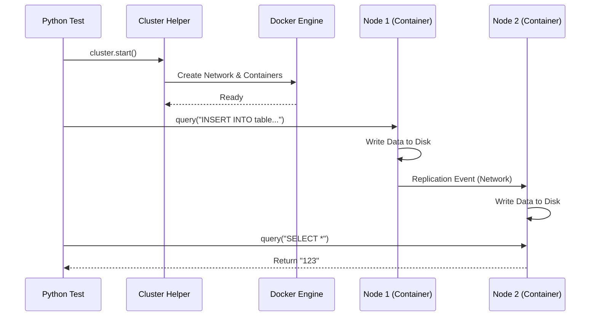

# Chapter 8: Integration Tests

In the previous chapter, [Integration Test Job Script](07_integration_test_job_script.md), we built the "Site Manager" that orchestrates our testing environment. We learned how to run tests in parallel using batches.

Now, we need to look at the tests themselves. While [Stateless Queries](06_stateless_queries.md) check if the database *calculates* correctly, **Integration Tests** check if the database *cooperates* correctly.

## The Problem: Testing the "Choir"

Imagine you are directing a choir.
1.  **Stateless Test:** You listen to one singer alone in a soundproof room to see if they hit the right note.
2.  **Integration Test:** You put the whole choir on stage to see if they sing in harmony.

**The Challenge:** ClickHouse is a distributed system. It splits data across many servers ("Shards") and copies data for safety ("Replicas").
*   What happens if Server A tries to talk to Server B, but Server B is restarting?
*   What happens if the network is slow?
*   What happens if ZooKeeper (the coordinator) crashes?

A single SQL file cannot test this. We need a way to spin up multiple servers, connect them, and simulate these chaotic events.

**Central Use Case:**
We want to write a Python script that:
1.  Spins up **two ClickHouse servers**.
2.  Creates a table on Server 1 that automatically replicates data to Server 2.
3.  Inserts data into Server 1.
4.  **Verifies** that the data instantly appears on Server 2.

## Key Concepts

To write these tests, we use the `tests/integration/` directory.

### 1. The `ClickHouseCluster` Helper
This is a Python class provided by the framework. It is your "God Mode." It allows you to create servers, start them, stop them, and even "kill" them abruptly.

### 2. The Nodes (Instances)
A "Node" represents a single running ClickHouse server inside a Docker container. In your Python script, this is an object you can command.
*   `node1.query("SELECT count() FROM table")` sends SQL to that specific container.

### 3. Pytest Fixtures
We use standard **Pytest** features. A "fixture" is a setup function that runs before your test. It builds the cluster so your test function can focus purely on logic.

## How to Write an Integration Test

Let's build a test for our **Central Use Case**: Replication.

### Step 1: Import the Helpers

We start by importing the tools we need from `helpers.cluster`.

```python
import pytest
from helpers.cluster import ClickHouseCluster

# Initialize the cluster environment
cluster = ClickHouseCluster(__file__)

# Define our two servers (nodes)
node1 = cluster.add_instance('node1', with_zookeeper=True)
node2 = cluster.add_instance('node2', with_zookeeper=True)
```
*Explanation:* We create a cluster object. We ask for two instances (`node1` and `node2`). We add `with_zookeeper=True` because replication requires coordination.

### Step 2: Set Up the "World" (Fixture)

We use a generic setup function (fixture) to start the containers before the tests run.

```python
@pytest.fixture(scope="module")
def started_cluster():
    try:
        # Ask Docker to start the containers
        cluster.start()
        yield cluster
    finally:
        # Shut everything down when done
        cluster.shutdown()
```
*Explanation:* The `yield` command pauses here while the tests run. Once finished, the code resumes and shuts down the cluster to save resources.

### Step 3: Write the Test Logic

Now we write the actual test function using `node1` and `node2`.

```python
def test_replication(started_cluster):
    # 1. Create a Replicated table on Node 1
    node1.query("""
        CREATE TABLE test_table (id Int64) 
        ENGINE = ReplicatedMergeTree('/clickhouse/tables/t', 'r1') 
        ORDER BY id
    """)
    
    # 2. Create the SAME table on Node 2 (Replica)
    node2.query("""
        CREATE TABLE test_table (id Int64) 
        ENGINE = ReplicatedMergeTree('/clickhouse/tables/t', 'r2') 
        ORDER BY id
    """)
```
*Explanation:* We send SQL commands to specific nodes. Note the engine arguments `r1` and `r2`—these identify the unique replicas.

### Step 4: Verify Behavior

Finally, we insert data and check if it traveled across the network.

```python
    # 3. Insert data ONLY into Node 1
    node1.query("INSERT INTO test_table VALUES (123)")

    # 4. Sync the replicas (force them to talk)
    node2.query("SYSTEM SYNC REPLICA test_table")

    # 5. Check if data exists on Node 2
    assert node2.query("SELECT id FROM test_table") == "123\n"
```
*Explanation:* We insert into `node1`. We verify on `node2`. If the output matches "123", the test passes. Replication works!

## Under the Hood: The Virtual Network

How does a Python script control a database cluster? It relies on the [Docker Server Image](05_docker_server_image.md) we built earlier.

1.  **Request:** Python asks `ClickHouseCluster` to start `node1`.
2.  **Translation:** The helper converts this into Docker API calls.
3.  **Networking:** It creates a virtual Docker bridge network so `node1` can ping `node2` by name.
4.  **Mounts:** It injects configuration files (XML) into the containers so they know where ZooKeeper is.

Here is the flow:



### Implementation Details: The `helpers` Module

The file `tests/integration/helpers/cluster.py` is the heavy lifter. It abstracts away the complexity of Docker commands.

For example, when you call `node.query()`, it actually executes a command *inside* the container.

```python
# Simplified logic from helpers/cluster.py

class ClickHouseInstance:
    def query(self, sql):
        # Build the command to run inside Docker
        cmd = ["clickhouse-client", "--query", sql]
        
        # Execute it inside the specific container
        result = self.docker_client.exec_run(self.container_id, cmd)
        
        return result.output
```
*Explanation:* The test script doesn't connect to ClickHouse over TCP directly (usually). It tells Docker to run the `clickhouse-client` binary *inside* the container and captures the text output. This avoids firewall or port mapping issues on the test runner.

### Simulating Failures

One of the most powerful features of Integration Tests is the ability to break things.

```python
def test_network_partition():
    # Simulate a network cut
    node1.disconnect_from_network()
    
    # Try to query (should fail or timeout)
    with pytest.raises(Exception):
         node1.query("SELECT * FROM remote_table")
         
    # Restore network
    node1.connect_to_network()
```
*Explanation:* You can programmatically disconnect the network cable. This is impossible with simple SQL tests, but essential for testing distributed database stability.

## Why This Matters

Integration Tests are the bridge between "It compiles" and "It's production-ready."
1.  **Realism:** They run the actual binary in an actual Linux environment.
2.  **Distributed Logic:** They are the only way to test Sharding, Replication, and Distributed DDL.
3.  **Resilience:** They allow us to ensure ClickHouse recovers gracefully when servers crash.

## Summary

In this chapter, we learned about **Integration Tests**.
*   We use **Python and Pytest** to write complex test scenarios.
*   We use the **`ClickHouseCluster`** helper to spin up virtual clusters using Docker.
*   We can send queries to specific nodes to verify data flows correctly between servers.

These tests are generic. However, ClickHouse has many specific features (like the new Query Analyzer) that require specialized testing approaches.

In the next chapter, we will explore **Core Feature Tests** to see how we validate the fundamental building blocks of the database.

[Next Chapter: Core Feature Tests](09_core_feature_tests.md)

---

Generated by [Code IQ](https://github.com/adityasoni99/Code-IQ)