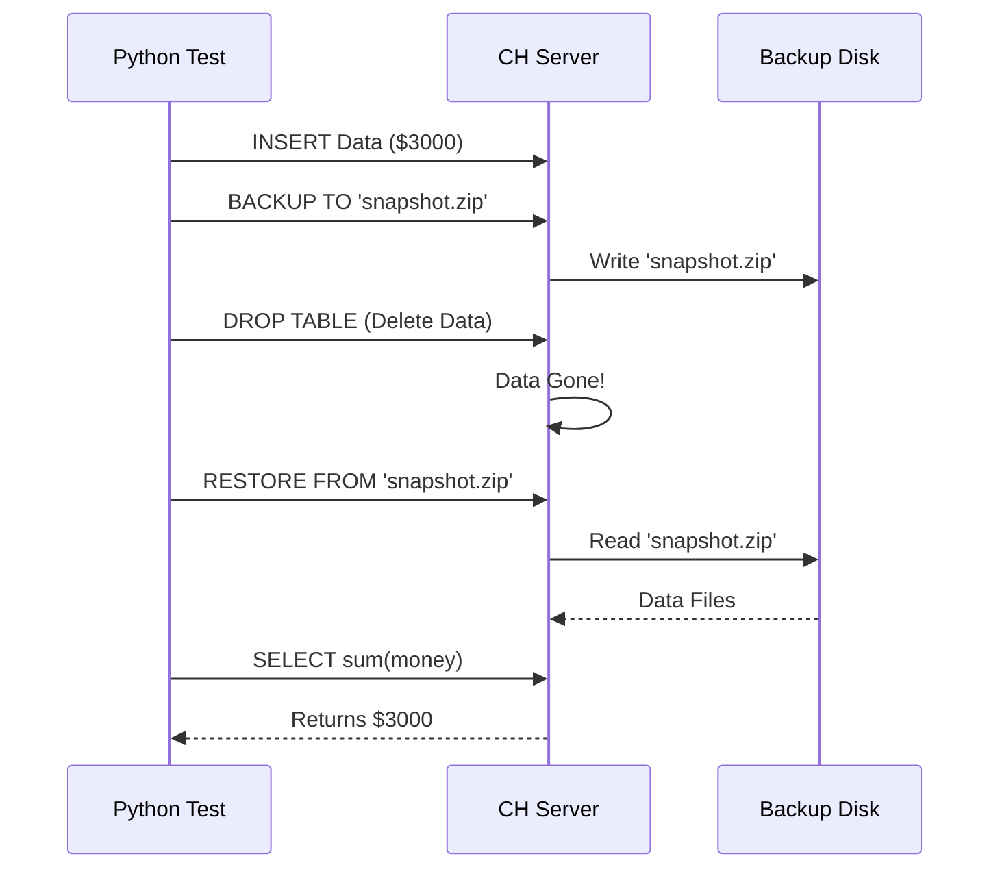

# Chapter 9: Core Feature Tests

In the previous chapter, [Integration Tests](08_integration_tests.md), we learned how to spin up a "virtual world" of multiple ClickHouse servers using Python. We ran a basic test to see if data could move from one server to another.

But ClickHouse is more than just moving data. It has complex "Core Features" that define its reliability and security. If `1 + 1` fails, it's a bug. If **Backups** fail, it's a catastrophe.

This chapter is about **Core Feature Tests**.

## The Problem: The "Pillars" of the Database

Imagine you are building a bank vault.
1.  **Stateless Test:** Does the door handle turn?
2.  **Core Feature Test:** If we attack the door with a sledgehammer, does it hold? Does the alarm ring?

**The Challenge:** ClickHouse relies on five critical pillars to function in production:
1.  **Replication:** Copying data so nothing is lost.
2.  **Distributed DDL:** Changing table structures on 100 servers at once.
3.  **Backups:** Saving snapshots to restore later.
4.  **RBAC:** Security (Usernames, Passwords, Roles).
5.  **Keeper:** The coordination system (traffic control).

We cannot just "hope" these work. We need rigorous scenarios that simulate disasters.

**Central Use Case:**
We want to test a **Backup and Restore** scenario.
1.  We have a table with valuable customer data.
2.  A user "accidentally" deletes the table.
3.  We must prove that we can restore the data from a backup file perfectly.

## Key Concepts

These tests live in `tests/integration/` alongside the others, but they focus on specific subsystems.

### 1. Backups
This feature allows ClickHouse to freeze data and copy it to a safe place (like an S3 bucket or a local disk).

### 2. Distributed DDL (Data Definition Language)
"DDL" means commands like `CREATE TABLE` or `ALTER TABLE`. "Distributed" means you type the command on *one* server, and it magically happens on *all* servers in the cluster.

### 3. RBAC (Role-Based Access Control)
This manages who is allowed to do what.
*   **User:** "John"
*   **Role:** "Admin"
*   **Privilege:** "Can drop tables"

### 4. ClickHouse Keeper
This is a special component (replacing ZooKeeper) that ensures all servers agree on the truth. It prevents "Split Brain" scenarios where two servers think they are the leader.

## How to Test a Core Feature

Let's solve our **Central Use Case**: Testing the "Undo Button" (Backups).

### Step 1: Prepare the Configuration

To test backups, we first need to tell the virtual server *where* to store them. We do this by injecting a configuration snippet.

```python
import pytest
from helpers.cluster import ClickHouseCluster

# We define a "virtual disk" called 'backups' for the test
config = """
<clickhouse>
    <storage_configuration>
        <disks>
            <backups><type>local</type><path>/backups/</path></backups>
        </disks>
    </storage_configuration>
</clickhouse>
"""

# Start the cluster with this config
cluster = ClickHouseCluster(__file__)
node = cluster.add_instance('node', main_configs=['configs/backups.xml'])
```
*Explanation:* We define a local folder `/backups/` as a valid place to store data. We pass this config to the instance.

### Step 2: Create Data (The "Before" State)

We use a standard Pytest function to set up our valuable data.

```python
@pytest.fixture(scope="module", autouse=True)
def setup_node():
    cluster.start()
    
    # Create a table and insert money
    node.query("CREATE TABLE bank (id Int, money Int) ENGINE=MergeTree ORDER BY id")
    node.query("INSERT INTO bank VALUES (1, 1000), (2, 2000)")
    
    yield
    cluster.shutdown()
```
*Explanation:* We have a bank table. User 1 has $1000. User 2 has $2000.

### Step 3: Perform the Backup

Now, inside the test function, we run the backup command.

```python
def test_backup_and_restore():
    # 1. Create a backup named 'snapshot1' on the 'backups' disk
    node.query("BACKUP TABLE bank TO Disk('backups', 'snapshot1.zip')")
    
    # Verify the backup file exists (optional check)
    assert "snapshot1.zip" in node.query("SELECT name FROM system.backups")
```
*Explanation:* The `BACKUP` SQL command tells ClickHouse to bundle the data into a file named `snapshot1.zip`.

### Step 4: Simulate the Disaster

Now we simulate a developer making a terrible mistake.

```python
    # 2. DISASTER! Someone drops the table
    node.query("DROP TABLE bank")
    
    # Verify the data is gone (should raise error or be empty)
    with pytest.raises(Exception):
        node.query("SELECT * FROM bank")
```
*Explanation:* The table is gone. If this were a real production environment without backups, the money would be lost.

### Step 5: The Restore

Finally, we use the restore command to bring the data back.

```python
    # 3. RESTORE from the snapshot
    node.query("RESTORE TABLE bank FROM Disk('backups', 'snapshot1.zip')")
    
    # 4. Verify the money is back
    assert node.query("SELECT sum(money) FROM bank") == "3000\n"
```
*Explanation:* We pull the data from the zip file. We check the sum ($1000 + $2000 = $3000). Success!

## Under the Hood: The Core Logic

When you run `BACKUP TABLE`, ClickHouse performs a complex dance to ensure data consistency without stopping the database.

1.  **Freeze:** It tells the database engine, "Stop merging files for a second."
2.  **Hard Link:** It creates shortcuts to the data files on the file system (instant).
3.  **Copy:** It copies these files to the destination (the Backup Disk).
4.  **Unfreeze:** The database goes back to normal work.

Here is the flow of the test we just wrote:



### Implementation Details: Security Tests (RBAC)

Testing Security (RBAC) works similarly but focuses on *permission denied* errors.

```python
def test_rbac_security():
    # Create a user 'intern' who can ONLY read
    node.query("CREATE USER intern IDENTIFIED BY 'password'")
    node.query("GRANT SELECT ON bank TO intern")
    
    # 1. Intern tries to read (Allowed)
    node.query("SELECT * FROM bank", user="intern", password="password")
    
    # 2. Intern tries to delete data (Should be Denied)
    error = node.query_and_get_error("DROP TABLE bank", user="intern", password="password")
    
    assert "Not enough privileges" in error
```
*Explanation:*
*   We use standard SQL (`CREATE USER`, `GRANT`) to set up rules.
*   We connect as that user using `user="intern"`.
*   We check specifically that the *wrong* action triggers an error message.

## Why This Matters

Core Feature Tests protect the most vital parts of the system.
1.  **Safety:** They ensure backups actually work when needed.
2.  **Security:** They ensure unauthorized users cannot delete data.
3.  **Stability:** They ensure that coordination tools (Keeper) don't get confused.

If these tests pass, we know the "Skeleton" of the database is strong.

## Summary

In this chapter, we learned about **Core Feature Tests**.
*   We focused on the "Pillars" of ClickHouse: **Replication, Backups, and Security**.
*   We wrote a test case to **Backup and Restore** a table to recover from a disaster.
*   We learned how to test permissions by creating users and expecting **failures**.

ClickHouse is constantly evolving. One of the biggest recent changes is a completely new engine for understanding SQL, called the **Analyzer**. It needs its own special category of tests.

In the next chapter, we will explore **Analyzer Tests**.

[Next Chapter: Analyzer Tests](10_analyzer_tests.md)

---

Generated by [Code IQ](https://github.com/adityasoni99/Code-IQ)