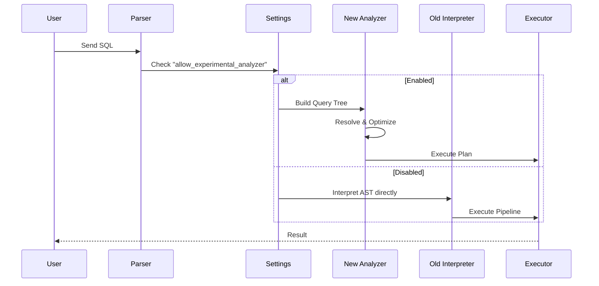

# Chapter 10: Analyzer Tests

In the previous chapter, [Core Feature Tests](09_core_feature_tests.md), we tested the "Pillars" of ClickHouse, such as backups and security. We made sure the database keeps data safe.

Now, we move to the "Brain" of the database. When you type a SQL query, how does ClickHouse figure out *how* to execute it? It uses a component called the **Query Analyzer**.

ClickHouse is currently undergoing a massive brain transplant: we are replacing the old query planner with a powerful new **Analyzer**.

This chapter is about **Analyzer Tests**.

## The Problem: The "New Brain"

Imagine you have a translator who translates English to Spanish.
1.  **Old Translator (Legacy):** Translates word-for-word. It works for "Hello", but fails for complex poetry.
2.  **New Translator (Analyzer):** Understands grammar, context, and idioms. It is much smarter.

**The Challenge:** We are building the New Translator. But before we fire the Old Translator, we must verify that the New one is working perfectly. It must handle complex sentences (queries) that the old one couldn't, without breaking the simple ones.

**Central Use Case:**
We want to run a complex SQL query that uses a **Common Table Expression (CTE)** and a **Join**—structures that require deep grammatical understanding of SQL. We want to ensure the New Analyzer calculates the result correctly.

## Key Concepts

### 1. The Legacy Planner
This is the original code that processed SQL in ClickHouse for years. It was fast but struggled with very complex SQL standard features (like subqueries inside joins).

### 2. The New Analyzer
This is the new engine. It builds a complete "Semantic Graph" of the query. It knows that column `id` in the subquery is the same as column `id` in the main table.

### 3. The Feature Flag
Since the new brain is still experimental in some versions, we have a switch to turn it on:
`SET allow_experimental_analyzer = 1;`

## How to Write an Analyzer Test

Analyzer tests are technically very similar to [Stateless Queries](06_stateless_queries.md). They involve a `.sql` file and a `.reference` file. The key difference is that we explicitly force the new brain to be active.

### Step 1: Create the SQL File

We create a file in `tests/queries/0_stateless/` (or a specific analyzer folder). The most important part is the first line.

```sql
-- tests/queries/0_stateless/01234_analyzer_test.sql

-- Turn on the NEW Analyzer
SET allow_experimental_analyzer = 1;

-- Also turn on new optimization support
SET allow_experimental_analyzer_glossary_optimization = 1;
```
*Explanation:* These settings tell ClickHouse: "Ignore the old logic. Use the new experimental logic for everything that follows."

### Step 2: Write a Complex Query

The new analyzer shines with complex logic, like defining a temporary result (CTE) and joining it.

```sql
-- Define a "Common Table Expression" (CTE) called 'my_cte'
WITH my_cte AS (
    SELECT number, number * 10 AS val FROM numbers(3)
)

-- Join the CTE with itself
SELECT t1.val, t2.val 
FROM my_cte AS t1
JOIN my_cte AS t2 ON t1.number = t2.number;
```
*Explanation:*
1.  `WITH ...`: Creates a temporary table `my_cte` containing `{0, 0}, {1, 10}, {2, 20}`.
2.  `JOIN`: Matches the rows based on the ID.
3.  The Legacy planner often struggled with CTEs in Joins. The New Analyzer handles this natively.

### Step 3: Create the Reference File

Just like in Chapter 6, we define the expected output in `01234_analyzer_test.reference`.

```text
0	0
10	10
20	20
```
*Explanation:* We expect the multiplication to work and the join to find the matching rows.

## Under the Hood: The Processing Pipeline

What actually happens when you turn that setting on? The entire path the query takes inside the C++ code changes.

1.  **Parser:** Reads the text SQL and creates a basic tree (AST).
2.  **Switch:** The code checks `allow_experimental_analyzer`.
3.  **Analyzer Path:** If true, it runs the **Query Analysis** pass. This resolves table names, checks types, and optimizes the tree *before* executing.
4.  **Legacy Path:** If false, it uses the old `Interpreter` logic which does analysis and execution simultaneously (which is harder to optimize).

Here is the flow:



### Internal Implementation

The fork in the road usually happens in `InterpreterSelectQuery.cpp` (or similar interpreters).

```cpp
// Simplified C++ Logic inside InterpreterSelectQuery.cpp

// Check the settings context
if (context->getSettings().allow_experimental_analyzer)
{
    // Use the new "Brain"
    auto analyzer = QueryAnalyzer(query, context);
    
    // Analyze and build a plan
    plan = analyzer.analyze();
}
else
{
    // Use the old "Brain" (Legacy)
    // Manually interpret the AST parts one by one
    analyzeLegacy(query, context);
}
```
*Explanation:*
*   The `context` holds the user settings (where we did `SET allow... = 1`).
*   If set, we instantiate `QueryAnalyzer`. This class is responsible for the new, rigorous semantic checks.

### Verifying the Tree

Sometimes, we want to see *how* the Analyzer understood the query. We can use a special command:

```sql
-- Debugging the Analyzer
EXPLAIN QUERY TREE SELECT 1 + 1;
```

**Output (Simplified):**
```text
QUERY id: 0
  PROJECTION
    FUNCTION name: plus
      CONSTANT value: 1
      CONSTANT value: 1
```
*Explanation:* This output confirms that the Analyzer successfully broke the query down into a "Function" (plus) and "Constants". If the test fails, developers look at this tree to see where the logic broke.

## Why This Matters

Analyzer Tests are critical for the future of ClickHouse.
1.  **Correctness:** SQL is complex. These tests ensure we strictly follow the SQL standard.
2.  **Performance:** The new Analyzer can perform optimizations (like removing unused columns) that the old one couldn't.
3.  **Future-Proofing:** Eventually, the "Old Translator" will be removed. These tests ensure the transition happens without users noticing bugs.

## Summary

In this chapter, we learned about **Analyzer Tests**.
*   We enable the **New Analyzer** using `SET allow_experimental_analyzer = 1`.
*   We use these tests to verify complex SQL features like **CTEs** and **Joins**.
*   We ensure the "New Brain" of ClickHouse understands our questions correctly.

So far, we have tested the database engine (Stateless, Integration, Analyzer). But a database often needs a manager to coordinate multiple servers. In ClickHouse, this manager is called **ClickHouse Keeper**.

In the next chapter, we will learn how to verify that the manager is doing its job correctly.

[Next Chapter: ClickHouse Keeper Tests](11_clickhouse_keeper_tests.md)

---

Generated by [Code IQ](https://github.com/adityasoni99/Code-IQ)