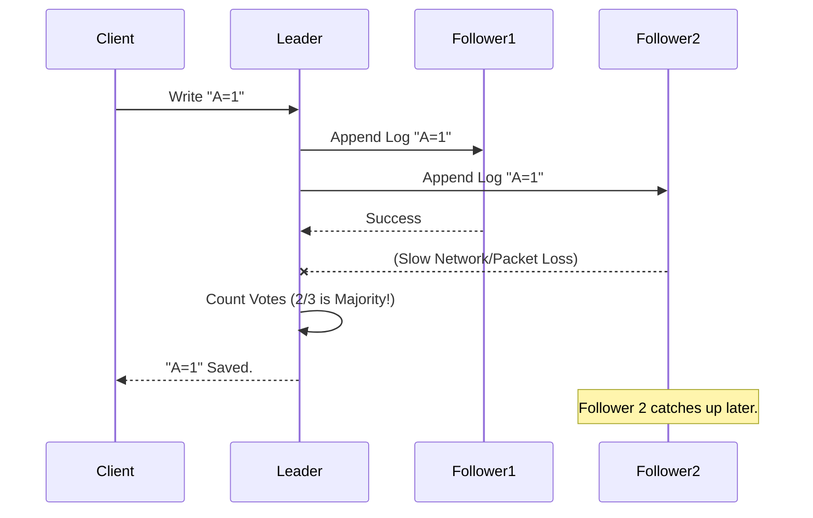

# Chapter 11: ClickHouse Keeper Tests

In the previous chapter, [Analyzer Tests](10_analyzer_tests.md), we ensured that the "New Brain" of ClickHouse understands complex SQL queries correctly. We verified that the database calculates the right answers.

However, a brain is useless if the body parts cannot agree on what to do. In a distributed cluster, servers need a way to agree on things like: "Who is the leader?" or "Did we successfully create that table?"

For years, ClickHouse used a separate software called **ZooKeeper** for this. But recently, we built our own version called **ClickHouse Keeper**.

This chapter is about **ClickHouse Keeper Tests**.

## The Problem: The "Democracy" of Servers

Imagine you have three friends trying to order a pizza.
1.  **Friend A** wants Pepperoni.
2.  **Friend B** wants Cheese.
3.  **Friend C** falls asleep.

If they don't have a system to decide, they will never eat. Distributed databases have the same problem. If Server 1 thinks it is the leader, and Server 2 also thinks it is the leader, data gets corrupted (a "Split Brain" scenario).

**The Solution:** We use an algorithm called **Raft**. It is a strict set of rules for voting. "If you get 2 out of 3 votes, you are the leader."

**The Challenge:** Implementing Raft is incredibly difficult. If we get the logic wrong, the whole cluster freezes. We need tests that simulate servers dying, networks failing, and votes being lost.

**Central Use Case:**
We want to run a 3-node Keeper cluster.
1.  We verify that **Node 1 is the Leader**.
2.  We **kill Node 1** (pull the plug).
3.  We verify that **Node 2 or Node 3** automatically detects this and wins the election to become the new Leader.
4.  No data is lost during the transition.

## Key Concepts

Keeper tests are a specialized type of [Integration Tests](08_integration_tests.md).

### 1. ClickHouse Keeper
This is a C++ binary (embedded inside ClickHouse or standalone) that replaces ZooKeeper. It stores small pieces of data (metadata) and ensures strong consistency.

### 2. The Raft Algorithm
This is the logic used for consensus.
*   **Leader:** The boss. Handles all writes.
*   **Follower:** Listens to the boss.
*   **Candidate:** Someone trying to become the boss.

### 3. Snapshotting
Keeper stores every action in a "Log" (a list).
*   *Action 1: X = 1*
*   *Action 2: X = 2*
If we run forever, the log gets too big. **Snapshotting** means saving the current state ("X is 2") to a file and deleting the old log entries to save space.

### 4. Force Recovery
If the cluster loses the majority of nodes (e.g., 2 out of 3 die), Raft stops working. **Force Recovery** is a manual command to tell the last survivor: "Forget the others. You are the King now."

## How to Write a Keeper Test

These tests live in `tests/integration/` and usually start with `test_keeper_`. We use the `ClickHouseCluster` helper, just like in Chapter 8.

### Step 1: Configure the Cluster

We need a special XML configuration to turn on Keeper.

```python
import pytest
from helpers.cluster import ClickHouseCluster

# We define a 3-node cluster
cluster = ClickHouseCluster(__file__)

# We add 3 nodes, all configured to be part of the "Keeper" ring
node1 = cluster.add_instance('node1', main_configs=['configs/keeper_config.xml'])
node2 = cluster.add_instance('node2', main_configs=['configs/keeper_config.xml'])
node3 = cluster.add_instance('node3', main_configs=['configs/keeper_config.xml'])
```
*Explanation:* We tell the test runner to spin up three Docker containers. The `keeper_config.xml` (not shown here) contains the list of IDs (1, 2, 3) so they know about each other.

### Step 2: Write Data to the Leader

We start the cluster and write some data to verify it works.

```python
def test_keeper_failover():
    cluster.start()
    
    # Connect to Node 1 (ZooKeeper client) and create a node
    # 'create' returns the path created
    assert node1.get_keeper_client().create("/test_node", "hello") == "/test_node"
    
    # Read it back to make sure it exists
    assert node1.get_keeper_client().get("/test_node")[0] == b"hello"
```
*Explanation:* `get_keeper_client()` gives us a tool to talk specifically to the Keeper port. We create a path `/test_node` with value "hello".

### Step 3: Kill the Leader (The Simulation)

Now for the fun part. We find out who is in charge and stop them.

```python
    # 1. Ask Node 1: "Who is the leader?"
    # (Simplified logic for tutorial)
    leader_id = get_leader_id(node1)
    
    # 2. Stop the leader container
    cluster.instances[leader_id].stop_clickhouse()
    
    # 3. Wait for the remaining nodes to hold an election
    import time
    time.sleep(5)
```
*Explanation:* We simulate a crash. The remaining two nodes will notice the silence from the leader and start a new voting round.

### Step 4: Verify Survival

We verify that the data is still there on a surviving node.

```python
    # Connect to a survivor (e.g., Node 2)
    survivor = node2
    
    # The data MUST be there
    data = survivor.get_keeper_client().get("/test_node")[0]
    
    assert data == b"hello"
```
*Explanation:* If the test passes, it means Keeper successfully replicated the "hello" data to Node 2 *before* Node 1 died, and Node 2 successfully became the new leader (or follower to a new leader).

## Under the Hood: The Raft Consensus

How does Keeper actually agree on data? It uses a "Replicated Log."

1.  **Client Request:** A client sends `set X=5` to the Leader.
2.  **Log Entry:** The Leader writes `X=5` to its local log (but doesn't commit it yet).
3.  **Replication:** The Leader sends `X=5` to Followers.
4.  **Acks:** Followers write it to their logs and say "Got it!"
5.  **Commit:** Once the Leader gets a majority (2 out of 3), it says "Commited!" and applies `X=5` to the memory.
6.  **Response:** Leader tells Client "Done."

Here is the flow:



### Internal Implementation

The core logic resides in `src/Coordination/`.

One of the most critical files is `KeeperDispatcher.cpp`. It acts as the bridge between network requests and the Raft logic.

```cpp
// Simplified concept from src/Coordination/KeeperDispatcher.cpp

void KeeperDispatcher::putRequest(Request request)
{
    // 1. Check if we are the leader using RaftServer
    if (!raft_server->isLeader())
    {
        throw Exception("I am not the leader!");
    }

    // 2. Put the request into the Raft Log
    // This triggers the replication process to other nodes
    raft_server->addEntry(request);
}
```
*Explanation:*
*   `KeeperDispatcher` receives the request.
*   It asks `raft_server` (the implementation of the algorithm) if it is allowed to write. Only the Leader can write.
*   It adds the entry to the log. The `raft_server` then handles the complex background work of talking to other nodes.

### Testing Snapshots

We also have specialized tests for Snapshotting.

```python
def test_snapshotting():
    # 1. Fill the log with thousands of entries
    for i in range(10000):
        node1.get_keeper_client().create(f"/node_{i}", "data")
        
    # 2. Force a snapshot
    node1.query("SYSTEM SYNC KEEPER")
    
    # 3. Check if log files were compressed/deleted
    # (We inspect the disk usage inside the container)
    assert node1.contains_snapshot_file()
```
*Explanation:* Without snapshotting, the log on disk would grow infinitely until the server crashed. This test ensures the "Garbage Collection" of logs is working.

## Why This Matters

ClickHouse Keeper is the backbone of modern ClickHouse clusters.
1.  **Independence:** It removes the dependency on ZooKeeper (Java).
2.  **Performance:** It is written in C++ and optimized for ClickHouse workloads.
3.  **Correctness:** These tests ensure that "Split Brain" (two leaders) never happens, which protects your data from corruption.

## Summary

In this chapter, we learned about **ClickHouse Keeper Tests**.
*   We use them to validate the **Raft Algorithm** that coordinates the cluster.
*   We write integration tests to simulate **killing leaders** and forcing elections.
*   We ensure that **metadata is replicated** safely across multiple nodes.

Now we have a working Brain (Analyzer) and a working Nervous System (Keeper). The last major piece is how the database talks to the outside world. How do clients send data? TCP? HTTP? MySQL protocol?

In the next chapter, we will explore **Protocol Tests**.

[Next Chapter: Protocol Tests](12_protocol_tests.md)

---

Generated by [Code IQ](https://github.com/adityasoni99/Code-IQ)