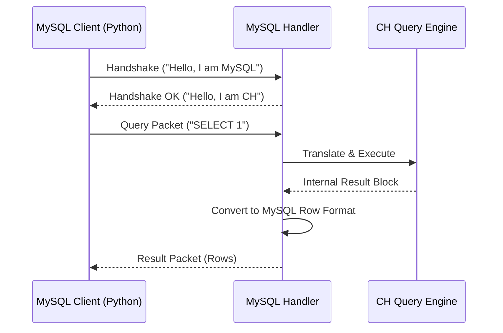

# Chapter 12: Protocol Tests

In the previous chapter, [ClickHouse Keeper Tests](11_clickhouse_keeper_tests.md), we ensured that our servers can coordinate and agree on a leader. We verified the internal nervous system of the cluster.

But a healthy brain and nervous system are useless if the entity cannot speak to the outside world. ClickHouse is unique because it is "multilingual." It speaks its own native language, but it also speaks HTTP, MySQL, PostgreSQL, gRPC, and Prometheus.

This brings us to **Protocol Tests**.

## The Problem: The Tower of Babel

Imagine you run a restaurant (ClickHouse).
1.  **The Kitchen:** This is your query engine. It cooks the data.
2.  **The Waiters:** These are your **Protocols**.

*   Some customers speak **English** (Native TCP Client).
*   Some speak **French** (MySQL Client).
*   Some speak **Binary** (gRPC).

If your kitchen cooks a perfect burger, but the waiter doesn't understand the order, the customer leaves unhappy.

**The Challenge:** We need to ensure that when a user connects with a standard MySQL tool (like `mysql` command line) or a Prometheus scraper, ClickHouse understands the request perfectly and responds in the correct format.

**Central Use Case:**
We want to write a test that:
1.  Starts ClickHouse with the **MySQL Compatibility Port** open.
2.  Uses a standard Python **MySQL library** (not a ClickHouse library!) to connect.
3.  Sends a query `SELECT "Hello"`.
4.  Verifies that ClickHouse pretends to be MySQL successfully.

## Key Concepts

### 1. The Protocol Handler
This is the piece of code inside ClickHouse that sits at the door. It listens on a specific port (e.g., 9004). It translates "Foreign" requests into "Native" ClickHouse internal commands.

### 2. The Native Protocol (TCP)
This is the default way `clickhouse-client` talks to the server (usually port 9000). It is highly optimized for speed.

### 3. Compatibility Protocols
These are layers that mimic other databases.
*   **MySQL Wire Protocol:** Pretends to be a MySQL server.
*   **PostgreSQL Wire Protocol:** Pretends to be a Postgres server.
*   **HTTP:** Allows web browsers to query the DB directly.

## How to Write a Protocol Test

These tests are a subset of [Integration Tests](08_integration_tests.md). We use the same machinery (`ClickHouseCluster`), but we change *how* we talk to the server.

### Step 1: Configure the Listener

First, we must tell ClickHouse to open its ears to the specific protocol. We do this via an XML config file.

```xml
<!-- configs/mysql_protocol.xml -->
<clickhouse>
    <!-- Tell ClickHouse to listen for MySQL on port 9004 -->
    <mysql_port>9004</mysql_port>
</clickhouse>
```
*Explanation:* By default, this port might be closed. We explicitly open port 9004 for our test.

### Step 2: The Test Setup

We start the cluster with this configuration.

```python
import pytest
from helpers.cluster import ClickHouseCluster
import pymysql # Standard Python library for MySQL

cluster = ClickHouseCluster(__file__)
node = cluster.add_instance('node', main_configs=['configs/mysql_protocol.xml'])

@pytest.fixture(scope="module", autouse=True)
def started_cluster():
    cluster.start()
    yield
    cluster.shutdown()
```
*Explanation:* We import `pymysql`. This is crucial. We are NOT using a ClickHouse client. We are using a tool designed for a completely different database to prove compatibility.

### Step 3: The Connection Logic

Now we write the test. We connect to the ClickHouse container using the MySQL driver.

```python
def test_mysql_protocol_select():
    # Connect to ClickHouse as if it were MySQL
    conn = pymysql.connect(
        user='default',
        password='',
        host='127.0.0.1',
        port=node.port, # This is mapped to 9004
    )
    
    # Create a cursor to execute commands
    cursor = conn.cursor()
    cursor.execute("SELECT 1")
```
*Explanation:* The `pymysql.connect` function sends a specific "Handshake" packet. ClickHouse must recognize this handshake and reply correctly, or the connection will fail immediately.

### Step 4: Verification

We check the result.

```python
    # Fetch the result
    result = cursor.fetchone()
    
    # Verify the data
    assert result[0] == 1
    
    conn.close()
```
*Explanation:* If `result` is `1`, it means ClickHouse successfully:
1.  Decoded the MySQL packet.
2.  Ran the query internally.
3.  Encoded the answer back into a MySQL result packet.

## Testing Other Protocols

We use the same logic for other protocols.

### HTTP Protocol
We use the standard Python `requests` library.

```python
import requests

def test_http_protocol():
    # Send a POST request to port 8123 (Standard HTTP)
    url = f"http://{node.ip_address}:8123/"
    response = requests.post(url, data="SELECT 1")
    
    assert response.status_code == 200
    assert response.text.strip() == "1"
```

### Prometheus Metrics
ClickHouse exposes metrics (like CPU usage) for Prometheus to scrape.

```python
def test_prometheus_endpoint():
    # Prometheus scrapes /metrics
    url = f"http://{node.ip_address}:9363/metrics"
    response = requests.get(url)
    
    # Check for a specific metric key
    assert "ClickHouseProfileEvents_Query" in response.text
```

## Under the Hood: The Translation Layer

How does ClickHouse pretend to be MySQL? It uses a **Handler Pattern**.

1.  **Listener:** The server has a socket open on port 9004.
2.  **Packet Sniffer:** When data arrives, the `MySQLHandler` looks at the first byte.
3.  **Translation:** It converts the MySQL "Command Packet" into an internal ClickHouse AST (Abstract Syntax Tree).
4.  **Execution:** The engine runs the query normally.
5.  **Formatting:** The result block is converted into MySQL "Row Packets."

Here is the flow:



### Internal Implementation

The code for these handlers resides in `src/Server/`.

For example, `MySQLHandler.cpp` acts as the translator.

```cpp
// Simplified Logic inside src/Server/MySQLHandler.cpp

void MySQLHandler::readPacket()
{
    // Read the packet type from the wire
    PacketType type = readType();

    if (type == COM_QUERY)
    {
        // Extract the SQL string
        String query = readString();
        
        // Pass it to the internal engine
        executeQuery(query);
    }
}
```
*Explanation:* This C++ code reads raw bytes from the network. It switches based on `PacketType`. If it receives a `COM_QUERY` (standard MySQL command), it extracts the text and runs it.

### The Complexity of Types

The hardest part is mapping data types.
*   **MySQL:** Has `VARCHAR`, `DECIMAL`.
*   **ClickHouse:** Has `String`, `Decimal128`.

The protocol tests heavily verify that these conversions happen without losing precision. We often write tests that insert `DateTime` via MySQL and read it back to ensure the timezone didn't shift.

## Why This Matters

Protocol Tests ensure the ecosystem around ClickHouse works.
1.  **Tooling Support:** They ensure users can use Tableau, Grafana, or DBeaver to connect to ClickHouse.
2.  **Migration:** They make it easier for users to switch from MySQL to ClickHouse without rewriting all their application code.
3.  **Observability:** They ensure monitoring tools (Prometheus) can keep an eye on the database health.

## Summary

In this chapter, we learned about **Protocol Tests**.
*   We use them to ensure ClickHouse speaks multiple languages (MySQL, HTTP, Prometheus).
*   We write tests using **standard client libraries** (like `pymysql` or `requests`) to simulate real-world usage.
*   We enable specific **Ports** in the configuration to activate the translation layers.

Now that we know we can talk to clients, what about talking to *other systems*? ClickHouse often needs to pull data from Kafka or read files from S3. These are complex external dependencies.

In the next chapter, we will explore **External Integrations Tests**.

[Next Chapter: External Integrations Tests](13_external_integrations_tests.md)

---

Generated by [Code IQ](https://github.com/adityasoni99/Code-IQ)