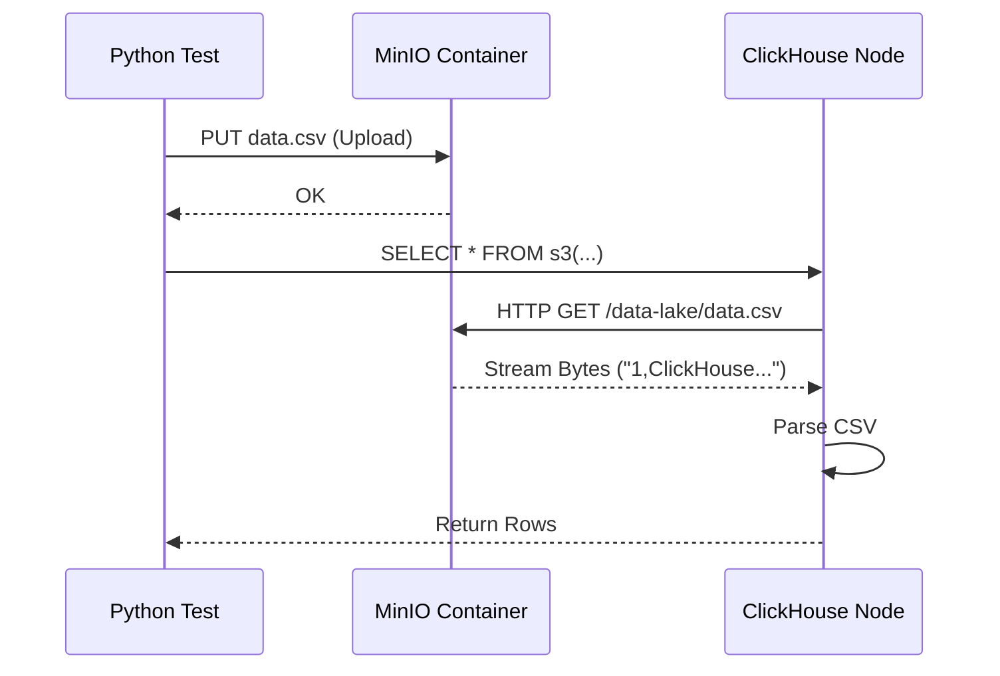

# Chapter 13: External Integrations Tests

In the previous chapter, [Protocol Tests](12_protocol_tests.md), we ensured that clients (like MySQL tools or web browsers) could talk to ClickHouse. We verified the "Front Door" of the database.

But ClickHouse isn't just a destination; it is also a traveler. It often needs to reach out and pull data from other systems like **AWS S3**, **Kafka**, **PostgreSQL**, or **MongoDB**.

If Amazon changes how S3 works, or if we break our Kafka consumer code, data ingestion stops. To prevent this, we need **External Integrations Tests**.

## The Problem: The "Smart Home" Challenge

Imagine you are building a central "Smart Home" hub (ClickHouse).
1.  **Protocol Tests:** You check if *you* can command the hub via your phone.
2.  **Integration Tests:** You check if the hub can turn on the lights.
3.  **External Integrations:** You check if the hub can actually talk to third-party devices, like a specific brand of thermostat or a music streaming service.

**The Challenge:** We cannot control the third parties. AWS S3 is a massive cloud service. We cannot "restart" AWS for a test. We also don't want to pay real money every time we run a test in CI.

**Central Use Case:**
We want to verify that ClickHouse can read a CSV file stored in **Object Storage (S3)**.
To do this without using real AWS, we will use **MinIO**, a tool that pretends to be S3 but runs locally in Docker.

## Key Concepts

To simulate the outside world, we rely on **Docker Compose** and **Mock Services**.

### 1. The "Stunt Doubles" (Mocks)
Since we can't use the real internet services in a sealed CI environment, we use local versions:
*   **MinIO:** Pretends to be AWS S3.
*   **Redpanda:** Pretends to be Apache Kafka.
*   **MySQL/Postgres Containers:** Real databases running locally.

### 2. Docker Compose
This is a tool that lets us define a "Environment File" (`docker-compose.yml`). It says: "Start one ClickHouse, one MinIO, and one Kafka, and connect them all on a shared network."

### 3. Table Functions
ClickHouse has special SQL functions to talk to these services directly without creating a table first.
*   `s3(...)`: Reads files from object storage.
*   `kafka(...)`: Reads streams from a message bus.
*   `mysql(...)`: Reads tables from a remote MySQL database.

## How to Write an External Integration Test

We will build a test that verifies ClickHouse can download and query a file from our fake S3 (MinIO).

### Step 1: Prepare the "Double"

First, we need to ensure MinIO is running. In `tests/integration`, we configure the `ClickHouseCluster` to include MinIO.

```python
import pytest
from helpers.cluster import ClickHouseCluster

# We start a cluster that includes a "MinIO" container
cluster = ClickHouseCluster(__file__)
node = cluster.add_instance('node', with_minio=True)

@pytest.fixture(scope="module")
def started_cluster():
    cluster.start()
    yield cluster
    cluster.shutdown()
```
*Explanation:* The `with_minio=True` flag tells our test runner (from [Chapter 7](07_integration_test_job_script.md)) to spin up a MinIO container alongside ClickHouse.

### Step 2: Upload Data to the "Cloud"

In the test function, we first act as the user uploading data. We use a standard Python library (`minio`) to put a file into our fake bucket.

```python
from minio import Minio

def test_s3_read(started_cluster):
    # Connect to the local MinIO instance
    minio_client = cluster.minio_client
    
    # Create a bucket named 'data-lake'
    if not minio_client.bucket_exists("data-lake"):
        minio_client.make_bucket("data-lake")

    # Upload a simple CSV file
    csv_data = b"1,ClickHouse\n2,Integrations"
    minio_client.put_object(
        "data-lake", "data.csv", io.BytesIO(csv_data), len(csv_data)
    )
```
*Explanation:* We connect to the MinIO container. We create a bucket (folder) and upload a file `data.csv` containing two rows.

### Step 3: Query from ClickHouse

Now, we verify that ClickHouse can "see" this file using the `s3` table function.

```python
    # ClickHouse needs to know the address of MinIO inside the Docker network
    # usually: http://minio:9000/bucket/file
    
    s3_url = "http://minio:9000/data-lake/data.csv"
    
    # Run the query
    result = node.query(f"""
        SELECT * FROM s3(
            '{s3_url}', 
            'minio', 'minio123', 
            'CSV'
        )
    """)
```
*Explanation:*
*   We use the `s3()` function in SQL.
*   We pass the URL, the fake credentials (`minio`/`minio123`), and the format (`CSV`).
*   ClickHouse will make an HTTP request to the MinIO container to fetch the data.

### Step 4: Verify the Result

Finally, we assert that the data traveled from MinIO to ClickHouse correctly.

```python
    # Expected output: 1, ClickHouse (newline) 2, Integrations
    expected = "1\tClickHouse\n2\tIntegrations\n"
    
    assert result == expected
```
*Explanation:* If the result matches, it means the entire chain (Network -> HTTP Request -> CSV Parsing) is working correctly.

## Under the Hood: The HTTP Fetcher

When you run an `s3` query, ClickHouse acts like a web browser downloading a file, but it processes the file *while* it is downloading (streaming).

1.  **Parsing:** The `s3()` function parses the URL.
2.  **Connection:** `StorageS3` opens a TCP connection to the MinIO container.
3.  **Request:** It sends an HTTP `GET /data-lake/data.csv` request.
4.  **Streaming:** MinIO sends bytes. ClickHouse reads these bytes into a buffer.
5.  **Decoding:** The `CSV` format decoder turns raw bytes into columns and rows.

Here is the flow:



### Internal Implementation: The `ReadBuffer`

The magic happens in the C++ layer handling Input/Output. ClickHouse uses an abstraction called `ReadBufferFromHTTP`.

```cpp
// Simplified concept from src/IO/ReadBufferFromHTTP.cpp

class ReadBufferFromHTTP : public ReadBuffer
{
public:
    bool nextImpl() override
    {
        // 1. If we ran out of data in the buffer, fetch more
        // 2. Read from the socket connected to S3/MinIO
        ssize_t bytes_read = socket.read(internal_buffer);
        
        // 3. If bytes_read is 0, the file is finished
        return bytes_read > 0;
    }
};
```
*Explanation:*
*   ClickHouse doesn't download the whole file to RAM.
*   It fetches small chunks (e.g., 1MB) at a time using `nextImpl()`.
*   This allows ClickHouse to process a 100GB file from S3 using only a few MB of RAM.

### Big Data Integrations: Iceberg, Hudi, Delta

Modern "Lakehouse" architectures use complex formats like **Apache Iceberg**. Testing these is similar but requires more setup.

1.  **Format Complexity:** Iceberg isn't just a file; it's a folder of metadata files (`.json`, `.avro`) pointing to data files (`.parquet`).
2.  **The Test:** We usually need a Java program (Spark) to create the Iceberg table in MinIO first.
3.  **ClickHouse:** Then we ask ClickHouse to read it.

```python
def test_iceberg_integration():
    # 1. Start Spark and create an Iceberg table in MinIO
    run_spark_job("create_table.py")
    
    # 2. ClickHouse reads the metadata file
    node.query("SELECT * FROM iceberg('http://minio.../metadata.json')")
```
*Explanation:* This proves ClickHouse can decode the complex metadata structures used by big data engines.

## Why This Matters

External Integration Tests are vital because:
1.  **Realism:** They catch bugs that only happen over a real network.
2.  **Compatibility:** They ensure we support the latest versions of Kafka, MySQL, or AWS signatures.
3.  **Performance:** We can test if reading from S3 is too slow or uses too much CPU.

## Summary

In this chapter, we learned about **External Integrations Tests**.
*   We use **Docker Containers** (like MinIO) to simulate external services.
*   We verify that ClickHouse can **read and write** to these services using Table Functions.
*   We ensure that data flows correctly between ClickHouse and the rest of the data ecosystem.

We have covered almost every aspect of testing now. However, writing these tests requires a lot of repetitive code (starting clusters, creating tables). To make life easier, the framework provides a library of helpers.

In the final chapter, we will look at **Integration Test Helpers** to see the tools available to speed up your test writing.

[Next Chapter: Integration Test Helpers](14_integration_test_helpers.md)

---

Generated by [Code IQ](https://github.com/adityasoni99/Code-IQ)