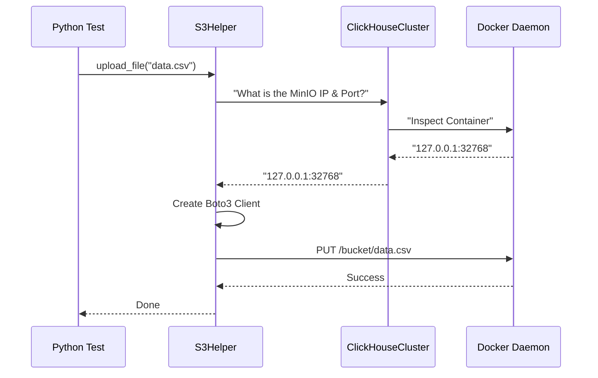

# Chapter 14: Integration Test Helpers

In the previous chapter, [External Integrations Tests](13_external_integrations_tests.md), we learned how to test ClickHouse against real-world external systems like S3 and Kafka using Docker.

However, if you looked closely at the code, you might have noticed a lot of setup work. "Start the cluster," "Find the IP address," "Connect the network," "Create a bucket." Doing this manually for every single test would be exhausting and messy.

This brings us to the final piece of the puzzle: **Integration Test Helpers**.

## The Problem: "Reinventing the Wheel"

Imagine you are a chef. Every time you want to cook an omelet, you first have to:
1.  Forge a pan from raw iron.
2.  Raise a chicken to lay an egg.
3.  Build a stove.

That is ridiculous! You just want to cook. You should have tools ready to go.

**The Challenge:** In testing, we often need to perform repetitive tasks:
*   "Upload this file to S3."
*   "Wait for this node to restart."
*   "Check if these two tables have the same data."

If every developer writes their own code for this, we end up with buggy, duplicate code.

**Central Use Case:**
We want to upload a CSV file to a simulated S3 bucket and verify that ClickHouse can read it. We want to do this in **3 lines of code**, without worrying about ports, authentication, or Docker networking.

## Key Concepts

The helpers are located in `tests/integration/helpers/`. They are the "Toolbox" for test writers.

### 1. The Cluster Manager (`ClickHouseCluster`)
We have used this throughout the tutorial. It is the ultimate helper. It abstracts away `docker-py` and manages the lifecycle of containers.

### 2. The Storage Helpers (`S3Helper`, `AzureBlobStorageHelper`)
These classes handle the complexity of talking to cloud mocks (like MinIO). They know the default passwords, how to create buckets, and how to upload data.

### 3. The Data Matchers (`TSV`, `CSV`)
Comparing query results is tricky.
*   Is "1.0" the same as "1"?
*   Does the order of rows matter?
These helpers allow us to compare data intelligently, ignoring formatting differences that don't matter.

## How to Use Helpers

Let's solve our **Central Use Case** using these tools.

### Step 1: The Cluster Setup (Review)

This part should look familiar. The helper handles the Docker complexity.

```python
from helpers.cluster import ClickHouseCluster

# The helper manages the Docker lifecycle
cluster = ClickHouseCluster(__file__)

# We ask the helper to attach a MinIO container
node = cluster.add_instance('node', with_minio=True)
```
*Explanation:* `with_minio=True` is a helper shortcut. Behind the scenes, it edits the Docker Compose configuration to add a MinIO service and links it to the ClickHouse network.

### Step 2: Using the S3 Helper

Instead of importing `boto3` and manually configuring connections, we use a helper designed for our test environment.

```python
from helpers.s3_tools import S3Helper

def test_easy_s3_upload():
    # Initialize the helper (it knows the default MinIO credentials)
    s3_helper = S3Helper(cluster)
    
    # Upload a file in ONE line
    # (bucket, filename, content)
    s3_helper.upload_file("my-bucket", "data.csv", "1,Hello\n2,World")
```
*Explanation:* The `S3Helper` looks up the dynamic port MinIO is running on. It creates the bucket "my-bucket" if it doesn't exist. It uploads the data. We didn't have to write any connection logic!

### Step 3: Using Data Matchers

Now let's query ClickHouse and verify the result using the `TSV` helper.

```python
from helpers.test_tools import TSV

def test_verify_data():
    # Run the query
    result = node.query("SELECT * FROM s3(...)")
    
    # Define expected data using the TSV helper
    expected = TSV("1\tHello\n2\tWorld")
    
    # Compare
    assert TSV(result) == expected
```
*Explanation:* `TSV` stands for Tab-Separated Values. This helper wraps the string. If the result had extra whitespace or slightly different number formatting (like `1.0` vs `1`), the `TSV` class handles the comparison gracefully.

## Under the Hood: How Helpers Work

Helpers are essentially **Wrappers**. They wrap complex, low-level libraries into high-level, easy-to-use methods.

Let's look at how the `S3Helper` manages to find the MinIO instance.

1.  **Context:** The `ClickHouseCluster` object knows everything about the running Docker containers.
2.  **Lookup:** When you initialize `S3Helper(cluster)`, it asks the cluster: "Where is MinIO running?"
3.  **Port Mapping:** Docker assigns random ports (e.g., 32768) to map to the internal port (9000). The helper finds this mapping.
4.  **Connection:** It creates a standard client with this dynamic information.

Here is the flow:



### Implementation Details

The code for these helpers is often found in `tests/integration/helpers/`. Let's look at a simplified version of how a helper creates a client.

```python
# Simplified logic from helpers/s3_tools.py

class S3Helper:
    def __init__(self, cluster):
        # The cluster object has the details
        self.host = cluster.minio_host
        self.port = cluster.minio_port
        
        # Standard MinIO credentials used in our CI
        self.client = Minio(
            f"{self.host}:{self.port}",
            access_key="minio",
            secret_key="minio123",
            secure=False
        )
```
*Explanation:*
*   The helper encapsulates the "Secrets" (access keys) so you don't copy-paste "minio123" into 500 different test files.
*   If we ever change the password in the Docker image, we only need to update this one helper file, and all 500 tests will still work.

### Smart Retries

Another critical feature of helpers is **Retries**. Distributed systems are flaky. Sometimes S3 takes 100ms to start; sometimes it takes 1 second.

The helpers often include logic to "Wait until ready."

```python
# Simplified retry logic
import time

def safe_query(node, sql):
    for i in range(10):
        try:
            return node.query(sql)
        except Exception:
            # If query fails, wait and try again
            time.sleep(1)
            
    raise Exception("Query failed after 10 retries")
```
*Explanation:* Instead of the test failing immediately because the network blipped, the helper catches the error, waits, and retries. This makes our CI pipeline much more stable (less "Flaky Tests").

## Conclusion

Congratulations! You have reached the end of the tutorial series.

We started by understanding the **Praktika Framework** that orchestrates our work. We learned how to **Build** ClickHouse, package it into a **Docker Image**, and verify it using **Stateless Queries**.

We then dove deep into **Integration Tests**, learning how to simulate clusters, test **Core Features** like backups, verify the new **Analyzer**, ensure **ClickHouse Keeper** consensus, and validate **Protocols** and **External Integrations**.

Finally, we saw how **Integration Test Helpers** glue everything together, making it possible to write powerful tests with minimal code.

You are now equipped to navigate the `ClickHouse/ClickHouse` repository, understand the CI pipeline, and contribute your own tests to this massive project.

Happy Testing!

---

Generated by [Code IQ](https://github.com/adityasoni99/Code-IQ)