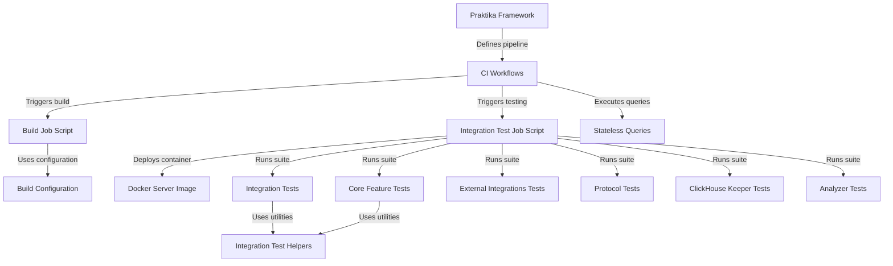

# Tutorial: ClickHouse

ClickHouse is a **high-performance OLAP database** designed for real-time analytics. The project includes a sophisticated *CI/CD infrastructure* powered by the Praktika framework to orchestrate builds and tests. It utilizes **Docker** for deployment and runs extensive *integration and stateless query tests* to verify distributed features, external integrations, and core database functionality.

**Source Repository:** [https://github.com/ClickHouse/ClickHouse](https://github.com/ClickHouse/ClickHouse)

## Chapters

1. [Praktika Framework](01_praktika_framework.md)
2. [CI Workflows](02_ci_workflows.md)
3. [Build Configuration](03_build_configuration.md)
4. [Build Job Script](04_build_job_script.md)
5. [Docker Server Image](05_docker_server_image.md)
6. [Stateless Queries](06_stateless_queries.md)
7. [Integration Test Job Script](07_integration_test_job_script.md)
8. [Integration Tests](08_integration_tests.md)
9. [Core Feature Tests](09_core_feature_tests.md)
10. [Analyzer Tests](10_analyzer_tests.md)
11. [ClickHouse Keeper Tests](11_clickhouse_keeper_tests.md)
12. [Protocol Tests](12_protocol_tests.md)
13. [External Integrations Tests](13_external_integrations_tests.md)
14. [Integration Test Helpers](14_integration_test_helpers.md)

---

Generated by [Code IQ](https://github.com/adityasoni99/Code-IQ)