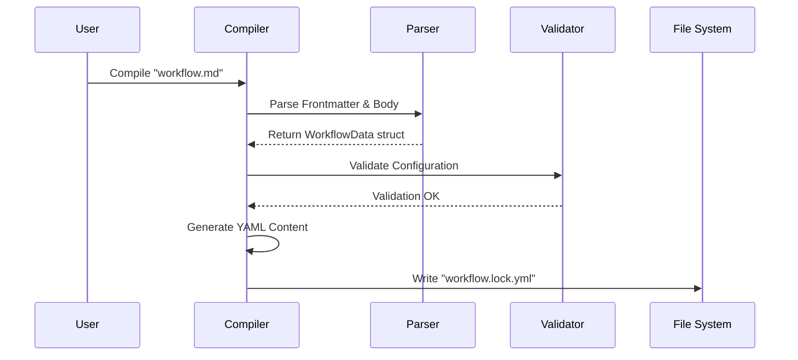

# Chapter 1: Workflow Compiler

Welcome to the **GitHub Agentic Workflows** tutorial! We are starting with the absolute core of the system: the **Workflow Compiler**.

If you've ever written a GitHub Actions workflow, you know that YAML files can get complicated, verbose, and fragile. Imagine if you could instead write a simple, human-readable document describing what you want your AI agent to do, and a machine automatically converted that into the strict code required by GitHub.

That is exactly what the Workflow Compiler does.

## The Core Concept: Sketch vs. Blueprint

Think of the Workflow Compiler as a **translator** or **transpiler**.

1.  **The Sketch (Input):** You write a `.md` (Markdown) file. It contains high-level instructions for an AI agent and configuration in the "frontmatter" (the metadata at the top of the file). It's easy for humans to read and edit.
2.  **The Blueprint (Output):** The Compiler transforms that sketch into a `.lock.yml` file. This is a rigorous GitHub Actions workflow file. It is "locked" because you shouldn't edit it manually; the machine generates it for you.

### Why do we need this?

GitHub Actions runners don't understand Markdown prompts or abstract AI instructions. They only understand strict YAML syntax. The Workflow Compiler bridges this gap, handling:
*   **Validation:** Ensuring your configuration is safe and correct.
*   **Expansion:** Turning one line of configuration into fifty lines of YAML boilerplate.
*   **Safety:** Injecting security layers automatically.

---

## How It Works: A Use Case

Let's look at a simple example.

### 1. The Input (The Sketch)
You create a file called `.github/workflows/triage-agent.md`.

```markdown
---
name: Triage Agent
on:
  issues:
    types: [opened]
permissions:
  issues: write
---

# Triage Instructions

Please look at the new issue. If it is a bug, label it 'bug'.
If it is a feature request, label it 'enhancement'.
```

### 2. The Compilation Process
When the compiler runs, it reads this file. It sees you want to trigger on `issues`, so it generates the necessary YAML event triggers. It sees you need `issues: write` permission, so it adds that to the job config.

### 3. The Output (The Blueprint)
The compiler generates `.github/workflows/triage-agent.lock.yml`. It might look like this (simplified):

```yaml
# GENERATED FILE - DO NOT EDIT
name: Triage Agent
on:
  issues:
    types: [opened]
jobs:
  agent-run:
    permissions:
      issues: write
    steps:
      - name: Execute Agent
        uses: agentic-engine/action@v1
        with:
          prompt: "Please look at the new issue..."
```

---

## Under the Hood: The Compilation Pipeline

What happens internally when the compiler runs? Let's visualize the process.



The compiler follows a strict pipeline to ensure the output is valid and safe.

### Step 1: Parsing the Sketch
The compiler first reads the Markdown file. It splits the file into **Frontmatter** (YAML metadata) and **Markdown Content** (the prompt).

Here is how the compiler starts the process in `pkg/workflow/compiler.go`:

```go
// CompileWorkflow is the main entry point
func (c *Compiler) CompileWorkflow(markdownPath string) error {
    // 1. Parse the markdown file into a struct
    workflowData, err := c.ParseWorkflowFile(markdownPath)
    if err != nil {
        return formatCompilerError(markdownPath, "error", err.Error(), err)
    }

    // 2. Continue to compile the parsed data
    return c.CompileWorkflowData(workflowData, markdownPath)
}
```
*   **Explanation:** The function takes the path to your `.md` file. It calls `ParseWorkflowFile` to turn text into a Go struct (`workflowData`), and then passes that data to the next stage.

### Step 2: Validating the Configuration
Before generating any YAML, the compiler must ensure your "sketch" makes sense. It uses **JSON Schemas** to strictly validate the configuration.

In `pkg/parser/schema_compiler.go`, we see how validation works:

```go
func validateWithSchema(frontmatter map[string]any, schemaJSON, context string) error {
    // 1. Get the compiled schema (cached for performance)
    schema, err := getCompiledMainWorkflowSchema()
    if err != nil {
        return fmt.Errorf("schema error: %w", err)
    }

    // 2. Validate the frontmatter against the schema
    if err := schema.Validate(frontmatter); err != nil {
        return err
    }

    return nil
}
```
*   **Explanation:** This function loads a formal definition (Schema) of what a workflow *should* look like. It checks your frontmatter against this rulebook. If you misspelled a key or used the wrong data type, it fails here, protecting you from generating broken YAML.

### Step 3: Safety Checks
The compiler isn't just a translator; it's also a security guard. It checks for dangerous permissions or configurations.

Back in `pkg/workflow/compiler.go`:

```go
func (c *Compiler) validateWorkflowData(data *WorkflowData, path string) error {
    // 1. Check for dangerous permissions (like admin access)
    if err := validateDangerousPermissions(data); err != nil {
        return formatCompilerError(path, "error", err.Error(), err)
    }

    // 2. Validate network firewall settings
    if err := validateNetworkFirewallConfig(data.NetworkPermissions); err != nil {
        return formatCompilerError(path, "error", err.Error(), err)
    }
    
    // ... more checks ...
    return nil
}
```
*   **Explanation:** Before generating code, the compiler runs specific checks. For example, `validateNetworkFirewallConfig` ensures that if you define network rules, they are valid. This connects directly to the [Isolation Layer (Firewall & Sandbox)](04_isolation_layer__firewall___sandbox_.md) which we will cover in Chapter 4.

### Step 4: Generating and Writing the Blueprint
Finally, if everything is valid, the compiler generates the YAML string and writes it to the disk.

```go
func (c *Compiler) generateAndValidateYAML(data *WorkflowData, path, lockFile string) (string, error) {
    // 1. Generate the actual YAML string
    yamlContent, err := c.generateYAML(data, path)
    if err != nil {
        return "", err
    }

    // 2. Validate the output size (GitHub has a 500KB limit)
    if len(yamlContent) > MaxLockFileSize {
        // Handle error...
    }

    return yamlContent, nil
}
```
*   **Explanation:** `generateYAML` (not shown) does the heavy lifting of formatting the text. This function wraps it, checking limits like `MaxLockFileSize` (500KB) to ensure GitHub won't reject the file later.

---

## Validating Safe Outputs

One of the most critical jobs of the Compiler is handling **Safe Outputs**. When an AI agent runs, we often want it to produce structured data (like a boolean flag `is_bug: true`).

The compiler parses these definitions from your schema to ensure the agent understands them.

```go
// From pkg/parser/schema_compiler.go
func GetSafeOutputTypeKeys() ([]string, error) {
    // ... setup code ...
    
    // Extract keys that are actual safe output types
    var keys []string
    for key := range safeOutputsProperties {
        // Filter out meta-fields like 'env' or 'runs-on'
        if !safeOutputMetaFields[key] {
            keys = append(keys, key)
        }
    }
    return keys, nil
}
```
*   **Explanation:** The compiler distinguishes between configuration (like *where* to run) and actual outputs (like *what* to return). We will dive deep into how these are used in the [Safe Outputs System](03_safe_outputs_system.md).

---

## Conclusion

The **Workflow Compiler** is the foundation of the Agentic Workflow project. It allows developers to work in a high-level, human-friendly Markdown format while ensuring the final result is a rigorous, secure, and executable GitHub Actions YAML file.

By separating the "Sketch" from the "Blueprint," we gain:
1.  **Simplicity:** Write Markdown, not complex YAML.
2.  **Safety:** Automated validation and security checks.
3.  **Reliability:** The compiler prevents syntax errors before they hit GitHub.

Now that we have compiled our workflow into a "Blueprint," how does the system actually execute the prompt instructions?

[Next Chapter: Agentic Engine Interface](02_agentic_engine_interface.md)

---

Generated by [Code IQ](https://github.com/adityasoni99/Code-IQ)