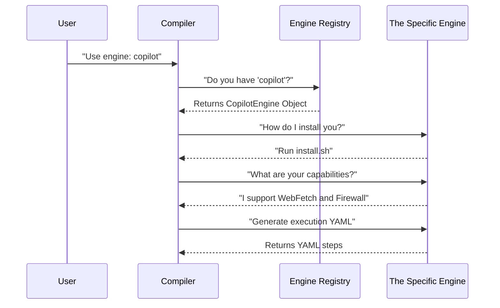

# Chapter 2: Agentic Engine Interface

In [Chapter 1: Workflow Compiler](01_workflow_compiler.md), we learned how to turn a simple Markdown sketch into a complex GitHub Actions blueprint.

But here is a question: **Who actually does the work?**

When you write "Fix this bug," which AI model reads that? Is it GitHub Copilot? OpenAI's Codex? Anthropic's Claude? And crucially, if you want to switch from one AI to another, do you have to rewrite your entire system?

This brings us to the **Agentic Engine Interface**.

## The Core Concept: The Universal Driver

Imagine you are buying a video game console. You don't need a different TV for every game console. You just plug the console into your TV using a standard HDMI cable. The TV doesn't care if it's displaying a PlayStation or an Xbox; it just displays the signal.

The **Agentic Engine Interface** is that HDMI cable.

*   **The TV:** The GitHub Agentic Workflows system (the Compiler, the Logging, the Security).
*   **The Console:** The specific AI backend (Copilot, Claude, etc.).
*   **The Interface:** A standard set of rules that allows *any* AI "Console" to plug into our system.

### Why is this important?

Without this interface, our compiler would look like this:

```go
// BAD DESIGN (Don't do this!)
if userWantsCopilot {
    generateCopilotYaml()
} else if userWantsClaude {
    generateClaudeYaml()
}
```

Every time a new AI model comes out, we'd have to rewrite the core compiler.

With the **Agentic Engine Interface**, the compiler looks like this:

```go
// GOOD DESIGN
engine.GetExecutionSteps()
```

The compiler doesn't care *which* engine it is. It just asks the engine to do the work.

---

## Use Case: Switching "Brains"

Let's see how this benefits you, the user.

Imagine you have a workflow using the default **Copilot** engine.

```markdown
---
name: Bug Fixer
engine: copilot   <-- The "Brain"
---
# Instructions
Fix the bug in main.go
```

Now, you want to test if the new **Claude** engine performs better. Because of the Interface, you only change **one word**:

```markdown
---
name: Bug Fixer
engine: claude    <-- Swapped!
---
# Instructions
Fix the bug in main.go
```

The system automatically loads the "Claude Driver," changes the installation steps, updates the required secrets, and adjusts the network permissions—all automatically.

---

## Under the Hood: The Abstraction Layer

How does the code handle this? Let's visualize the flow when the compiler runs.



The Compiler never needs to know the specific details of Copilot. It just asks standard questions defined by the Interface.

---

## Implementation: Defining the Interface

In Go (the language used for this project), an **Interface** is a contract. It says, "If you want to be an Engine, you must be able to do these specific things."

Let's look at `pkg/workflow/agentic_engine.go`. We use a "Composite Interface," which means we group small sets of duties together.

### 1. The Core Identity
First, an engine must identify itself.

```go
type Engine interface {
    GetID() string           // e.g., "copilot"
    GetDisplayName() string  // e.g., "GitHub Copilot CLI"
    GetDescription() string  // What do I do?
    IsExperimental() bool    // Am I stable?
}
```
*   **Explanation:** Every engine must answer "Who are you?".

### 2. The Execution Logic
This is the most important part. The engine must tell the compiler how to create the GitHub Actions YAML.

```go
type WorkflowExecutor interface {
    // Returns YAML steps to install the tool (e.g., download binaries)
    GetInstallationSteps(data *WorkflowData) []GitHubActionStep

    // Returns YAML steps to actually run the prompt
    GetExecutionSteps(data *WorkflowData, logFile string) []GitHubActionStep
}
```
*   **Explanation:** The compiler calls `GetInstallationSteps`. The Copilot engine returns code to download the Copilot CLI. The Claude engine returns code to download the Claude CLI. The compiler writes it to the file without caring what it is.

### 3. Capability Checks (Feature Flags)
Not all AI models are equal. Some can browse the web; some can't. Some support Firewalls; others don't.

```go
type CapabilityProvider interface {
    SupportsWebFetch() bool   // Can I download files from the internet?
    SupportsFirewall() bool   // Do I work with the isolation layer?
    SupportsMaxTurns() bool   // Can you limit how many steps I take?
}
```
*   **Explanation:** Before the compiler adds firewall rules, it asks `SupportsFirewall()`. If the engine says `false`, the compiler skips generating those rules. This connects to the [Isolation Layer (Firewall & Sandbox)](04_isolation_layer__firewall___sandbox_.md).

---

## Real World Example: The Copilot Engine

Let's look at how the **Copilot** engine implements this contract in `pkg/workflow/copilot_engine.go`.

```go
type CopilotEngine struct {
    BaseEngine // Inherit common defaults
}

func NewCopilotEngine() *CopilotEngine {
    return &CopilotEngine{
        BaseEngine: BaseEngine{
            id:                "copilot",
            displayName:       "GitHub Copilot CLI",
            supportsWebFetch:  true,  // Yes, I can fetch the web!
            supportsFirewall:  true,  // Yes, I support the firewall!
        },
    }
}
```

And here is how it tells the system which secrets it needs (like API keys):

```go
func (e *CopilotEngine) GetRequiredSecretNames(data *WorkflowData) []string {
    // Copilot always needs a GitHub Token
    secrets := []string{"COPILOT_GITHUB_TOKEN"}
    
    // If we are using MCP (Chapter 6), we need a Gateway Key too
    if HasMCPServers(data) {
        secrets = append(secrets, "MCP_GATEWAY_API_KEY")
    }
    
    return secrets
}
```
*   **Explanation:** The engine logic is self-contained. If we added a "Gemini Engine," it would return `GEMINI_API_KEY` instead. The rest of the system remains unchanged.

---

## The Registry: finding the Engine

How does the compiler know which engine to pick? It uses the **Engine Registry** (`pkg/workflow/agentic_engine.go`).

Think of this as a menu in a restaurant.

```go
func NewEngineRegistry() *EngineRegistry {
    registry := &EngineRegistry{
        engines: make(map[string]CodingAgentEngine),
    }

    // Add items to the menu
    registry.Register(NewClaudeEngine())
    registry.Register(NewCodexEngine())
    registry.Register(NewCopilotEngine())

    return registry
}
```

When you write `engine: copilot` in your Markdown file, the compiler looks up the string "copilot" in this registry and gets the matching object.

---

## Conclusion

The **Agentic Engine Interface** is the key to flexibility. It allows the GitHub Agentic Workflows system to be "Model Agnostic."

By standardizing how we **Install**, **Execute**, and **Check Capabilities** of an AI model, we allow users to swap the "brain" of their workflow as easily as changing a single line of text.

Now that we have an engine running, it's going to start producing data, answers, and potentially files. How do we ensure the agent gives us exactly what we need, in a format we can use?

[Next Chapter: Safe Outputs System](03_safe_outputs_system.md)

---

Generated by [Code IQ](https://github.com/adityasoni99/Code-IQ)