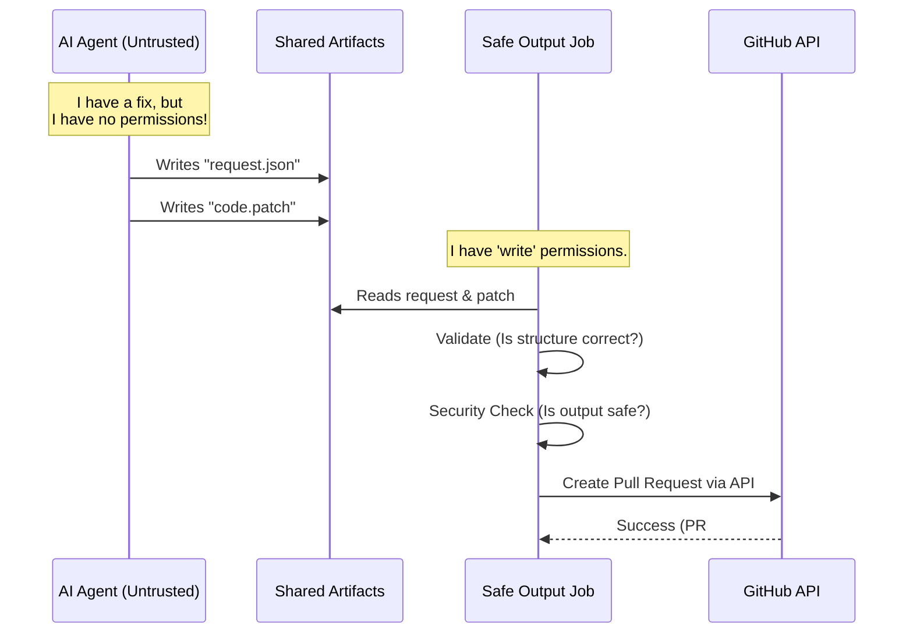

# Chapter 3: Safe Outputs System

In [Chapter 2: Agentic Engine Interface](02_agentic_engine_interface.md), we gave our workflow a "brain" by plugging in an AI model (like Copilot or Claude).

But here is the problem: **Brains can be dangerous.**

Imagine an AI agent accidentally hallucinates a command to delete your entire repository history, or pushes a commit that leaks your API keys. If we give the AI agent direct "Write Access" to your repository, these accidents become permanent disasters.

This chapter introduces the **Safe Outputs System**, the security architecture that prevents this.

## The Core Concept: The Bank Teller

To understand Safe Outputs, think of a **Bank**.

1.  **The Customer (The AI Agent):** The customer wants to transfer money. However, the customer is **not allowed** to walk into the vault and grab the cash themselves. That would be chaotic and insecure.
2.  **The Slip (The Artifact):** Instead, the customer fills out a **transaction slip**. This is just a piece of paper. It can't hurt anyone.
3.  **The Teller (The Safe Output Job):** The customer slides the slip under the glass to the Teller. The Teller checks the signature, checks the balance, and if everything looks good, **the Teller performs the transaction**.

In **GitHub Agentic Workflows**:
*   The **AI Agent** runs in a locked-down, read-only box. It cannot change your code.
*   If it wants to change something, it writes a **JSON file** (the slip).
*   A separate, trusted **Safe Output Job** (the teller) reads that file, validates it, and performs the action.

## Use Case: Creating a Pull Request

Let's say you want an agent to fix a bug and open a Pull Request (PR).

### 1. The Configuration
In your Markdown file, you tell the compiler you want to allow this specific action:

```markdown
---
name: Bug Fixer
permissions:
  contents: read  # Note: The agent is READ ONLY
safe-outputs:
  create-pull-request: # The "Teller" we are hiring
    draft: true
---
# Instructions
Fix the bug in main.go
```

### 2. What the Agent Does
The agent reads the code and figures out the fix. Since it cannot run `git push`, it generates a "Request Artifact" (a JSON file) that looks like this:

```json
{
  "action": "create-pull-request",
  "title": "Fix crash in main.go",
  "body": "I handled the nil pointer exception.",
  "patch": "diff --git a/main.go b/main.go..."
}
```

### 3. What the System Does
The Agent job finishes. Then, the **Safe Output Job** wakes up. It reads that JSON, checks if the patch is valid, checks if the branch name is allowed, and uses a secure GitHub Token to actually open the PR.

---

## How It Works: The Flow of Data

Let's visualize how data moves from the untrusted Agent to the trusted Repository.



The Agent never touches the GitHub API directly. It only touches the disk.

---

## Under the Hood: The Compiler's Job

The **Workflow Compiler** (from [Chapter 1](01_workflow_compiler.md)) is responsible for setting up this relay race. When it sees `safe-outputs` in your Markdown, it splits your workflow into two distinct jobs.

### 1. Building the Safe Output Job
In `pkg/workflow/create_pull_request.go`, the compiler generates the YAML for the "Teller."

```go
// From pkg/workflow/create_pull_request.go

func (c *Compiler) buildCreateOutputPullRequestJob(data *WorkflowData, ...) (*Job, error) {
    // 1. Define the permissions this SPECIAL job needs
    permissions := NewPermissionsContentsWritePRWrite()
    
    // 2. Configure environment variables for the job
    var customEnvVars []string
    
    // Pass configuration from your Markdown to the job env
    customEnvVars = append(customEnvVars, 
        fmt.Sprintf("GH_AW_PR_DRAFT: %q", fmt.Sprintf("%t", draftValue)))
        
    // 3. Create the job structure
    return c.buildSafeOutputJob(data, SafeOutputJobConfig{
        JobName:     "create_pull_request",
        Permissions: permissions, // Give write access ONLY to this job
        // ...
    })
}
```
*   **Explanation:** The compiler explicitly grants `contents: write` and `pull-requests: write` **only** to this specific job. The Agent job remains read-only.

### 2. Passing the Instructions
The compiler also ensures the "Safe Output Job" knows how to behave. It takes the settings you wrote in Markdown (like `draft: true`) and converts them into Environment Variables (`GH_AW_PR_DRAFT`).

---

## Runtime Validation: The JavaScript Handler

Once the workflow is running on GitHub, the "Safe Output Job" executes a JavaScript handler to process the request. This is where the actual validation happens.

Let's look at a different example: `dispatch_workflow`. This safe output allows an agent to trigger *another* workflow.

In `actions/setup/js/dispatch_workflow.cjs`, we see how the system validates the request:

```javascript
// From actions/setup/js/dispatch_workflow.cjs

// The main function that processes the agent's request
async function handleDispatchWorkflow(message) {
    const workflowName = message.workflow_name;

    // VALIDATION 1: Is the name empty?
    if (!workflowName || workflowName.trim() === "") {
        return { success: false, error: "Workflow name is empty" };
    }

    // VALIDATION 2: Is the agent allowed to trigger this?
    if (allowedWorkflows.length > 0 && !allowedWorkflows.includes(workflowName)) {
        return { success: false, error: "Workflow not in allowed list" };
    }

    // EXECUTION: If valid, call GitHub API
    await github.rest.actions.createWorkflowDispatch({
        workflow_id: workflowName,
        // ...
    });
}
```
*   **Explanation:** Even if the AI Agent "hallucinates" and tries to trigger a dangerous workflow (like `deploy-to-prod`), this handler blocks it because it validates the input against an `allowedWorkflows` list before calling the API.

---

## Why "Safe Outputs" Matter

This architecture provides three critical benefits:

1.  **Least Privilege:** The AI running the prompt has **Read-Only** access. If the AI goes rogue, it can't delete code.
2.  **Structured Validation:** We can enforce rules (like "PRs must be drafts" or "Titles must start with [AI]") programmatically in the Safe Output job.
3.  **Human-in-the-Loop:** Because the output is often a Pull Request or an Issue, a human has a chance to review the AI's work before it is merged.

## Conclusion

The **Safe Outputs System** acts as the responsible adult in the room. It lets the AI be creative and generate code, but it keeps the keys to the repository safely in the pocket of a separate, trusted process.

Now that we know how to handle the *outputs* safely, we need to talk about the *environment* the agent lives in. How do we stop the agent from downloading viruses or scanning your private network?

[Next Chapter: Isolation Layer (Firewall & Sandbox)](04_isolation_layer__firewall___sandbox_.md)

---

Generated by [Code IQ](https://github.com/adityasoni99/Code-IQ)