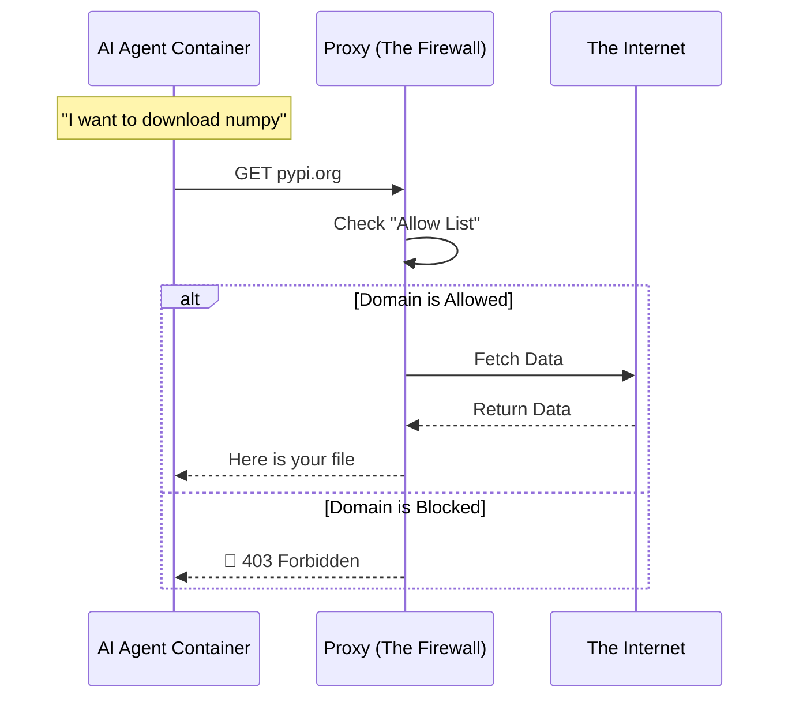

# Chapter 4: Isolation Layer (Firewall & Sandbox)

In [Chapter 3: Safe Outputs System](03_safe_outputs_system.md), we acted like a bank manager, ensuring that the AI agent couldn't rob the vault (your repository) by strictly controlling its **Write Access**.

But what if the spy isn't trying to steal money, but trying to leak secrets? Or what if the agent accidentally downloads a virus from the internet?

This brings us to the **Isolation Layer**.

## The Core Concept: The Bio-Safety Cabinet

Imagine a scientist working with a dangerous virus. They don't work at a kitchen table. They work inside a **Bio-Safety Cabinet**:

1.  **Sealed Glass (The Sandbox):** The virus cannot escape into the room.
2.  **Air Filters (The Firewall):** Nothing enters or leaves the cabinet without passing through strict filters.

In **GitHub Agentic Workflows**, the AI Agent is the scientist:
*   **The Sandbox (Filesystem):** The agent runs inside a container. It can see your code to fix it, but it cannot permanently damage the underlying server (the GitHub Runner).
*   **The Firewall (Network):** The agent cannot connect to `evil-server.com`. It can only talk to specific, trusted domains you list on the door.

## Why do we need this?

Standard GitHub Actions runners have unrestricted internet access. If you run `npm install` and a malicious package steals your `GITHUB_TOKEN`, it sends it to a hacker's server immediately.

Our Isolation Layer (Agent Workflow Firewall - AWF) prevents this by blocking **all** outgoing network traffic by default, only allowing what is necessary.

---

## How It Works: The "Clean Room"

Let's look at how to set this up in your Markdown workflow.

### 1. The Configuration
You define the rules in the `network` section of your workflow file.

```markdown
---
name: Secure Fixer
network:
  firewall: true
  allowed:
    - defaults     # GitHub APIs, etc.
    - python       # PyPI (to download packages)
    - "api.google.com" # A specific trusted domain
---
# Instructions
Write a script that queries Google API.
```

### 2. The Enforcement
When the agent tries to run code:
*   `requests.get("https://api.google.com")` -> **ALLOWED**.
*   `requests.get("https://hacker.site")` -> **BLOCKED** (Connection Refused).

This happens transparently. The agent doesn't know it's in a cage until it hits the bars.

---

## Under the Hood: The Architecture

How do we technically achieve this isolation on a GitHub Runner? We use a sidecar container proxy.



The system uses `iptables` (Linux networking rules) to force **all** traffic from the Agent container to go through the Proxy container. The Agent cannot bypass this.

### Implementation: Checking the Rules

The **Workflow Compiler** (from [Chapter 1](01_workflow_compiler.md)) is responsible for checking if the firewall should be on.

In `pkg/workflow/firewall.go`, the system decides whether to deploy the isolation layer:

```go
// isFirewallEnabled determines if we need to lock the doors
func isFirewallEnabled(workflowData *WorkflowData) bool {
    // 1. Did the user explicitly disable it in the sandbox settings?
    if isFirewallDisabledBySandboxAgent(workflowData) {
        return false
    }

    // 2. Did the user explicitly ask for it?
    if workflowData.NetworkPermissions.Firewall.Enabled {
        return true
    }

    // 3. Default: If using a Sandbox, the firewall is ON.
    return isSandboxEnabled(workflowData)
}
```
*   **Explanation:** Safety is the default. Unless you explicitly turn it off or use a mode that doesn't support it, the compiler assumes you want the firewall enabled.

### Implementation: Configuring the Proxy

Once enabled, we need to translate your simple list (`python`, `node`) into technical rules for the proxy. We also handle advanced features like "SSL Bump" (which allows the proxy to inspect HTTPS URLs, not just domain names).

```go
// From pkg/workflow/firewall.go

func getSSLBumpArgs(config *FirewallConfig) []string {
    if config == nil || !config.SSLBump {
        return nil
    }

    // Enable deep inspection of encrypted traffic
    args := []string{"--ssl-bump"}
    
    // Add specific URL paths to the allow list
    if len(config.AllowURLs) > 0 {
        list := strings.Join(config.AllowURLs, ",")
        args = append(args, "--allow-urls", list)
    }

    return args
}
```
*   **Explanation:** If you enable `SSLBump`, the firewall acts like a "Man in the Middle" (a good one). It decrypts the traffic locally to check the full URL (e.g., allow `github.com/my-org` but block `github.com/other-org`), then re-encrypts it.

---

## The Filesystem Sandbox

Network is only half the battle. We also need to restrict the filesystem.

The **Agentic Engine** (from [Chapter 2](02_agentic_engine_interface.md)) runs inside a container. By default, it can:
1.  Read the code in your repository (mounted as a volume).
2.  Write to temporary folders.
3.  **NOT** access the GitHub Runner's system files (`/etc`, `/usr/bin` of the host).

### Configuring the Agent Sandbox

In `pkg/workflow/sandbox.go`, we manage the configuration for this container.

```go
// SandboxConfig defines the environment structure
type SandboxConfig struct {
    // Configuration for the Agent's container
    Agent *AgentSandboxConfig `yaml:"agent,omitempty"`
    
    // Configuration for MCP Servers (covered in Chapter 6)
    MCP   *MCPGatewayConfig   `yaml:"mcp,omitempty"`
}
```

When the system boots up, it applies defaults to ensure you are protected even if you forget to configure it.

```go
// applySandboxDefaults ensures safety is on by default
func applySandboxDefaults(config *SandboxConfig) *SandboxConfig {
    // If no config exists, create a default "AWF" (Firewall) sandbox
    if config == nil {
        return &SandboxConfig{
            Agent: &AgentSandboxConfig{ Type: SandboxTypeAWF },
        }
    }
    
    return config
}
```
*   **Explanation:** The code strictly enforces that if you don't say otherwise, you get the "AWF" (Agent Workflow Firewall) sandbox. This aligns with the security principle of **Secure by Default**.

---

## Migrating from Legacy Systems

You might notice code referencing "SRT" (Sandbox Runtime). This was an older system. The project includes logic to automatically migrate users to the new, more secure AWF system.

```go
func migrateSRTToAWF(config *SandboxConfig) *SandboxConfig {
    // If the user asks for "srt", give them "awf" instead
    if config.Type == "srt" {
        sandboxLog.Printf("Migrating legacy sandbox to AWF")
        config.Type = SandboxTypeAWF
    }
    return config
}
```
*   **Explanation:** This is a "Codemod" (Code Modification). It ensures that as the security architecture evolves, old workflow files don't break; they just get upgraded automatically.

---

## Conclusion

The **Isolation Layer** is the invisible shield of the GitHub Agentic Workflows.
1.  **Sandbox:** Keeps the agent from damaging the host computer.
2.  **Firewall:** Keeps the agent from leaking data to the internet or downloading malware.

By combining **Read-Only Permissions** (Chapter 3) with **Network Isolation** (Chapter 4), we have created a very secure environment. The agent is locked in a room, unable to break out, unable to call home, and unable to overwrite the master records.

But even within a locked room, an agent might write code that *looks* safe but contains a hidden vulnerability. How do we spot that?

[Next Chapter: Threat Detection Layer](05_threat_detection_layer.md)

---

Generated by [Code IQ](https://github.com/adityasoni99/Code-IQ)