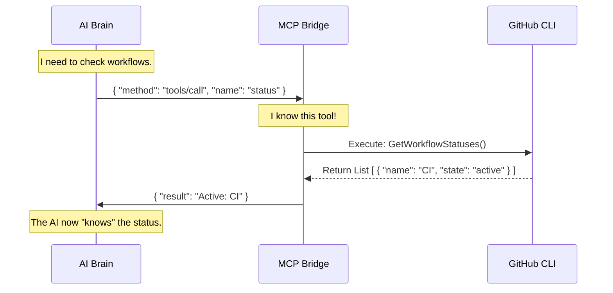

# Chapter 6: MCP Server Bridge

In [Chapter 5: Threat Detection Layer](05_threat_detection_layer.md), we acted as security guards, scanning the AI's output for malicious code or hidden traps.

Now that our agent is secure, we have a new problem: **It is trapped in a box.**

A secure AI model is just a text processing engine. It cannot natively "see" your files, run `git status`, or check your server logs. It only knows how to generate text.

To be useful, the AI needs "hands" to interact with the world. This brings us to the **MCP Server Bridge**.

## The Core Concept: The Universal Docking Station

The **Model Context Protocol (MCP)** is a standard that allows an AI model to connect to external tools.

Think of it like a **USB Hub** for Artificial Intelligence.
*   **The Computer (The AI):** The brain that wants to do work.
*   **The Peripheral (The Tool):** A specific utility, like a database client, a git command, or a log viewer.
*   **The USB Cable (MCP):** The standardized connection that makes them talk to each other without custom drivers.

In **GitHub Agentic Workflows**, the MCP Server Bridge sits between the AI Agent and the GitHub CLI. It translates the AI's desire ("I need to see the logs") into actual command-line executions.

---

## Use Case: "Check the Status"

Let's look at a concrete example. You want the AI to tell you if your workflows are running correctly.

### 1. The AI's Problem
The AI cannot just "look" at GitHub. If you ask "What is the status?", it will hallucinate an answer because it has no data.

### 2. The MCP Solution
We give the AI a tool called `status`.

1.  **AI Request:** The AI sends a JSON message: "Call tool `status`".
2.  **MCP Bridge:** Receives the message. It runs the internal Go function to check workflow files.
3.  **Response:** The Bridge sends back structured JSON data showing the workflows.
4.  **AI Output:** The AI reads the data and says: "Your 'Triage' workflow is currently failing."

---

## How It Works: The Conversation

The communication happens via **JSON-RPC** (Remote Procedure Call). It's a text-based conversation hidden from the user.



The AI doesn't need to know *how* to run the CLI command. It just needs to know the tool exists.

---

## Under the Hood: Defining Tools

How do we build this bridge? Let's look at the code in `pkg/cli/mcp_server.go`.

The server is built using a Go SDK that makes defining tools very easy. We define a tool by giving it a **Name**, a **Description**, and a **Handler Function**.

### Step 1: Defining the Arguments
First, we tell the AI what inputs the tool accepts. We use Go structs with tags to define this.

```go
// From pkg/cli/mcp_server.go

// The 'status' tool accepts an optional pattern string
type statusArgs struct {
    Pattern string `json:"pattern,omitempty" jsonschema:"Optional pattern to filter workflows"`
}
```
*   **Explanation:** This struct tells the AI: "If you want to use the status tool, you *can* provide a `pattern` to search for specific names, but it is optional."

### Step 2: Registering the Tool
Next, we add the tool to the MCP server. This is where we plug the "USB device" into the hub.

```go
mcp.AddTool(server, &mcp.Tool{
    Name: "status", 
    Description: "Show status of agentic workflow files.",
    Icons: []mcp.Icon{{Source: "📊"}},
}, func(ctx context.Context, req *mcp.CallToolRequest, args statusArgs) (*mcp.CallToolResult, any, error) {
    
    // This code runs when the AI calls the tool
    statuses, err := GetWorkflowStatuses(args.Pattern, "", "", "")
    
    // We convert the result to text/JSON and send it back
    outputStr := convertToJSON(statuses)

    return &mcp.CallToolResult{
        Content: []mcp.Content{
            &mcp.TextContent{Text: outputStr},
        },
    }, nil, nil
})
```
*   **Explanation:**
    1.  `mcp.AddTool`: Registers the capability.
    2.  `Name: "status"`: The keyword the AI uses to call it.
    3.  The anonymous function (the Handler) performs the actual work. It calls `GetWorkflowStatuses`, which is internal logic, and returns the result.

---

## Advanced Capabilities: The "Audit" Tool

Some tools are more powerful (and dangerous) than others. The `audit` tool allows the AI to investigate why a workflow failed by reading logs and error messages.

This requires checking permissions. We don't want a "Guest" user asking the AI to dump secure audit logs.

### Access Control in MCP
In `pkg/cli/mcp_server.go`, we implement security checks inside the tool handlers.

```go
func (ctx context.Context, req *mcp.CallToolRequest, args auditArgs) ... {
    // 1. Check if the user (Actor) has permission
    if err := checkActorPermission(actor, validateActor, "audit"); err != nil {
        return nil, nil, err
    }

    // 2. If allowed, execute the audit command
    cmdArgs := []string{"audit", args.RunIDOrURL, "--json"}
    cmd := execCmd(ctx, cmdArgs...)
    
    // ... return output ...
}
```
*   **Explanation:** Before running the expensive or sensitive `audit` command, the code calls `checkActorPermission`. If the user is just a "Reader," the Bridge refuses to run the tool, even if the AI asked nicely.

---

## The JavaScript Core: Handling the Protocol

While Go handles the specific GitHub tools, we also have a JavaScript core (`actions/setup/js/mcp_server_core.cjs`) that handles the raw protocol message parsing. This is useful when the agent runs inside a GitHub Action using Node.js.

It handles the low-level "handshake" between the AI and the tool.

```javascript
// From actions/setup/js/mcp_server_core.cjs

async function handleMessage(server, req) {
  const { id, method, params } = req;

  // 1. AI asks to list available tools
  if (method === "tools/list") {
    const list = Object.values(server.tools).map(tool => ({
        name: tool.name,
        inputSchema: tool.inputSchema
    }));
    server.replyResult(id, { tools: list });
  } 
  
  // 2. AI asks to call a specific tool
  else if (method === "tools/call") {
    const tool = server.tools[params.name];
    const result = await tool.handler(params.arguments);
    server.replyResult(id, { content: result.content });
  }
}
```
*   **Explanation:**
    *   `tools/list`: The AI asks "What can I do?". The server replies "You can run `status`, `logs`, or `audit`."
    *   `tools/call`: The AI says "Run `status`". The server finds the function and runs it.

---

## Connecting External Scripts

The MCP Bridge is extensible. You aren't limited to the built-in Go tools. You can register Python scripts, Shell scripts, or JavaScript files as tools.

The system automatically detects the file type and creates a handler:

```javascript
// From actions/setup/js/mcp_server_core.cjs

if (ext === ".py") {
    // It's a Python script!
    tool.handler = createPythonHandler(server, toolName, path);
} else if (ext === ".sh") {
    // It's a Shell script!
    tool.handler = createShellHandler(server, toolName, path);
}
```
*   **Explanation:** This allows you to drop a file named `cleanup_db.py` into your tools folder, and the MCP Bridge immediately exposes a `cleanup_db` tool to the AI.

---

## Conclusion

The **MCP Server Bridge** acts as the translator and authorized operator for the AI.

1.  **Standardization:** The AI interacts with all tools (Go, Python, Shell) using one standard JSON protocol.
2.  **Safety:** The Bridge enforces permissions (like `checkActorPermission`) before executing commands.
3.  **Extensibility:** We can add new capabilities (like `status` or `audit`) without retraining the AI model.

The AI can now inspect the system, run diagnostics, and even compile workflows. But looking at raw JSON output in a terminal isn't very user-friendly for humans watching the process.

How do we make the output look good for the human operator?

[Next Chapter: Console UI & Formatting](07_console_ui___formatting.md)

---

Generated by [Code IQ](https://github.com/adityasoni99/Code-IQ)