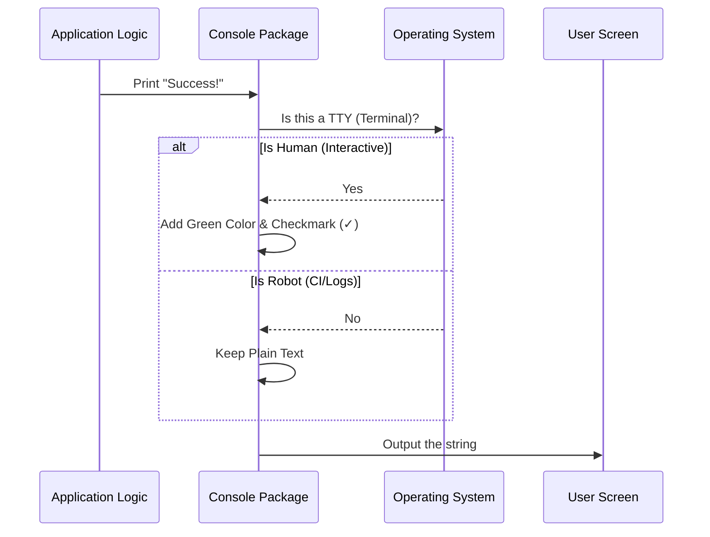

# Chapter 7: Console UI & Formatting

In [Chapter 6: MCP Server Bridge](06_mcp_server_bridge.md), we gave our AI agent "hands" to run commands and fetch data. The agent can now check statuses, read logs, and perform audits.

However, the agent and the system communicate in raw data (JSON, structs, and error codes). While machines love raw data, humans do not.

If you run a command and get a wall of unformatted white text, you might miss a critical error. If you get a JSON blob, it's hard to read at a glance.

This brings us to the **Console UI & Formatting** layer.

## The Core Concept: The Presentation Manager

Think of this layer as the **Waiter** in a restaurant.

1.  **The Kitchen (The System):** The Compiler and the Agent cook up the result (the food).
2.  **The Customer (The User):** You are waiting at the table (the Terminal).
3.  **The Waiter (Console UI):**
    *   If you are dining in (Interactive Terminal), the waiter plates the food beautifully with garnishes (Colors, Boxes, Emojis).
    *   If you ordered takeout (CI/Log File), the waiter packs it efficiently in plain boxes (Plain Text) so nothing spills.

**Why is this important?**
GitHub Actions logs usually don't support advanced cursor movements or interactive prompts. But your local terminal does. The **Console UI** detects where it is running and adapts automatically.

---

## Use Case: The "Smart" Error Message

Let's look at a concrete example. You made a mistake in your workflow file: you typed `engine: c3po` instead of `copilot`.

### Without Console UI
The system might just crash with:
`Error: invalid engine 'c3po' at line 4.`

### With Console UI
The system treats you like a human. It highlights the mistake visually.

```text
/path/to/workflow.md:4:10: error: invalid engine value
   3 | name: Fixer
   4 | engine: c3po
     |         ^^^^
```

This is called "Rust-like" error formatting, and our Console UI handles this rendering logic so the rest of the app doesn't have to worry about it.

---

## How It Works: The Flow of Output

How does the system decide how to dress up the text?



The application logic just says "I succeeded." The Console package figures out if that should look like `✓ Success!` (green) or `Success!` (plain).

---

## Under the Hood: The Console Package

Let's look at how this is implemented in `pkg/console/console.go`.

### 1. The TTY Check
The foundation of the entire system is knowing *where* we are running.

```go
// From pkg/console/console.go

// isTTY checks if stdout is a terminal
func isTTY() bool {
    // Uses a helper to check file descriptors
    return tty.IsStdoutTerminal()
}
```

*   **Explanation:** This function asks the Operating System: "Is the output attached to a human screen?" If yes, it returns `true`. If it's being piped to a file or running in GitHub Actions, it returns `false`.

### 2. Applying Styles
We use a library called **Lipgloss** to handle colors. But we wrap it to be safe.

```go
// applyStyle conditionally applies styling
func applyStyle(style lipgloss.Style, text string) string {
    // 1. If we are a human, render with colors
    if isTTY() {
        return style.Render(text)
    }
    // 2. If we are a robot, return plain text
    return text
}
```

*   **Explanation:** We define styles (like "Red for Error"). If `isTTY()` is true, `style.Render` wraps the text in ANSI color codes. If not, we return the raw text. This ensures your CI logs aren't filled with garbage characters like `\033[31m`.

### 3. Pre-defined Formats
To keep the UI consistent, we create helper functions for common messages.

```go
// FormatSuccessMessage adds a green checkmark
func FormatSuccessMessage(message string) string {
    // styles.Success is defined as Green color
    return applyStyle(styles.Success, "✓ ") + message
}

// FormatErrorMessage adds a red X
func FormatErrorMessage(message string) string {
    // styles.Error is defined as Red color
    return applyStyle(styles.Error, "✗ ") + message
}
```

*   **Explanation:** Developers working on the project don't need to remember color codes. They just call `console.FormatSuccessMessage("Done")`.

---

## Advanced Formatting: Tables

Printing a list of workflows isn't helpful if the columns don't align. The Console UI includes a table renderer.

### Defining a Table
The system uses a configuration struct to define the table data.

```go
type TableConfig struct {
    Headers   []string
    Rows      [][]string
    Title     string
    // ...
}
```

### Rendering the Table
In `pkg/console/console.go`, the `RenderTable` function handles the complexity of calculating column widths.

```go
func RenderTable(config TableConfig) string {
    // 1. Create a new Lipgloss table
    t := table.New().
        Headers(config.Headers...).
        Rows(config.Rows...).
        Border(styles.RoundedBorder) // Use pretty rounded corners

    // 2. Return the string representation
    return t.String()
}
```

*   **Result:**
    ```text
    ╭────────────┬──────────╮
    │ Workflow   │ Status   │
    ├────────────┼──────────┤
    │ Triage     │ Active   │
    │ CI Doctor  │ Disabled │
    ╰────────────┴──────────╯
    ```

If `isTTY()` was false, it would render a simpler version without the fancy rounded border characters, ensuring compatibility with older log viewers.

---

## Advanced Formatting: Error Context

The most complex part of the Console UI is `FormatError`. This function takes an error and the source code, and draws arrows pointing to the problem.

```go
type CompilerError struct {
    Position ErrorPosition // File, Line, Column
    Message  string
    Context  []string      // The actual code lines
}
```

The rendering logic acts like a mini-painter:

```go
func renderContext(err CompilerError) string {
    var output strings.Builder

    // Loop through the code lines
    for _, line := range err.Context {
        // ... (logic to print line numbers) ...

        // Highlight the specific bad word
        if lineNum == err.Position.Line {
             output.WriteString(applyStyle(styles.Highlight, line))
        }
    }
    return output.String()
}
```

*   **Explanation:** It calculates how much padding is needed for line numbers (e.g., `  1 |` vs ` 10 |`), highlights the specific line causing the error, and draws a pointer `^^^^` under the specific column if provided.

---

## Conclusion

The **Console UI & Formatting** layer is the face of the GitHub Agentic Workflows project. It abstracts away the complexity of terminal codes, ensuring that:
1.  **Humans** get a rich, interactive, colorful experience.
2.  **Robots/CI** get clean, parsable, plain text.

It unifies the "Look and Feel" of the application. Whether you are seeing a success message, a table of data, or a compilation error, the style remains consistent because it all passes through this single package.

You have now completed the entire architecture tutorial for GitHub Agentic Workflows!

### Summary of Your Journey
1.  **Compiler:** You learned how we turn Markdown sketches into YAML blueprints.
2.  **Engine:** You saw how we plug in different AI brains (Copilot, Claude).
3.  **Safe Outputs:** You learned how we let the AI write code without giving it keys to the vault.
4.  **Isolation:** You saw how we lock the agent in a box (Sandbox & Firewall).
5.  **Threat Detection:** You saw how we scan the output for hidden traps.
6.  **MCP Bridge:** You gave the agent tools to interact with the world.
7.  **Console UI:** You learned how we present the results beautifully to the user.

You are now ready to contribute to the project or build your own Agentic Workflows!

---

Generated by [Code IQ](https://github.com/adityasoni99/Code-IQ)