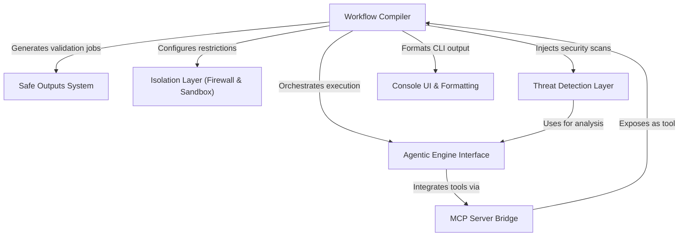

# Tutorial: GitHub-Agentic-Workflows

**GitHub Agentic Workflows** is a secure framework that compiles high-level **Markdown** workflow definitions into executable GitHub Actions. It acts as an orchestrator for AI agents, wrapping them in a rigorous **defense-in-depth** architecture that includes network *firewalls*, execution *sandboxes*, and a **Safe Outputs** system to validate and approve any changes (like Pull Requests) before they affect the repository.

**Source Repository:** [https://github.com/github/gh-aw](https://github.com/github/gh-aw)

## Chapters

1. [Workflow Compiler](01_workflow_compiler.md)
2. [Agentic Engine Interface](02_agentic_engine_interface.md)
3. [Safe Outputs System](03_safe_outputs_system.md)
4. [Isolation Layer (Firewall & Sandbox)](04_isolation_layer__firewall___sandbox_.md)
5. [Threat Detection Layer](05_threat_detection_layer.md)
6. [MCP Server Bridge](06_mcp_server_bridge.md)
7. [Console UI & Formatting](07_console_ui___formatting.md)

---

Generated by [Code IQ](https://github.com/adityasoni99/Code-IQ)