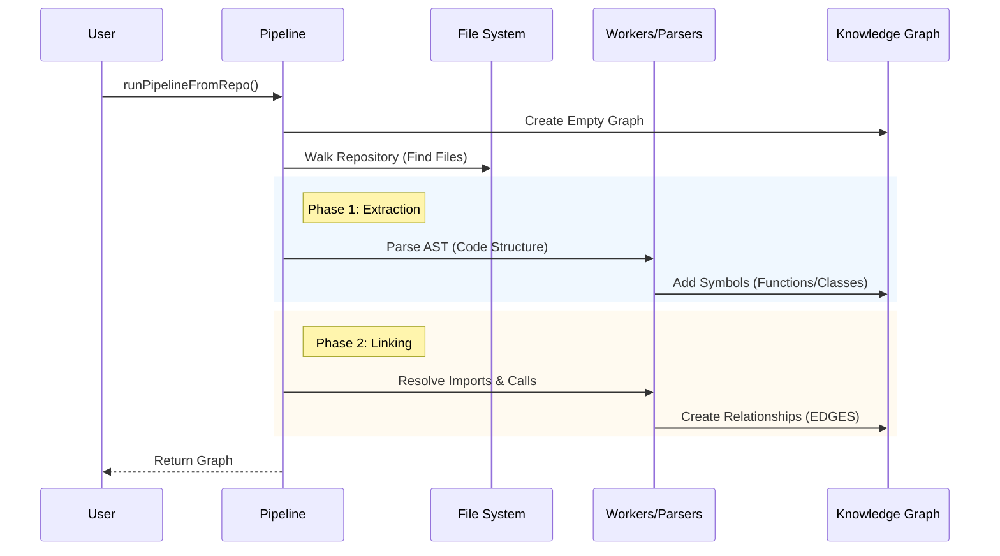

# Chapter 1: The Ingestion Pipeline

Welcome to the heart of GitNexus! 

If you are just joining us, this is the very first step in understanding how GitNexus turns a folder full of text files into a smart database you can query.

## The "Digestive System" of Code

Imagine you have a giant book written in a language you don't speak. To understand it, you wouldn't just stare at the pages. You would:
1.  **Scan** the pages to see how many there are.
2.  **Break down** sentences into words (verbs, nouns).
3.  **Connect** the dots (who is the main character? who are they talking to?).
4.  **Summarize** the plot.

The **Ingestion Pipeline** is exactly this, but for code. It acts like a digestive system:
1.  It **ingests** raw source files.
2.  It **breaks them down** (parsing).
3.  It **absorbs nutrients** (extracting symbols, function calls, and imports).
4.  It **maps relationships** (creating a connected graph).

### The Use Case

Why do we need this? Imagine you drop a complex TypeScript repository into GitNexus. You want to ask: *"What happens when a user logs in?"*

To answer this, GitNexus cannot just "search text." It needs to know:
*   Which function handles login?
*   What database functions does *that* function call?
*   Which file is that defined in?

The Ingestion Pipeline runs once to build this map so you can ask unlimited questions later.

## High-Level Concepts

The pipeline is orchestrating a series of specialized processors. Here is the flow:

1.  **File Walker:** Finds all relevant files (ignoring `.git`, `node_modules`, etc.).
2.  **Structure Processor:** Creates nodes for directories and files.
3.  **Parsing:** Reads the code syntax to find Classes, Functions, and Variables.
4.  **Linking:**
    *   **Imports:** Connects files to other files they depend on.
    *   **Calls:** Connects functions to other functions they use.
    *   **Heritage:** Connects classes to their parents (inheritance).
5.  **Community Detection:** Groups related files into "neighborhoods" (e.g., all "User" related code).
6.  **Process Detection:** Traces execution flows (e.g., A calls B, which calls C).

## How to Use It

In the codebase, the pipeline is triggered via the `runPipelineFromRepo` function. You don't usually call the internal steps manually; this function runs them in the correct order.

Here is what it looks like to start the engine:

```typescript
import { runPipelineFromRepo } from './core/ingestion/pipeline.js';

const repoPath = '/path/to/my-project';

// Run the pipeline
const result = await runPipelineFromRepo(repoPath, (progress) => {
  // This callback lets us know what's happening
  console.log(`[${progress.phase}] ${progress.percent}% complete`);
});

console.log(`Done! Created ${result.graph.nodeCount} nodes.`);
```

**What happens here?**
1.  We point the pipeline to a folder (`repoPath`).
2.  We pass a callback function to watch the progress (like a loading bar).
3.  The `result` contains the fully constructed `Knowledge Graph`.

## Implementation Walkthrough

Let's look under the hood. The pipeline is essentially a **Manager**. It doesn't do the parsing itself; it hires specialized workers (processors) to do it.

Here is the sequence of events:



### Deep Dive: The Code

Let's look at `gitnexus/src/core/ingestion/pipeline.ts`. We will break the big function down into small, understandable chunks.

#### Step 1: Initialization

First, we prepare the empty containers.

```typescript
export const runPipelineFromRepo = async (repoPath, onProgress) => {
  // 1. Create an empty graph database in memory
  const graph = createKnowledgeGraph();
  
  // 2. Prepare a lookup table for symbols (variables/functions)
  const symbolTable = createSymbolTable();
  
  // 3. Prepare a cache for ASTs (Abstract Syntax Trees) so we don't re-read files
  let astCache = createASTCache(50); // placeholder size
  
  // ... continued below
```

*   **Explanation:** We need a place to store our data (`graph`) and a way to remember what we've read (`astCache`) so we don't waste time reading the same file twice.

#### Step 2: Scanning Files

Next, we walk the file system.

```typescript
  // ...
  onProgress({ phase: 'extracting', percent: 0, message: 'Scanning...' });

  // 4. Find all files in the folder
  const files = await walkRepository(repoPath, (curr, total, path) => {
    // Update progress bar
    onProgress({ phase: 'extracting', percent: ... });
  });

  // 5. Save file contents for later use
  files.forEach(f => fileContents.set(f.path, f.content));
```

*   **Explanation:** `walkRepository` recursively looks through folders. We store the raw text content immediately because we'll need it for parsing.

#### Step 3: Parsing (The Heavy Lifting)

This is where the magic happens. We try to use parallel workers to speed things up.

```typescript
  // ...
  // 6. Attempt to create a pool of background workers
  const workerPool = createWorkerPool(workerUrl);

  // 7. Parse the code!
  // This looks at text like "function add(a,b)" and understands it's a Function named "add"
  const workerData = await processParsing(
    graph, files, symbolTable, astCache, 
    progressCallback, workerPool
  );
```

*   **Explanation:** `processParsing` reads the code syntax. If you have a multi-core processor, `workerPool` allows GitNexus to parse multiple files at the same time. We will cover the details of parsing in [Parsing & Symbol Resolution](03_parsing___symbol_resolution.md).

#### Step 4: Connecting the Dots

Once we have the nodes (files, functions), we need to draw lines between them.

```typescript
  // ...
  // 8. Connect files based on "import" statements
  await processImportsFromExtracted(graph, files, workerData.imports, ...);

  // 9. Connect functions based on who calls whom
  await processCallsFromExtracted(graph, workerData.calls, ...);

  // 10. Connect classes based on inheritance (extends)
  await processHeritageFromExtracted(graph, workerData.heritage, ...);
```

*   **Explanation:** 
    *   **Imports:** If File A imports File B, we draw an arrow: `(A)-[IMPORTS]->(B)`.
    *   **Calls:** If Function X calls Function Y, we draw: `(X)-[CALLS]->(Y)`.

#### Step 5: Advanced Analysis (Communities)

Finally, we look at the graph as a whole to find patterns.

```typescript
  // ...
  // 11. Detect Communities (Clusters of related code)
  const communityResult = await processCommunities(graph, ...);

  // 12. Detect Processes (Execution flows)
  const processResult = await processProcesses(graph, ...);

  return { graph, communityResult, processResult };
};
```

*   **Explanation:** This part doesn't look at code text anymore; it looks at the *math* of the graph. It uses algorithms to say, "Hey, these 10 files are all tightly connected, they form a Community."

## Conclusion

You have just seen how raw files are transformed into a rich, interconnected graph. The Ingestion Pipeline is the conductor of this orchestra, ensuring every file is scanned, parsed, and linked correctly.

However, right now, this graph only lives in the computer's **memory (RAM)**. If we turn off the program, we lose everything!

In the next chapter, we will learn how to save this graph permanently to a disk-based database so we can query it later.

[Next Chapter: Graph Persistence & KuzuDB Adapter](02_graph_persistence___kuzudb_adapter.md)

---

Generated by [Code IQ](https://github.com/adityasoni99/Code-IQ)