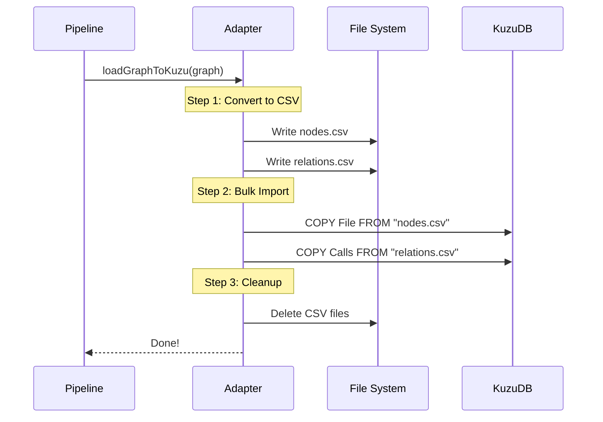

# Chapter 2: Graph Persistence & KuzuDB Adapter

In the previous chapter, [The Ingestion Pipeline](01_the_ingestion_pipeline.md), we learned how GitNexus reads your code and builds a map of it.

However, there was a catch: that map lived entirely in **RAM (Memory)**. If you closed the terminal or your computer crashed, all that hard work of scanning and linking files would vanish. You would have to start over every time.

In this chapter, we add **Long-Term Memory** to GitNexus. We will learn how to take that fragile in-memory graph and "freeze" it into a permanent database on your hard drive.

## The Motivation: Why KuzuDB?

Imagine you have just spent 10 minutes scanning a massive project. You want to ask questions about it today, tomorrow, and next week.

To do this, we need a database. But not just any database (like SQL/MySQL), because code is highly connected. Functions call functions, classes extend classes.

We use **KuzuDB**.
*   **It is Embedded:** It runs right inside the GitNexus app (no need to install a separate server).
*   **It is a Graph Database:** It thinks in terms of "Nodes" and "Arrows," exactly like our mental model of code.
*   **It is Fast:** It is optimized for following deep links in data.

## Key Concepts

Before we look at the code, let's define the roles:

1.  **The In-Memory Graph:** This is the "Whiteboard." It's fast to draw on, easy to erase, but temporary.
2.  **KuzuDB (Disk):** This is the "Filing Cabinet." It's permanent and organized.
3.  **The Adapter:** This is the "Librarian." It translates your Javascript objects into a language the database understands (Cypher) and handles filing the data away.

### What is Cypher?
KuzuDB uses a query language called **Cypher**. It is designed to look like ASCII art.

*   **SQL:** `SELECT * FROM users WHERE name = 'Alice'`
*   **Cypher:** `MATCH (u:User {name: 'Alice'}) RETURN u`

Notice the parenthesis `(u:User)`? That represents a **Node** (a bubble).

## How to Use It

The **Kuzu Adapter** hides the complexity of talking to the database. You generally only need to do three things: Initialize, Save, and Query.

### 1. Initialization
First, we tell the adapter where to store the database files.

```typescript
import { initKuzu } from './core/kuzu/kuzu-adapter.js';

const dbPath = './my-gitnexus-db';

// This creates the folder and sets up the database schema
await initKuzu(dbPath);

console.log("Database is ready!");
```

**What happens here?** 
GitNexus checks if the folder exists. If not, it creates it and defines the "Schema" (rules saying "A Function node must have a name and a file path").

### 2. Saving the Graph
Once the [Ingestion Pipeline](01_the_ingestion_pipeline.md) finishes, we pass the result to the adapter.

```typescript
import { loadGraphToKuzu } from './core/kuzu/kuzu-adapter.js';

// Assume 'graph' came from the Ingestion Pipeline
await loadGraphToKuzu(graph, fileContents, dbPath, (msg) => {
  console.log(msg); // e.g., "Loading nodes..."
});
```

**What happens here?**
This function takes the "Whiteboard" (memory graph) and efficiently packs it into the "Filing Cabinet" (KuzuDB). It uses a high-speed bulk loader to handle thousands of files in seconds.

### 3. Querying
Now that the data is saved, we can ask questions using Cypher.

```typescript
import { executeQuery } from './core/kuzu/kuzu-adapter.js';

// "Find all Functions defined in 'auth.ts'"
const cypher = `
  MATCH (f:Function)
  WHERE f.filePath CONTAINS 'auth.ts'
  RETURN f.name
`;

const results = await executeQuery(cypher);
console.log(results); // [{ f.name: 'login' }, { f.name: 'logout' }]
```

## Implementation Walkthrough

Let's look under the hood. Writing data to a database one item at a time is very slow (like moving books one by one). To make GitNexus fast, the Adapter uses a **Batch Strategy**.

### The Sequence



1.  **Generate CSVs:** The adapter converts the Javascript graph into temporary CSV (Comma Separated Values) files.
2.  **Bulk Copy:** It tells KuzuDB to "inhale" these CSV files. This is much faster than inserting nodes one by one.
3.  **Cleanup:** It deletes the temporary files.

### Deep Dive: The Code

Let's look at `gitnexus/src/core/kuzu/kuzu-adapter.ts`.

#### The Initialization
We ensure the database connection exists.

```typescript
// gitnexus/src/core/kuzu/kuzu-adapter.ts

let db: kuzu.Database | null = null;
let conn: kuzu.Connection | null = null;

export const initKuzu = async (dbPath: string) => {
  // If already connected, return
  if (conn) return { db, conn };

  // Create the database instance
  db = new kuzu.Database(dbPath);
  conn = new kuzu.Connection(db);
  
  // Run schema queries (Create Tables)
  // ... (omitted for brevity)
};
```

#### The Bulk Loader
This is the most complex part, simplified here. It loops through different types of nodes (Files, Functions, Classes) and loads them.

```typescript
export const loadGraphToKuzu = async (graph, fileContents, storagePath) => {
  // 1. Generate CSV strings from the graph
  const csvData = generateAllCSVs(graph, fileContents);
  
  // 2. Write CSVs to disk temporarily
  const csvDir = path.join(storagePath, 'csv');
  await fs.mkdir(csvDir, { recursive: true });
  // ... writes files like 'function.csv', 'file.csv' ...

  // 3. Tell KuzuDB to COPY the data
  for (const table of ['File', 'Function', 'Class']) {
    const query = `COPY ${table} FROM "${csvDir}/${table}.csv"`;
    await conn.query(query);
  }
  
  // 4. Cleanup temporary files
  await fs.rm(csvDir, { recursive: true });
};
```

*   **Beginner Tip:** Why CSV? Databases are incredibly good at reading simple text formats like CSV. It creates a "highway" for data to travel from your RAM to the Disk.

#### Full-Text Search (FTS)

Sometimes you don't know the exact structure, you just want to search for text (like a search engine). The Adapter sets up **Full-Text Search** indexes.

```typescript
export const queryFTS = async (tableName, indexName, query) => {
  // Uses Kuzu's special FTS syntax
  const cypher = `
    CALL QUERY_FTS_INDEX('${tableName}', '${indexName}', '${query}')
    RETURN node, score
  `;
  
  return await executeQuery(cypher);
};
```
*   **Use Case:** When an AI agent asks *"Find code related to 'authentication'"*, we use this function to find files containing that word, even if they aren't strictly named "Authentication".

## Conclusion

You have now successfully moved your data from a fleeting thought in RAM to a permanent record in KuzuDB. The **Kuzu Adapter** handled the heavy lifting of translating objects to Cypher queries and managing files.

Now we have a database full of nodes like `Function`, `Variable`, and `Class`. But wait... how did GitNexus know that `function login() {}` was a **Function** and not just a random string of text?

To answer that, we need to understand how computers read code.

[Next Chapter: Parsing & Symbol Resolution](03_parsing___symbol_resolution.md)

---

Generated by [Code IQ](https://github.com/adityasoni99/Code-IQ)