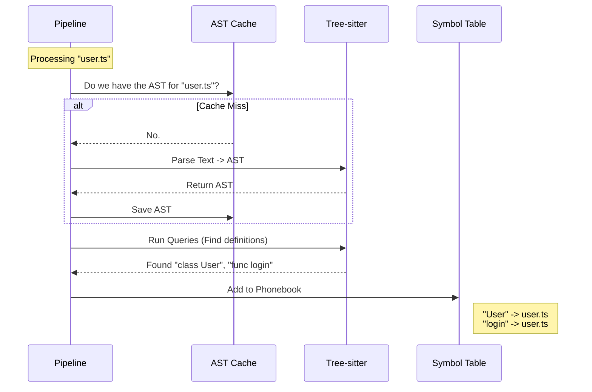

# Chapter 3: Parsing & Symbol Resolution

In the previous chapter, [Graph Persistence & KuzuDB Adapter](02_graph_persistence___kuzudb_adapter.md), we learned how to save our data permanently.

But we skipped a massive step: **How does GitNexus actually understand code?**

When a computer reads a file, it just sees a long string of text characters. It doesn't inherently know that `function login()` is a piece of logic, or that `import { User }` creates a dependency.

This chapter is about the **Universal Translator**. We will learn how to turn raw text into structured meaning using **Parsing** and **Symbol Resolution**.

## The Problem: The "Needle in the Haystack"

Imagine you are looking at a code file with 2,000 lines. You want to find every place a specific function is defined.

*   **Bad Way (Text Search/Regex):** You search for the word "function". But this finds comments, strings, and partial matches. It's messy.
*   **Good Way (Parsing):** You read the code like a compiler does. You understand the *grammar*.

GitNexus needs to support TypeScript, Python, Java, Rust, and more. Writing a custom reader for each one would take forever. Instead, we use a tool called **Tree-sitter**.

## Key Concept 1: The Abstract Syntax Tree (AST)

To understand code, we break it down into a tree structure called an **Abstract Syntax Tree (AST)**.

Think of it like diagramming a sentence in English class:
*   **Sentence:** "The cat sat."
*   **Diagram:** `[Subject: Cat]` -> `[Verb: Sat]`.

In code:
*   **Code:** `x = 1 + 2`
*   **AST:**
    *   `AssignmentExpression`
        *   `Identifier (x)`
        *   `BinaryExpression`
            *   `Number (1)`
            *   `Operator (+)`
            *   `Number (2)`

The AST allows us to ignore formatting (spaces, tabs) and focus purely on the *logic*.

## Key Concept 2: Grammar Queries

Once we have the tree, how do we find what we want? We use **Queries**.

Tree-sitter allows us to write a special pattern-matching syntax (similar to CSS selectors but for code trees) to extract specific nodes.

For example, to find a class definition in TypeScript, we don't look for the word "class". We look for a node type called `class_declaration`.

## Key Concept 3: The Symbol Table

Parsing tells us *structure* (e.g., "There is a function named `add` here").
**Symbol Resolution** tells us *identity*.

Imagine you see this line:
```typescript
const result = calculateTax(50);
```

Who is `calculateTax`? Is it defined in this file? Or did it come from an import?

The **Symbol Table** is GitNexus's internal "Phonebook."
1.  **Registration:** When we parse `function calculateTax() {...}`, we add it to the phonebook: *"calculateTax is defined in utils.ts, line 10"*.
2.  **Resolution:** When we see the call `calculateTax(50)`, we check the phonebook to find where it lives.

## Implementation Walkthrough

Let's see how GitNexus orchestrates this.

### The Flow



### 1. Defining the Grammar Queries

We need to tell Tree-sitter what we are looking for. We store these queries in `gitnexus/src/core/ingestion/tree-sitter-queries.ts`.

Let's look at the query for **TypeScript**:

```typescript
// From: gitnexus/src/core/ingestion/tree-sitter-queries.ts

export const TYPESCRIPT_QUERIES = `
(class_declaration
  name: (type_identifier) @name) @definition.class

(function_declaration
  name: (identifier) @name) @definition.function

(import_statement
  source: (string) @import.source) @import
`;
```

**Explanation:**
*   `(class_declaration ...)`: Look for a node in the tree of type "class_declaration".
*   `name: (type_identifier) @name`: Find the name of the class and tag it as `@name`.
*   `@definition.class`: Tag the whole block as a "Class Definition".

We have different queries for Python, Java, Go, etc., because every language names its nodes slightly differently.

### 2. The AST Cache (Efficiency Layer)

Parsing code is expensive (it takes CPU power). We don't want to re-parse a file if we just read it 5 seconds ago.

We use a "Least Recently Used" (LRU) Cache in `gitnexus/src/core/ingestion/ast-cache.ts`.

```typescript
// From: gitnexus/src/core/ingestion/ast-cache.ts
import { LRUCache } from 'lru-cache';

export const createASTCache = (maxSize: number = 50) => {
  // Create a cache that holds up to 50 trees
  const cache = new LRUCache<string, Parser.Tree>({
    max: maxSize,
    // If we remove an item to make space, delete it from memory
    dispose: (tree) => (tree as any).delete?.() 
  });

  return {
    get: (filePath) => cache.get(filePath),
    set: (filePath, tree) => cache.set(filePath, tree),
    // ...
  };
};
```

**Explanation:**
*   We only keep the last 50 files in memory.
*   If we try to add file #51, the cache automatically drops file #1 to make room. This prevents GitNexus from using up all your RAM on huge projects.

### 3. The Symbol Table (The Registry)

Finally, we need to store what we found. This happens in `gitnexus/src/core/ingestion/symbol-table.ts`.

It uses two strategies:
1.  **Exact Lookup:** "I am in `file A`. Where is `foo` defined in `file A`?"
2.  **Fuzzy Lookup:** "I don't know where I am. Just find me a `User` class anywhere in the project."

```typescript
// From: gitnexus/src/core/ingestion/symbol-table.ts

export const createSymbolTable = () => {
  // Map: FilePath -> (SymbolName -> NodeID)
  const fileIndex = new Map<string, Map<string, string>>();

  const add = (filePath, name, nodeId, type) => {
    // 1. Ensure the file bucket exists
    if (!fileIndex.has(filePath)) fileIndex.set(filePath, new Map());
    
    // 2. Store the symbol
    fileIndex.get(filePath)!.set(name, nodeId);
  };

  const lookupExact = (filePath, name) => {
    // Check specific file bucket
    return fileIndex.get(filePath)?.get(name);
  };

  return { add, lookupExact, ... };
};
```

**Explanation:**
*   `fileIndex` is a Map of Maps. It organizes symbols by the file they live in.
*   When the [Ingestion Pipeline](01_the_ingestion_pipeline.md) finds an import like `import { login } from './auth'`, it asks the Symbol Table: *"Hey, look in `./auth.ts`, do you have a symbol named `login`?"*
*   The Symbol Table returns the unique **Node ID**, allowing us to draw a perfect arrow in our graph.

## Putting It Together

When you run GitNexus:
1.  The **AST Cache** ensures we manage memory efficiently.
2.  **Tree-sitter** reads your code using the **Queries** we defined.
3.  We extract names (Symbols) and store them in the **Symbol Table**.
4.  Later, we use the Symbol Table to link everything together.

## Conclusion

We have now turned raw text strings into a structured web of meaning. We know exactly where every class and function is defined.

But GitNexus is designed to work with AI Agents (LLMs). An AI Agent doesn't interact via a command line; it needs a standardized protocol to ask questions.

In the next chapter, we will build the interface that allows AI tools (like Claude or Cursor) to talk to GitNexus.

[Next Chapter: Model Context Protocol (MCP) Server](04_model_context_protocol__mcp__server.md)

---

Generated by [Code IQ](https://github.com/adityasoni99/Code-IQ)