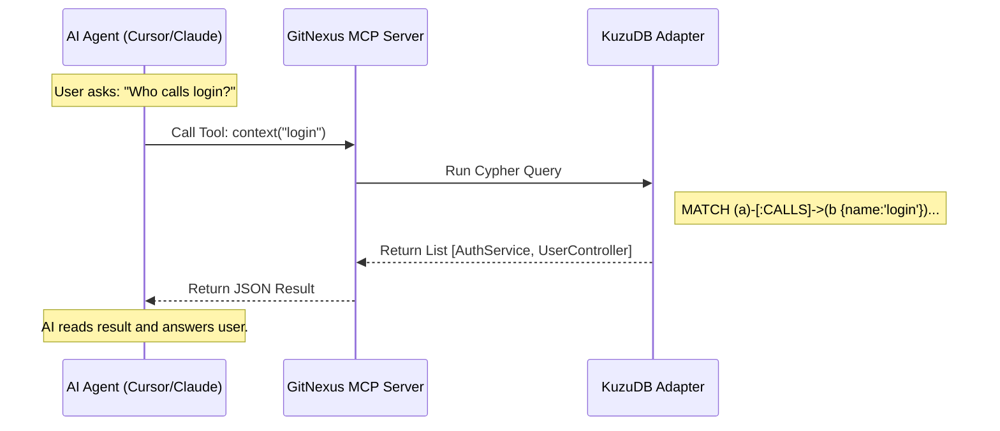

# Chapter 4: Model Context Protocol (MCP) Server

In the previous chapter, [Parsing & Symbol Resolution](03_parsing___symbol_resolution.md), we built a "Universal Translator" that turns raw code text into a structured, meaningful map. We stored this map in our database.

But there is a problem: **Who is going to read this map?**

You (the human) could write complex database queries, but the goal of GitNexus is to let **AI Agents** (like Cursor, Claude, or Windsurf) understand your code.

This chapter introduces the **Model Context Protocol (MCP) Server**. It is the bridge that allows an AI to "talk" to your database.

## The Motivation: The "Context Window" Problem

Imagine you are working with an AI assistant on a massive project (100,000 lines of code). You ask: *"How does the payment system work?"*

You cannot copy-paste all 100,000 lines into the chat. The AI has a limit (a "Context Window").

Instead, the AI needs to be able to **ask the database questions** like:
1.  "Search for files related to 'payments'."
2.  "Read the `processPayment` function."
3.  "Find what other functions call `processPayment`."

The **MCP Server** acts like a librarian. The AI asks the librarian for specific information, and the librarian fetches *only* what is needed from the shelves (KuzuDB).

## Key Concepts

### 1. The Protocol (MCP)
MCP is an open standard. It works like a USB port for AI. Because GitNexus implements this standard, any AI tool that supports MCP can instantly plug into your knowledge graph without custom code.

### 2. Tools (The Vocabulary)
We give the AI a specific set of "superpowers" (functions) it can call. These are:
*   **`query`**: "Search for a concept."
*   **`context`**: "Give me details about a specific function."
*   **`impact`**: "What breaks if I change this?"

### 3. Resources
These are like read-only files that the AI can open to see summaries, like `gitnexus://repo/stats`.

## The Use Case: Asking "What if?"

Let's look at a concrete example. You act as the developer.

**Developer:** *"I want to rename the `User` class to `Customer`. Is that safe?"*

**Without MCP:** The AI guesses based on the few files you have open. It might miss a file in a different folder that uses `User`.

**With MCP:**
1.  The AI calls the tool `impact({ target: "User", direction: "downstream" })`.
2.  GitNexus checks the graph database.
3.  GitNexus replies: *"High Risk. `User` is extended by `Admin` in `auth.ts` and imported by 15 other files."*

## How to Use It (The Tools)

The MCP Server runs in the background. You don't "call" it yourself; your AI editor does. However, it helps to understand the tools we are exposing to the AI.

### Tool 1: `query`
This is the starting point. It combines text search with graph relevance.

**AI Input:**
```json
{
  "query": "authentication flow",
  "limit": 3
}
```

**GitNexus Output:** Returns a ranked list of "Processes" (execution flows) related to authentication, identifying the exact files and functions involved.

### Tool 2: `context`
Once the AI finds a function name, it needs the details.

**AI Input:**
```json
{
  "name": "login",
  "include_content": true
}
```

**GitNexus Output:** Returns the source code of `login`, PLUS a list of every function that calls it and every function it calls.

### Tool 3: `impact`
This is for safety checks before editing code.

**AI Input:**
```json
{
  "target": "validateToken",
  "direction": "upstream" // Who depends on me?
}
```

**GitNexus Output:** A "Blast Radius" report showing items categorized by depth (Direct impact vs. Indirect impact).

## Implementation Walkthrough

How does this work under the hood? The MCP server doesn't use HTTP (like a web server); it uses **stdio** (Standard Input/Output). It listens for JSON messages from the AI editor directly.

Here is the flow of conversation:



## Deep Dive: The Code

Let's look at how we build this in TypeScript. We use the official `@modelcontextprotocol/sdk`.

### 1. Defining the Tools

In `gitnexus/src/mcp/tools.ts`, we define the "Menu" of options available to the AI. We must provide a schema so the AI knows what arguments to pass.

```typescript
// gitnexus/src/mcp/tools.ts

export const GITNEXUS_TOOLS = [
  {
    name: 'impact',
    description: 'Analyze the blast radius of changing a code symbol.',
    inputSchema: {
      type: 'object',
      properties: {
        target: { type: 'string', description: 'Name of function/class' },
        direction: { type: 'string', enum: ['upstream', 'downstream'] }
      },
      required: ['target', 'direction'],
    },
  },
  // ... other tools (query, context, etc.)
];
```

**Explanation:**
*   We describe the tool clearly. The AI uses this `description` to decide *when* to use the tool.
*   `inputSchema` validates the data the AI sends us.

### 2. Setting up the Server

In `gitnexus/src/mcp/server.ts`, we initialize the server and tell it how to handle requests.

```typescript
// gitnexus/src/mcp/server.ts
import { Server } from '@modelcontextprotocol/sdk/server/index.js';
import { CallToolRequestSchema } from '@modelcontextprotocol/sdk/types.js';

export async function startMCPServer(backend) {
  // 1. Create the server instance
  const server = new Server(
    { name: 'gitnexus', version: '1.0.0' },
    { capabilities: { tools: {} } }
  );

  // 2. Tell the AI what tools we have
  server.setRequestHandler(ListToolsRequestSchema, async () => ({
    tools: GITNEXUS_TOOLS
  }));
  
  // ... continued below
```

**Explanation:**
*   We create a `Server` object.
*   When the AI asks "What can you do?" (`ListToolsRequestSchema`), we return the list we defined above.

### 3. Handling Tool Calls

When the AI actually uses a tool, we execute the logic.

```typescript
  // 3. Handle the actual execution
  server.setRequestHandler(CallToolRequestSchema, async (request) => {
    const { name, arguments: args } = request.params;

    // "backend" is our link to KuzuDB (Chapter 2)
    const result = await backend.callTool(name, args);
    
    // Add a "Next Step Hint" to guide the AI
    const hint = getNextStepHint(name, args);

    return {
      content: [{ type: 'text', text: JSON.stringify(result) + hint }]
    };
  });
}
```

**Explanation:**
*   We look at `request.params.name` to see which tool was called (e.g., "impact").
*   We pass the work to `backend`, which runs the Cypher queries we learned about in [Chapter 2: Graph Persistence](02_graph_persistence___kuzudb_adapter.md).
*   **The "Hint":** Notice we append a hint. If the AI calls `query`, we hint: *"Next: Use context() to see details."* This helps "chain of thought" reasoning.

### 4. Connecting to Stdio

Finally, we connect the server to the terminal input/output.

```typescript
import { StdioServerTransport } from '@modelcontextprotocol/sdk/server/stdio.js';

// ... inside startMCPServer
const transport = new StdioServerTransport();
await server.connect(transport);
```

**Explanation:**
*   This creates the pipe. The AI editor (running as a separate process) sends text into GitNexus's `stdin`, and GitNexus writes answers to `stdout`.

## Conclusion

We have successfully built the "API Gateway" for our AI agents.
1.  We defined a vocabulary (**Tools**) like `query` and `impact`.
2.  We implemented the **MCP Server** to listen for requests.
3.  We connected it to our **KuzuDB** backend.

Now, your AI editor isn't just guessing based on open files. It has deep, structural knowledge of the entire repository.

But sometimes, **humans** need to see the big picture too. Lines of text and JSON are hard for people to visualize.

In the next chapter, we will build a visual dashboard to let *you* see the graph that the AI sees.

[Next Chapter: Web Graph Visualization](05_web_graph_visualization.md)

---

Generated by [Code IQ](https://github.com/adityasoni99/Code-IQ)