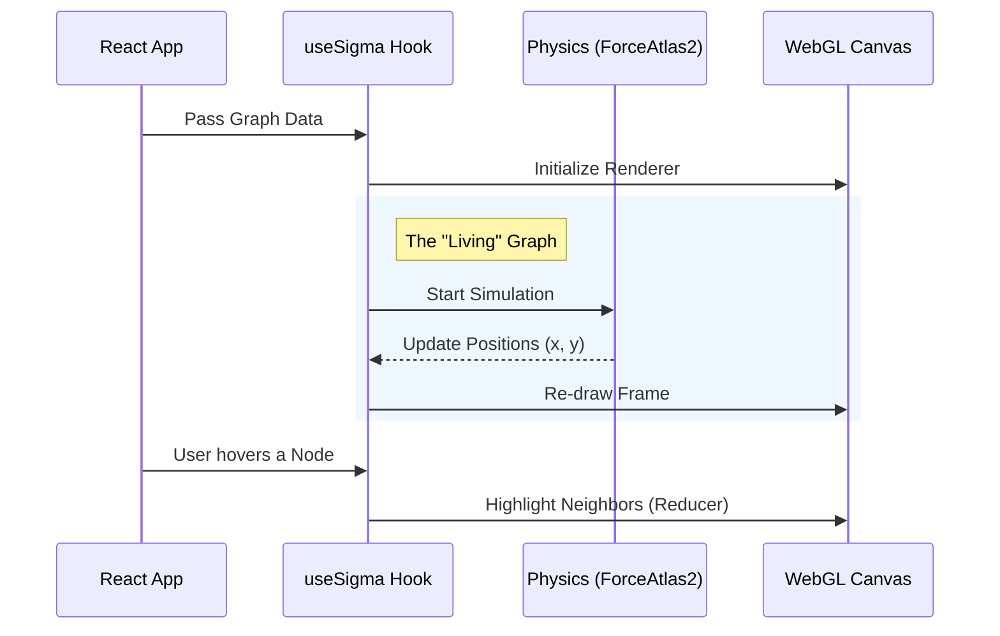

# Chapter 5: Web Graph Visualization

In the previous chapter, [Model Context Protocol (MCP) Server](04_model_context_protocol__mcp__server.md), we built a powerful interface for **AI Agents** to understand your code. The AI can now query the database and "see" the connections.

But what about **you**?

Reading JSON text responses or raw database rows is a terrible way for a human to understand a complex system. You need to *see* the architecture. You need to see the "Spaghetti Code" clusters, the isolated islands, and the critical bridges.

In this chapter, we build the **Control Center**. We will use **Sigma.js** to render a beautiful, interactive graph in the browser that allows you to physically explore your codebase.

## The Motivation: From Text to Territory

Imagine trying to understand the layout of New York City by reading a list of latitude and longitude coordinates. It’s impossible. You need a map.

Code is the same.
*   **Text Editor:** Shows you one street (file) at a time.
*   **GitNexus Visualization:** Shows you the entire city.

### The Use Case

You are hunting a bug. You suspect that changing the `User` class will break the `Billing` system.
1.  **Without Visualization:** You `Cmd+F` (Find) through 50 files, trying to keep a mental model of who imports what.
2.  **With Visualization:** You click the `User` node. Instantly, the graph lights up, showing a red "Blast Radius" extending into the `Billing` cluster. You *see* the danger immediately.

## Key Concepts

To build this, we need three specific technologies working together:

1.  **Sigma.js (The Painter):**
    Browsers are slow at drawing thousands of DOM elements (HTML `<div>`). Sigma.js uses **WebGL** (the graphics card) to draw thousands of nodes and edges instantly.

2.  **Graphology (The Data):**
    This is the standard format we use to describe the graph in JavaScript. It acts as the bridge between our raw data and the Sigma renderer.

3.  **ForceAtlas2 (The Physics Engine):**
    How do we know where to put the nodes? We don't manually place them. We run a **Physics Simulation**:
    *   **Nodes represent magnets:** They repel each other (push apart).
    *   **Edges represent springs:** Connected nodes pull each other close.
    *   **Result:** Related files naturally cluster together into "neighborhoods."

## Implementation Walkthrough

The visualization logic is contained in the React frontend. It follows a specific lifecycle to turn data into pixels.



### Step 1: The Canvas Component

We start with `gitnexus-web/src/components/GraphCanvas.tsx`. This component is the wrapper. It doesn't do the heavy lifting itself; it delegates that to a custom hook called `useSigma`.

Its main job is to provide a `div` container for Sigma to attach to.

```typescript
// gitnexus-web/src/components/GraphCanvas.tsx

export const GraphCanvas = () => {
  // 1. Get the state (graph data, highlighted nodes)
  const { graph, highlightedNodeIds } = useAppState();

  // 2. Initialize the engine via our custom hook
  const { containerRef, zoomIn, zoomOut } = useSigma({
    highlightedNodeIds
  });

  // 3. Render the container and some buttons
  return (
    <div className="relative w-full h-full bg-void">
      <div ref={containerRef} className="w-full h-full" />
      
      <div className="controls">
        <button onClick={zoomIn}>+</button>
        <button onClick={zoomOut}>-</button>
      </div>
    </div>
  );
};
```

**Explanation:**
*   `useAppState`: Retrieves the graph data we loaded in [Chapter 1](01_the_ingestion_pipeline.md).
*   `containerRef`: This is a "hook" we attach to the `div`. Sigma looks for this `div` and injects the `<canvas>` element inside it.

### Step 2: The `useSigma` Hook (The Brain)

This is where the magic happens (`gitnexus-web/src/hooks/useSigma.ts`). This hook initializes Sigma, starts the physics engine, and handles interactions.

#### Initialization
First, we create the Sigma instance.

```typescript
// gitnexus-web/src/hooks/useSigma.ts

export const useSigma = (options) => {
  const containerRef = useRef<HTMLDivElement>(null);
  const sigmaRef = useRef<Sigma | null>(null);

  useEffect(() => {
    if (!containerRef.current) return;

    // 1. Create the renderer
    const sigma = new Sigma(graph, containerRef.current, {
      renderLabels: true,
      labelFont: 'JetBrains Mono',
      // ... styling options
    });
    
    sigmaRef.current = sigma;
    
    return () => sigma.kill(); // Cleanup on unmount
  }, []);
```

#### The Physics Engine (ForceAtlas2)
If we just loaded the nodes, they would all sit at coordinates `(0,0)`. We need to explode them out and let them find their places.

```typescript
// Inside useSigma.ts

  const runLayout = (graph) => {
    // 1. Configure the physics settings
    const settings = {
      gravity: 0.5,      // Pull towards center
      scalingRatio: 30,  // How spread out?
      slowDown: 2,       // Friction
    };

    // 2. Start the simulation worker
    const layout = new FA2Layout(graph, { settings });
    layout.start();

    // 3. Stop it after 20 seconds (so it doesn't run forever)
    setTimeout(() => {
      layout.stop();
    }, 20000);
  };
```

**Explanation:**
*   We use a **Web Worker** for the layout. This ensures the physics calculations run on a separate thread, so the UI doesn't freeze while the graph is organizing itself.

### Step 3: Handling Visual State (Reducers)

This is the most "React-like" part of the graph. We want to change how nodes look based on state (e.g., "Hovered", "Selected", "Blast Radius").

Sigma uses a concept called **Reducers**. A reducer is a function that runs for every single node before it is drawn.

*   **Input:** The node's default data (Gray color, size 5).
*   **Output:** How it should look *right now* (Red color, size 10).

```typescript
// Inside useSigma configuration

nodeReducer: (node, data) => {
  const res = { ...data }; // Copy default styles

  // 1. Is this node in the "Blast Radius"?
  if (blastRadiusNodeIds.has(node)) {
    res.color = '#ef4444'; // Red
    res.size = 20;         // Huge
    res.highlighted = true;
    return res;
  }

  // 2. Is this node highlighted by a search query?
  if (highlightedNodeIds.has(node)) {
    res.color = '#06b6d4'; // Cyan
    res.size = 15;
    return res;
  }

  // 3. If something else is selected, dim this node
  if (selectedNode && node !== selectedNode) {
    res.color = '#333'; // Dark Gray (Dimmed)
  }

  return res;
}
```

**Explanation:**
*   This function runs thousands of times per frame. It must be fast.
*   It allows us to create dynamic effects. When a user asks "What depends on `User.ts`?", we simply update the `blastRadiusNodeIds` set, and the reducer automatically paints those nodes red in the next frame.

### Step 4: Camera Control

Finally, we need to let the user move around. Sigma provides a `Camera` API.

```typescript
  const focusNode = (nodeId) => {
    const nodePosition = graph.getNodeAttributes(nodeId);
    
    // Animate camera to the node's x,y coordinates
    sigmaRef.current?.getCamera().animate(
      { 
        x: nodePosition.x, 
        y: nodePosition.y, 
        ratio: 0.15 // Zoom level
      },
      { duration: 400 } // Animation speed in ms
    );
  };
```

## Putting It Together

When you launch GitNexus and drop in a project folder:

1.  **Ingestion (Chapter 1)** builds the data.
2.  **React** passes that data to `GraphCanvas`.
3.  **Sigma** creates the WebGL context.
4.  **ForceAtlas2** starts pushing nodes apart. You see the graph "unfold" live on screen.
5.  When you click a node, **React** calculates the dependencies and updates the `highlightedNodeIds`.
6.  The **Reducer** repaints the graph, dimming unrelated nodes and making the active cluster glow.

## Conclusion

We have successfully bridged the gap between raw data and human intuition. By using **Sigma.js** and physics simulations, we turned a database of thousands of code symbols into a navigable map.

Now the user can see the structure. But simply *seeing* isn't enough. The user wants to *change* the code and have the AI help them do it safely.

In the next chapter, we will look at how we inject this graph knowledge back into the AI's prompt to make it smarter.

[Next Chapter: Context Augmentation Hooks](06_context_augmentation_hooks.md)

---

Generated by [Code IQ](https://github.com/adityasoni99/Code-IQ)