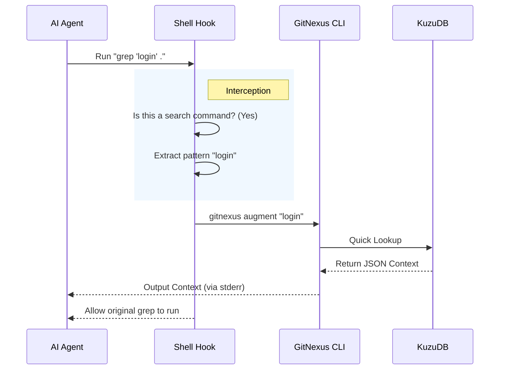

# Chapter 6: Context Augmentation Hooks

In the previous chapter, [Web Graph Visualization](05_web_graph_visualization.md), we built a beautiful visual dashboard so you, the human, could see the structure of your code.

But what about the **AI**?

We know AI agents (like Claude or Cursor) often use basic tools like `grep` or `ripgrep` to search for code. When an AI searches for "Payment", it gets a list of text matches. It **does not** get the structural context (definitions, inheritance, dependencies).

In this chapter, we will build **Context Augmentation Hooks**. Think of this as a "Whisperer." When the AI runs a command in the terminal, GitNexus secretly intercepts it, looks up relevant data in the graph, and "whispers" the answer into the output before the AI even asks for it.

## The Motivation: The "Blind Search" Problem

Imagine an AI agent is trying to fix a bug. It runs this command:

`grep -r "processTransaction" .`

**The Output (Standard):**
```text
./src/payment.ts: function processTransaction(amount) {
./src/checkout.ts: payment.processTransaction(100);
```

This is just text. The AI doesn't know:
1.  Is `processTransaction` part of a Class?
2.  Does it return a Promise?
3.  What happens if we rename it?

**The Output (With GitNexus Hook):**
```text
./src/payment.ts: function processTransaction(amount) {
...
[GITNEXUS CONTEXT]: 
"processTransaction" is a Method in class "PaymentService".
It is called by 5 files.
Defined at src/payment.ts:15.
```

By injecting this context automatically, we save the AI from having to run 5 extra queries to figure out what's going on.

## Key Concepts

### 1. The Hook (The Interceptor)
This is a small script that sits between the AI and the Operating System. It watches every command. If it sees a "search" command (like `grep`, `rg`, or `find`), it wakes up.

### 2. The Fast-Path CLI
Normally, starting the full GitNexus server takes a second or two. That is too slow for a hook! We need a specific "Sprint Mode" command that starts up, reads the database, and shuts down in milliseconds.

### 3. Invisible Injection
We don't want to break the format of the original command. We inject our data into a specific output stream (often `stderr` or a JSON field) that the AI knows how to read, but which doesn't corrupt the file content.

## How to Use It

As a user, you don't "run" the hook manually. It is installed into your AI editor's configuration.

However, we can simulate what happens manually using the CLI tool we will build.

**Input:**
```bash
# This is what the hook runs internally
gitnexus augment "User"
```

**Output:**
```json
{
  "symbol": "User",
  "type": "Class",
  "file": "src/models/User.ts",
  "related": ["AuthService", "Database"],
  "blast_radius": "High (Imported by 20 files)"
}
```

The AI reads this JSON and instantly understands the importance of the `User` class without reading the file.

## Implementation Walkthrough

Let's trace the lifecycle of a command when the hook is active.



### Deep Dive: The Code

Let's build the pieces. We need a shell script to catch the command, and a TypeScript function to fetch the data.

#### Step 1: The Interceptor (Shell Script)

This script is designed to work with Cursor's `beforeShellExecution` hook. It analyzes the command string.

```bash
#!/bin/bash
# gitnexus-cursor-integration/hooks/augment-shell.sh

# 1. Read the command the AI wants to run
INPUT=$(cat)
COMMAND=$(echo "$INPUT" | jq -r '.command')

# 2. Check if it is a search command (rg = ripgrep)
if echo "$COMMAND" | grep -qE '\brg\b|\bgrep\b'; then
  
  # 3. Extract the search term (simplified logic)
  PATTERN=$(echo "$COMMAND" | sed -n "s/.*\brg.*['\"]\([^'\"]*\)['\"].*/\1/p")
  
  # 4. Call GitNexus to get context
  RESULT=$(npx -y gitnexus augment "$PATTERN")
  
  # 5. Send result back to Cursor
  echo "{\"agent_message\": $RESULT}"
else
  echo '{"permission":"allow"}'
fi
```

**Explanation:**
*   We use `grep` to see if the AI is running `rg` (ripgrep) or `grep`.
*   We use `sed` (Stream Editor) to pull the search word out of the command.
*   We run `gitnexus augment`.
*   We return the result in a JSON field called `agent_message`. Cursor will show this message to the AI model.

#### Step 2: The Fast-Path CLI Command

Now we need the TypeScript code for `gitnexus augment`. It lives in `gitnexus/src/cli/augment.ts`.

It must be fast, so we avoid loading unnecessary things like the Web Server.

```typescript
// gitnexus/src/cli/augment.ts
import { augment } from '../core/augmentation/engine.js';

export async function augmentCommand(pattern: string) {
  // 1. If pattern is too short, ignore it
  if (!pattern || pattern.length < 3) process.exit(0);

  try {
    // 2. Query the graph (Fast lookup)
    const result = await augment(pattern, process.cwd());

    if (result) {
      // 3. Write to STDERR (See explanation below)
      process.stderr.write(result + '\n');
    }
  } catch (e) {
    // If we fail, fail silently so we don't crash the user's terminal
    process.exit(0);
  }
}
```

**Why `process.stderr`?**
This is a critical trick.
*   **stdout (Standard Output):** Used for the *actual* output of the command (the list of files).
*   **stderr (Standard Error):** Usually for errors, but often used for "Side Channel" communication.
*   By writing to `stderr`, we ensure our JSON data doesn't get mixed up with the file results, but the hook can still capture it.

#### Step 3: The Engine Logic

Finally, how do we find the info? We use the exact same logic from [Chapter 3](03_parsing___symbol_resolution.md) and [Chapter 2](02_graph_persistence___kuzudb_adapter.md).

```typescript
// gitnexus/src/core/augmentation/engine.ts

export async function augment(pattern, cwd) {
  // 1. Connect to DB
  const db = await getKuzuDb(cwd);

  // 2. Find the symbol
  const query = `
    MATCH (s:Symbol {name: $name})
    RETURN s.type, s.filePath, s.blastRadius
    LIMIT 1
  `;
  
  const result = await db.query(query, { name: pattern });

  // 3. Format as a helpful string
  return JSON.stringify(result);
}
```

**Explanation:**
*   We reuse the `KuzuDB` connection.
*   We run a Cypher query looking for a node with the name matching our `pattern`.
*   We return the metadata (Type, FilePath, BlastRadius).

## Conclusion

We have now created a truly "Smart" environment.
1.  **Ingestion:** Reads the code.
2.  **Database:** Stores the map.
3.  **Hooks:** Proactively volunteers information.

With Context Augmentation Hooks, GitNexus doesn't wait to be asked. It watches the AI working and slips it cheat sheets along the way. This drastically reduces hallucinations and improves the AI's ability to understand large codebases.

But... is it actually working? Is it fast enough? Does it provide *accurate* answers?

In the final chapter, we will learn how to test our system and measure its performance.

[Next Chapter: Evaluation & Benchmarking](07_evaluation___benchmarking.md)

---

Generated by [Code IQ](https://github.com/adityasoni99/Code-IQ)