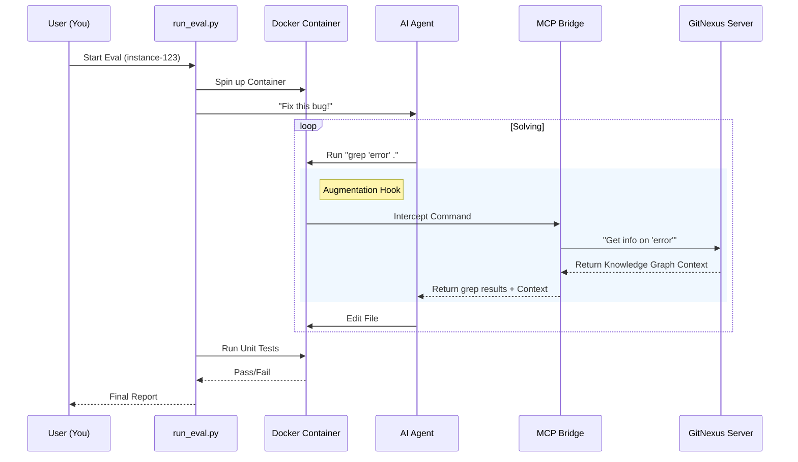

# Chapter 7: Evaluation & Benchmarking

In the previous chapter, [Context Augmentation Hooks](06_context_augmentation_hooks.md), we built a "whisperer" that secretly feeds code context to the AI. We *think* this makes the AI smarter and faster.

But **thinking** isn't enough. In software engineering, we don't rely on "vibes"—we rely on data.

*   Does GitNexus actually help the AI fix bugs it couldn't fix before?
*   Does it reduce the cost (fewer API calls)?
*   Does it prevent the AI from breaking other parts of the code?

This chapter introduces the **Evaluation Framework**. Think of this as the "Exam Proctor." It forces the AI to sit down, take a standardized test (SWE-bench), and grades its performance with and without GitNexus.

## The Motivation: The "Open Book" Exam

Imagine a student (the AI) taking a difficult calculus exam (fixing a bug).

1.  **Baseline Mode:** The student has a pencil and paper. They have to derive every formula from scratch. It's slow and error-prone.
2.  **GitNexus Mode:** The student is allowed to bring a smart textbook. They can look up formulas instantly.

Our Evaluation Framework sets up these two scenarios and compares the scores. We use **SWE-bench**, a collection of real-world GitHub issues (bugs) from popular Python libraries like Django and Flask.

## Key Concepts

To run these tests safely and accurately, we need three components:

### 1. The Sandbox (Docker)
We cannot let the AI run wild on your laptop. It might try to delete files or install weird packages. We run every test inside a **Docker Container**. This is a disposable, isolated room where the AI can break things without consequence.

### 2. The Agent
This is the AI player. We use a customized version of `mini-swe-agent`. It's a loop that says:
*   "Read file."
*   "Think."
*   "Edit file."
*   "Run tests."

### 3. The Bridge
The Evaluation Framework is written in **Python**, but GitNexus is written in **TypeScript**. We need a **Bridge** to let the Python test runner talk to the GitNexus MCP server.

## How to Use It

The entry point is a Python script: `eval/run_eval.py`. You act as the teacher administering the test.

### Step 1: Running a Single Test
Let's ask the AI (using the Claude model) to fix a specific bug in Django, using GitNexus for help.

```bash
# Run in "Native Augment" mode (With GitNexus)
python run_eval.py single \
  --model claude-sonnet \
  --mode native_augment \
  --instance django__django-16527
```

**What happens?**
1.  A Docker container starts.
2.  The GitNexus server starts inside the container.
3.  The AI tries to fix the bug.
4.  GitNexus "whispers" context whenever the AI searches for code.

### Step 2: Running the Baseline
Now we run the exact same test, but we take the textbook away.

```bash
# Run in "Baseline" mode (NO GitNexus)
python run_eval.py single \
  --model claude-sonnet \
  --mode baseline \
  --instance django__django-16527
```

### Step 3: Comparing Results
The script generates a `summary.json` file.

```json
{
  "instance_id": "django__django-16527",
  "baseline_status": "FAILED",
  "gitnexus_status": "PASSED",
  "gitnexus_metrics": {
    "augmentation_hits": 12,
    "tool_calls": 5
  }
}
```

In this example, the AI failed on its own but passed when GitNexus helped it 12 times!

## Implementation Walkthrough

Let's look at how the system orchestrates this complex dance.



### Deep Dive: The Code

The evaluation logic is built in Python. Let's look at the core pieces.

#### 1. The Test Runner (`process_instance`)
Found in `eval/run_eval.py`, this function sets up the "Exam Room."

```python
def process_instance(instance, config, output_dir, model_name, mode_name):
    # 1. Create the Docker Environment (The Sandbox)
    env = GitNexusDockerEnvironment(image=get_image(instance), **config)

    # 2. Create the Agent (The Student)
    # We tell it which "Mode" to use (Baseline vs GitNexus)
    agent = GitNexusAgent(model, env, gitnexus_mode=mode_name)

    # 3. Run the test!
    logger.info(f"Starting {instance['instance_id']}")
    info = agent.run(instance["problem_statement"])

    # 4. Collect the grades
    result = {
        "exit_status": info.get("exit_status"),
        "metrics": agent.gitnexus_metrics.to_dict()
    }
    return result
```

**Explanation:**
*   It initializes a specific Docker image that matches the library we are testing (e.g., an old version of Django).
*   It injects our custom `GitNexusAgent`.

#### 2. The Agent Logic (`GitNexusAgent`)
Found in `eval/agents/gitnexus_agent.py`, this extends the standard agent to track our specific metrics.

```python
class GitNexusAgent(DefaultAgent):
    def execute_actions(self, message):
        # 1. Let the agent run the command (e.g., grep)
        outputs = [self.env.execute(action) for action in actions]

        # 2. If in "Augment" mode, check if we helped
        if self.gitnexus_mode == GitNexusMode.NATIVE_AUGMENT:
            for i, action in enumerate(actions):
                # Did GitNexus inject extra info?
                if "[GitNexus]" in outputs[i]['output']:
                    self.gitnexus_metrics.augmentation_hits += 1

        return outputs
```

**Explanation:**
*   This is where we count the score. If the output contains the special string `[GitNexus]`, we know our hook (from [Chapter 6](06_context_augmentation_hooks.md)) successfully intercepted the call. We count this as a "Hit."

#### 3. The Bridge (`MCPBridge`)
Found in `eval/bridge/mcp_bridge.py`. Since Python cannot directly call TypeScript functions, we spawn GitNexus as a subprocess and talk to it via Standard Input/Output (stdio).

```python
class MCPBridge:
    def start(self):
        # 1. Launch the TypeScript binary
        self.process = subprocess.Popen(
            ["npx", "gitnexus", "mcp"],
            stdin=subprocess.PIPE,
            stdout=subprocess.PIPE
        )

    def call_tool(self, tool_name, args):
        # 2. Send JSON request to GitNexus
        request = {
            "jsonrpc": "2.0", 
            "method": "tools/call", 
            "params": {"name": tool_name, "arguments": args}
        }
        self._send_request(request)
        
        # 3. Read JSON response
        return self._read_response()
```

**Explanation:**
*   This acts as the translator. It takes Python dictionaries, converts them to JSON, sends them to the running GitNexus process, and waits for the answer. This is the implementation of the "Model Context Protocol" client.

## Conclusion

Congratulations! You have reached the end of the GitNexus Developer Tutorial.

We have journeyed through the entire lifecycle of a modern AI tool:
1.  **Ingestion:** We learned to digest raw code into a graph ([Chapter 1](01_the_ingestion_pipeline.md)).
2.  **Persistence:** We stored that graph in KuzuDB ([Chapter 2](02_graph_persistence___kuzudb_adapter.md)).
3.  **Understanding:** We parsed languages using Tree-sitter ([Chapter 3](03_parsing___symbol_resolution.md)).
4.  **Interface:** We built an MCP server for AI agents ([Chapter 4](04_model_context_protocol__mcp__server.md)).
5.  **Visualization:** We built a UI for humans ([Chapter 5](05_web_graph_visualization.md)).
6.  **Augmentation:** We injected context proactively ([Chapter 6](06_context_augmentation_hooks.md)).
7.  **Evaluation:** And finally, we built a rigorous testing framework to prove it all works (this chapter).

You now possess a complete blueprint for building advanced RAG (Retrieval-Augmented Generation) systems for code. Go forth and build the next generation of developer tools!

---

Generated by [Code IQ](https://github.com/adityasoni99/Code-IQ)