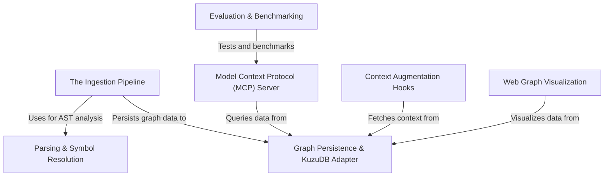

# Tutorial: GitNexus

GitNexus is a developer tool that transforms a raw codebase into a structured **Knowledge Graph**, enabling AI agents to understand **execution flows**, dependencies, and the impact of changes. It functions as a bridge between code and AI by *ingesting* source files, persisting relationships in **KuzuDB**, and exposing a semantic interface via the **Model Context Protocol (MCP)**. Additionally, it offers **visualization tools** and shell hooks to augment developer workflows with "invisible" context.

**Source Repository:** [https://github.com/abhigyanpatwari/GitNexus](https://github.com/abhigyanpatwari/GitNexus)

## Chapters

1. [The Ingestion Pipeline](01_the_ingestion_pipeline.md)
2. [Graph Persistence & KuzuDB Adapter](02_graph_persistence___kuzudb_adapter.md)
3. [Parsing & Symbol Resolution](03_parsing___symbol_resolution.md)
4. [Model Context Protocol (MCP) Server](04_model_context_protocol__mcp__server.md)
5. [Web Graph Visualization](05_web_graph_visualization.md)
6. [Context Augmentation Hooks](06_context_augmentation_hooks.md)
7. [Evaluation & Benchmarking](07_evaluation___benchmarking.md)

---

Generated by [Code IQ](https://github.com/adityasoni99/Code-IQ)