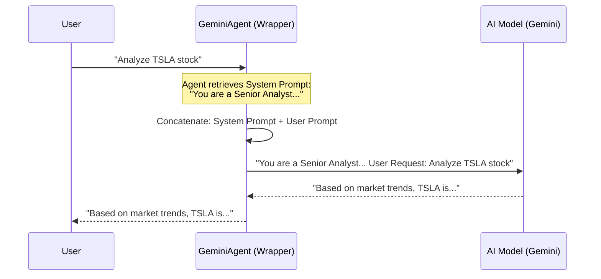

# Chapter 1: AI Agents & Personas

Welcome to the **Hands-On AI Engineering** project! 

If you have ever used ChatGPT or Gemini, you know you can ask them anything. But in software engineering, "anything" is too broad. We need reliability, consistency, and expertise.

This chapter introduces the fundamental building block of AI engineering: **The Agent**.

### 🎯 The Motivation: Why do we need Agents?

Imagine you run a company. You wouldn't hire a random person off the street and say, *"Do work."* You would hire a **Financial Analyst**, give them a specific job description, and a set of rules to follow.

*   **Raw LLM:** A generic genius who knows everything but lacks focus.
*   **AI Agent:** A "Digital Employee" wrapped around that genius with a specific **Job Title (Role)** and **Job Description (System Prompt)**.

By creating Agents, we stop treating AI as a chatbot and start treating it as a software component that performs a specific job reliably.

---

### 🔑 Key Concept: The Persona Wrapper

At its core, an **AI Agent** is just a class (a code wrapper) that holds three things:
1.  ** The Model:** The actual brain (e.g., Gemini, GPT-4).
2.  ** The Role:** Who the agent is (e.g., "Market Analyst").
3.  ** The System Prompt:** The strict instructions defining their behavior.

#### The Use Case: The Financial Analyst
Let's build a simple agent for our financial dashboard. We don't want it to write poems or tell jokes. We want it to look at stock data and give professional advice.

---

### 🛠️ Hands-On: Building Your First Agent

Let's look at how we build this abstraction using Python. We will create a class called `GeminiAgent`.

#### 1. The Setup
First, we define the "shell" of our employee. This class accepts a specific role and set of instructions when we create it.

```python
import google.generativeai as genai

class GeminiAgent:
    def __init__(self, api_key: str, role: str, system_prompt: str):
        # Configure the AI model (The Brain)
        genai.configure(api_key=api_key)
        self.model = genai.GenerativeModel('gemini-2.5-flash')
        
        # Save the "Job Description"
        self.role = role
        self.system_prompt = system_prompt
```
*   **`self.role`**: Just a label for us to know who this is.
*   **`self.system_prompt`**: This is the magic sauce. It persists for the life of the agent.

#### 2. The Execution Logic
Now, we need a method to actually do the work. This is where the **Persona** is applied. We don't just send the user's question; we attach the "Job Description" to it.

```python
    def generate(self, prompt: str) -> str:
        # Combine instructions with the user's request
        full_prompt = f"{self.system_prompt}\n\nUser Request: {prompt}"
        
        # Send to the AI model
        response = self.model.generate_content(full_prompt)
        return response.text
```
*   **`full_prompt`**: Notice how we stick the `system_prompt` *before* the user's request. This ensures the AI reads its instructions before it attempts to answer.

---

### 🚀 Putting it to Work

Now that we have our class, let's hire two different "employees" using the exact same underlying AI model.

#### Employee A: The Serious Analyst
```python
analyst = GeminiAgent(
    api_key="YOUR_KEY",
    role="Market Analyst",
    system_prompt="You are a senior financial analyst. Provide professional, concise risk assessments."
)

print(analyst.generate("What do you think about Tech Stocks?"))
```
> **Output:** "The technology sector currently faces high volatility due to interest rate fluctuations. I recommend a cautious approach..."

#### Employee B: The Excited Intern
```python
intern = GeminiAgent(
    api_key="YOUR_KEY",
    role="Intern",
    system_prompt="You are an excited intern! Use lots of emojis and be super optimistic!"
)

print(intern.generate("What do you think about Tech Stocks?"))
```
> **Output:** "Tech stocks are looking SUPER awesome right now!! 🚀💻 To the moon! Let's buy everything! 🌟"

**The Lesson:** The *model* is the same. The **Agent Persona** changes the entire output.

---

### ⚙️ Under the Hood: Internal Implementation

What actually happens when you run `agent.generate()`? It might feel like magic, but it is simple string manipulation.

When you create an Agent, you are essentially creating a **Context Container**. The LLM is stateless (it forgets everything after each call). The Agent class is responsible for re-injecting the "Who am I?" context every single time.

#### Sequence Diagram



#### Real-World Implementation
In our project file `finagent/financial_agents.py`, we use this exact pattern to create specialized roles.

For example, we have a **Query Parser** agent. Its only job is to turn English sentences into JSON data (like extracting a stock symbol). It doesn't analyze stocks; it just cleans data.

```python
# From finagent/financial_agents.py
self.query_parser = GeminiAgent(
    gemini_api_key,
    "Query Parser", # Role
    # Specific System Prompt for parsing
    """You are a financial query parser. Extract from the user query:
    - Stock symbol (ticker)
    Return a JSON object."""
)
```

By splitting these roles, we create a reliable pipeline:
1.  **Query Parser Agent** cleans the input.
2.  **Market Analyst Agent** generates the text.

---

### 📝 Summary

In this chapter, we learned:
1.  **Raw LLMs** are too generic for engineering tasks.
2.  **Agents** wrap an LLM with a specific **Role** and **System Prompt**.
3.  By concatenating the system prompt with the user request, we force the AI to stay "in character."
4.  We can create multiple specialized agents (like a Parser vs. an Analyst) to handle different parts of an application.

In the next chapter, we will give our agents "hands" so they can fetch real-world data instead of just generating text.

👉 **Next Step:** [External Tool Integration](02_external_tool_integration.md)

---

Generated by [Code IQ](https://github.com/adityasoni99/Code-IQ)