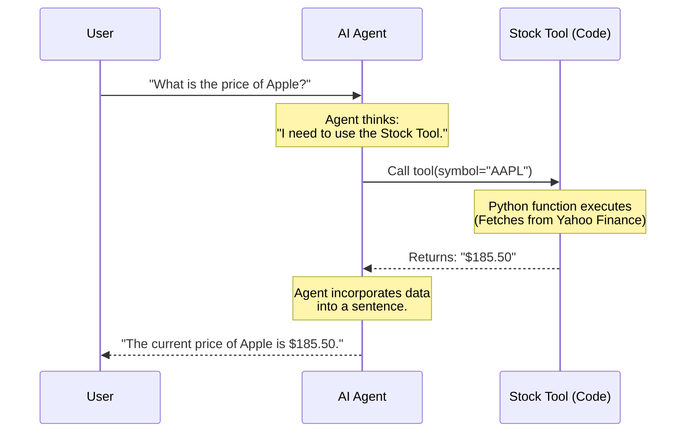

# Chapter 2: External Tool Integration

In [Chapter 1: AI Agents & Personas](01_ai_agents___personas.md), we learned how to create an AI Agent by giving a raw model a specific "Job Description."

However, even the best Market Analyst agent has a major flaw: **It is frozen in time.** If you ask it, *"What is the price of Apple (AAPL) right now?"*, it will either:
1.  Give you a price from its training data (months or years old).
2.  Hallucinate (guess) a number.

This chapter introduces the solution: **External Tools**.

### 🎯 The Motivation: The "Brain in a Jar" Problem

Imagine the AI model is a genius locked in a room with no windows and no internet. They have memorized every book ever written up to 2023.

*   **Scenario A:** You ask, "Who wrote Hamlet?"
    *   **Result:** The genius answers perfectly from memory.
*   **Scenario B:** You ask, "What is the weather in Tokyo right now?"
    *   **Result:** The genius cannot answer. They are disconnected from the present moment.

**Tool Integration** is like giving that genius a **Laptop** with internet access. Now, when you ask about the weather, they don't guess—they look it up.

---

### 🔑 Key Concept: What is a "Tool"?

In Python terms, a tool is simply a **function** that the AI is allowed to call.

It works like this:
1.  **You:** "Get me the stock price for Apple."
2.  **Agent:** "I don't know that, but I have a tool called `get_stock_price`. I will use it."
3.  **Tool:** Connects to the Stock Market API -> Returns `$150.00`.
4.  **Agent:** Reads the result -> "The current price is $150.00."

The Agent acts as the **brain** that decides *which* tool to use, and the Tool acts as the **hands** that actually do the work.

---

### 🛠️ Hands-On: Giving Your Agent Hands

Let's look at how this is implemented in our project using the `YFinanceStockTool` (from the file `multi_agent_financial_analyst/tools/financial_tools.py`).

#### 1. The Tool Definition
We wrap a standard Python library (`yfinance`) inside a class structure that the Agent can understand.

```python
# Simplified from tools/financial_tools.py
import yfinance as yf
from crewai.tools import BaseTool

class YFinanceStockTool(BaseTool):
    name: str = "stock_data_tool"
    description: str = "Get real-time stock prices and company info."

    def _run(self, symbol: str) -> str:
        # The actual work happens here
        stock = yf.Ticker(symbol)
        price = stock.history(period="1d")['Close'].iloc[-1]
        return f"The price of {symbol} is ${price}"
```
*   **`name`**: How the Agent identifies the tool.
*   **`description`**: The Agent reads this to know *when* to use the tool.
*   **`_run`**: The logic that fetches the data.

#### 2. Equipping the Agent
When we create an Agent (using a framework like Agno or CrewAI), we pass these tools in a list.

```python
# Conceptual example of equipping an agent
finance_agent = Agent(
    role="Financial Analyst",
    instructions="Use your tools to find live data.",
    tools=[YFinanceStockTool()]  # <--- We hand over the tools here
)
```

Now, if you ask this agent "Tell me a joke," it **won't** use the tool.
If you ask "How is Apple doing today?", it **will** automatically trigger `YFinanceStockTool`.

---

### ⚙️ Under the Hood: How does it know?

How does a text-generating AI know how to run a Python function? It uses a concept called **Function Calling** (or Tool Calling).

The AI doesn't actually run the code itself. It outputs a structured request (usually JSON), and our code framework runs the function for it.

#### The Execution Loop

1.  **User** sends a prompt.
2.  **Agent** analyzes the prompt against its list of available tools.
3.  **Agent** decides: "I need to run `stock_data_tool` with input `AAPL`."
4.  **System** pauses, runs the Python function, and gets the result.
5.  **System** feeds the result back to the Agent.
6.  **Agent** generates the final English answer.

#### Sequence Diagram



---

### 🚀 Real-World Example: Web Search

In our project file `agentic_rag_with_qwen_and_firecrawl/app.py`, we see another powerful use case: **Web Search**.

Here, we give an agent the ability to search the internet using `FirecrawlTools`.

```python
# From agentic_rag_with_qwen_and_firecrawl/app.py
agent = Agent(
    model=model,
    instructions=[...],
    # Give the agent the ability to crawl the web
    tools=[FirecrawlTools(api_key=key, scrape=False, crawl=True)], 
    show_tool_calls=True
)
```

**Why is this amazing?**
If you are analyzing a PDF about a company from 2021 (using the concepts we will learn in the next chapter), the data is old. By adding `FirecrawlTools`, the Agent can:
1.  Read the old PDF.
2.  Search Google for "Current stock price 2024".
3.  Compare the old data with the new data automatically.

---

### 📝 Summary

In this chapter, we learned:
1.  **LLMs are static**; they don't know current events.
2.  **Tools** are Python functions that we allow the Agent to "call."
3.  The Agent acts as the **Brain** (deciding what to do), and the Tool acts as the **Hands** (fetching data).
4.  We can integrate APIs (like YFinance) or Web Search (like Firecrawl) to make our agents "live."

Now our Agent is smart and connected to the internet. But what if we want it to read a specific, massive 500-page manual that isn't on the public internet?

For that, we need a way to "retrieve" specific knowledge.

👉 **Next Step:** [Retrieval-Augmented Generation (RAG)](03_retrieval_augmented_generation__rag_.md)

---

Generated by [Code IQ](https://github.com/adityasoni99/Code-IQ)