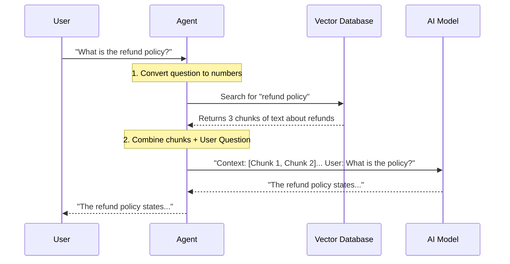

# Chapter 3: Retrieval-Augmented Generation (RAG)

In [Chapter 2: External Tool Integration](02_external_tool_integration.md), we gave our Agent "hands" to search the internet for live data (like stock prices).

But what if the answer isn't on the public internet?
What if you need the AI to answer questions about your company's **private 500-page employee handbook** or a specific **legal contract**?

You can't just copy-paste 500 pages into the chat prompt. It's too expensive, and the model might get confused.

The solution is **RAG (Retrieval-Augmented Generation)**.

---

### 🎯 The Motivation: The "Open Book Exam"

Imagine you are taking a test about a history book.
*   **Standard AI (Chapter 1):** You try to answer purely from memory. You might hallucinate details.
*   **RAG:** You have the textbook on your desk. When asked a question, you look up the specific page, read the paragraph, and write the answer.

RAG turns the AI from a **Memorizer** into a **Researcher**.

---

### 🔑 Key Concepts: The Librarian Analogy

RAG might sound technical, but it works exactly like a library.

1.  **Ingestion (The Library Stock):** You bring a PDF (the book) to the system.
2.  **Chunking (The Scissors):** We can't read the whole book at once. We cut the text into small pieces (paragraphs or pages).
3.  **Embeddings (The Dewey Decimal System):** We turn those text pieces into numbers (vectors) so we can organize them by *meaning*.
4.  **Retrieval (The Search):** When you ask a question, the system finds the 3 most relevant "chunks."
5.  **Generation (The Answer):** The AI reads those 3 chunks and answers your question.

---

### 🛠️ Hands-On: Building a RAG Agent

We will use the framework **Agno** (as seen in our project file `agentic_rag_with_o-3-mini_and_duckduckgo/app.py`) to build this.

#### 1. The Vector Database (The Bookshelf)
First, we need a place to store our "chunks" of text. We use a **Vector Database** (like Milvus).

```python
from agno.vectordb.milvus import Milvus
from agno.embedder.openai import OpenAIEmbedder

# Define where to store the data
vector_db = Milvus(
    collection="rag_documents_openai", 
    uri="http://localhost:19530",
    embedder=OpenAIEmbedder() 
)
```
*   **`Milvus`**: The database software.
*   **`embedder`**: The tool that converts text into numbers (vectors).

#### 2. The Knowledge Base (The Book)
Next, we load a PDF into that database. This step automatically handles **Chunking** (cutting text) and **Embedding** (converting to numbers).

```python
from agno.knowledge.pdf import PDFKnowledgeBase

# Connect a PDF file to our Vector DB
knowledge_base = PDFKnowledgeBase(
    path="company_manual.pdf",
    vector_db=vector_db,
)

# This triggers the "Reading" process
knowledge_base.load(recreate=True)
```
*   **`PDFKnowledgeBase`**: A helper class that knows how to read PDFs.
*   **`.load()`**: This is where the magic happens. It reads the file, splits it, and saves it to the database.

#### 3. The RAG Agent (The Librarian)
 Finally, we create the Agent. Notice we pass the `knowledge` parameter.

```python
from agno.agent import Agent

agent = Agent(
    model=OpenAIChat(id="gpt-4o"),
    knowledge=knowledge_base,
    search_knowledge=True,  # Enable RAG features
    instructions=["Always search the knowledge base first."]
)

agent.print_response("What is the policy on remote work?", stream=True)
```

**What just happened?**
1. The user asked about "remote work".
2. The Agent searched the `knowledge_base`.
3. It found the specific paragraph about working from home.
4. It generated an answer based *only* on that paragraph.

---

### ⚙️ Under the Hood: Vector Embeddings

You might be wondering: *How does the computer know which paragraph is relevant?*

It uses **Vector Embeddings**. An embedding model turns text into a list of coordinates (numbers).
*   "Apple" might be `[0.9, 0.1, 0.2]`
*   "Banana" might be `[0.85, 0.1, 0.2]` (Close to Apple)
*   "Car" might be `[0.1, 0.9, 0.8]` (Far away)

When you ask "What fruit is red?", the system converts your question into numbers and looks for the closest matching numbers in the database.

#### Sequence Diagram

Here is the flow when you ask a question:



---

### 🚀 Real-World Implementation

In our project file `agentic_rag_with_o-3-mini_and_duckduckgo/app.py`, we combine RAG with the Web Search we learned in Chapter 2.

This creates a "Super Agent" that checks internal documents *first*, and if the answer isn't there, it checks the internet.

```python
# From agentic_rag_with_o-3-mini_and_duckduckgo/app.py

# Instructions tell the agent the order of operations
instructions = [
    "1. Knowledge Base Search:",
    "   - ALWAYS start by searching the knowledge base",
    "2. External Search:",
    "   - If knowledge base yields insufficient results, use duckduckgo_search"
]

agent = Agent(
    model=model,
    knowledge=knowledge_base,
    tools=[DuckDuckGoTools()], # Tool from Chapter 2
    instructions=instructions
)
```

This is the power of **Agentic RAG**. It's not just looking up text; it's making a decision: *"Do I have this info in my files? No? Okay, I'll Google it."*

---

### 📝 Summary

In this chapter, we learned:
1.  **RAG** allows AI to read specific documents (like PDFs) before answering.
2.  **Vector Databases** store text as numbers (embeddings) to make them searchable by meaning.
3.  **Chunking** breaks large documents into small, digestible pieces for the AI.
4.  We can combine **Knowledge Bases** (internal data) with **Tools** (external data).

We now have a single agent that can use tools and read documents. But in a large software system, one agent isn't enough. You might need a team of agents working together.

👉 **Next Step:** [Multi-Agent Orchestration](04_multi_agent_orchestration.md)

---

Generated by [Code IQ](https://github.com/adityasoni99/Code-IQ)