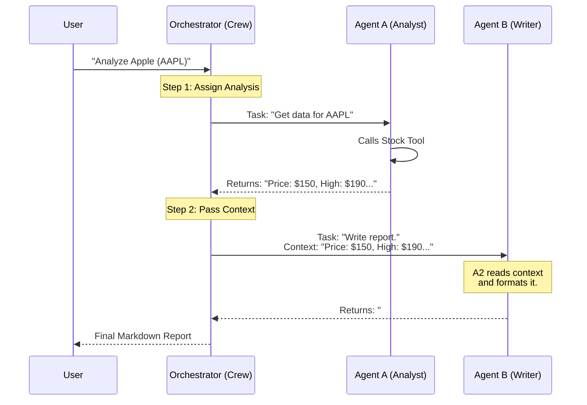

# Chapter 4: Multi-Agent Orchestration

In the previous chapter, [Retrieval-Augmented Generation (RAG)](03_retrieval_augmented_generation__rag_.md), we turned our agent into a researcher that can read documents. Before that, in [External Tool Integration](02_external_tool_integration.md), we gave it tools to search the web.

Now we have a very capable agent. But in software engineering, giving one person **too many responsibilities** is a recipe for disaster.

If you ask one agent to: *"Search for data, analyze the trends, write a report, format it in Markdown, and critique the writing style,"* it will likely lose focus or hallucinate.

This chapter introduces the solution: **Multi-Agent Orchestration**.

### 🎯 The Motivation: The "One-Man Band" Problem

Imagine a Newsroom. You rarely see one person acting as the Reporter, the Photographer, the Editor, and the Publisher all at the same time.

*   **Single Agent:** Tries to do everything. It might find good data but write a messy report.
*   **Multi-Agent Team:**
    *   **Agent A (Reporter):** Only cares about facts and numbers.
    *   **Agent B (Writer):** Only cares about tone, grammar, and formatting.
    *   **The Orchestrator:** The Manager who passes the Reporter's notes to the Writer.

**Orchestration** is the layer of code that manages this workflow. It ensures Agent A finishes their job before Agent B starts, and it passes the output of A into the input of B.

---

### 🔑 Key Concept: The Crew

To implement this, we often use frameworks like **CrewAI** (which we use in our project). Think of a "Crew" as a container that holds:

1.  **Agents:** The workers (defined by Personas).
2.  **Tasks:** The specific jobs assigned to workers.
3.  **Process:** The workflow logic (e.g., Sequential: A -> B -> C).

Let's build a **Financial Analysis Team** to solve the problem of creating high-quality stock reports.

---

### 🛠️ Hands-On: Building the Team

We will look at the code structure from our project file `multi_agent_financial_analyst/financial_analyst.py`.

#### Step 1: Hire the Agents
First, we define our distinct roles. Notice they have different "Goals".

```python
from crewai import Agent

# Agent 1: The Researcher (Focus: Data & Accuracy)
analyst_agent = Agent(
    role="Wall Street Analyst",
    goal="Analyze stock data using real-time numbers.",
    backstory="You are meticulous. You care about P/E ratios and trends.",
    tools=[stock_tool], # Only the analyst needs the data tool!
    verbose=True
)

# Agent 2: The Writer (Focus: Communication & Format)
writer_agent = Agent(
    role="Financial Report Writer",
    goal="Turn data into a readable, professional Markdown report.",
    backstory="You are an expert editor. You make complex data look easy.",
    verbose=True
)
```

*   **Specialization:** The `writer_agent` does *not* have access to the `stock_tool`. It doesn't need it. Its job is to process text, not fetch data.

#### Step 2: Assign the Tasks
A **Task** connects an Agent to a specific instruction.

```python
from crewai import Task

# Task for Agent 1
analysis_task = Task(
    description=f"Get the latest price and 52-week high for {symbol}.",
    expected_output="A summary of raw financial metrics.",
    agent=analyst_agent
)

# Task for Agent 2
report_task = Task(
    description="Take the analysis and write a blog post about it.",
    expected_output="A Markdown formatted blog post.",
    agent=writer_agent
)
```

#### Step 3: The Manager (The Orchestrator)
This is the magic step. We create a `Crew` to manage the flow.

```python
from crewai import Crew, Process

# Create the team
crew = Crew(
    agents=[analyst_agent, writer_agent],
    tasks=[analysis_task, report_task],
    process=Process.sequential, # <--- The Orchestration Logic
    verbose=True
)

# Start the work
result = crew.kickoff()
```

**What happens here?**
Because we chose `Process.sequential`, the Orchestrator knows:
1.  Run `analysis_task` first.
2.  Take the *output* of `analysis_task`.
3.  Feed it as *context* into `report_task`.
4.  Run `report_task`.
5.  Return the final result.

---

### ⚙️ Under the Hood: The Context Relay Race

How does the Writer know what the Analyst found? They don't talk on the phone. The Orchestrator passes the "state" automatically.

It works like a relay race where the "baton" is the text generated by the previous agent.

#### Sequence Diagram



### 🚀 Real-World Implementation

In `multi_agent_financial_analyst/financial_analyst.py`, we use this exact pattern to build a Streamlit app.

The power of this abstraction is that **Agent B (The Writer) is completely replaceable.**

*   Want a blog post? Swap in a "Blogger Agent."
*   Want a Tweet? Swap in a "Social Media Agent."
*   **Agent A (The Analyst)** never needs to change. It just keeps outputting raw facts.

#### The "Kickoff" Method
When you run `crew.kickoff()`, the framework handles the heavy lifting of error handling and loop management.

```python
# From financial_analyst.py (Simplified)

def create_crew(symbol):
    # ... define agents and tasks ...
    
    crew = Crew(
        agents=[stock_analysis_agent, report_writer_agent],
        tasks=[analysis_task, report_task],
        process=Process.sequential
    )
    return crew

# When user clicks button:
crew = create_crew("TSLA")
final_report = crew.kickoff() # This runs the entire sequence
```

---

### 📝 Summary

In this chapter, we learned:
1.  **Single agents** struggle with complex, multi-step workflows.
2.  **Multi-Agent Orchestration** splits a big problem into small, specialized steps.
3.  **Roles** allow us to separate concerns (e.g., Data fetching vs. Report writing).
4.  **Sequential Process** ensures that the output of one agent becomes the input for the next, creating a coherent pipeline.

We have built a team that can use tools and talk to each other. But as our agents get more complex, they need a standardized way to connect to *servers*, *databases*, and *local file systems* that isn't just a simple Python function.

For that, we need a standard protocol.

👉 **Next Step:** [Model Context Protocol (MCP) Server](05_model_context_protocol__mcp__server.md)

---

Generated by [Code IQ](https://github.com/adityasoni99/Code-IQ)