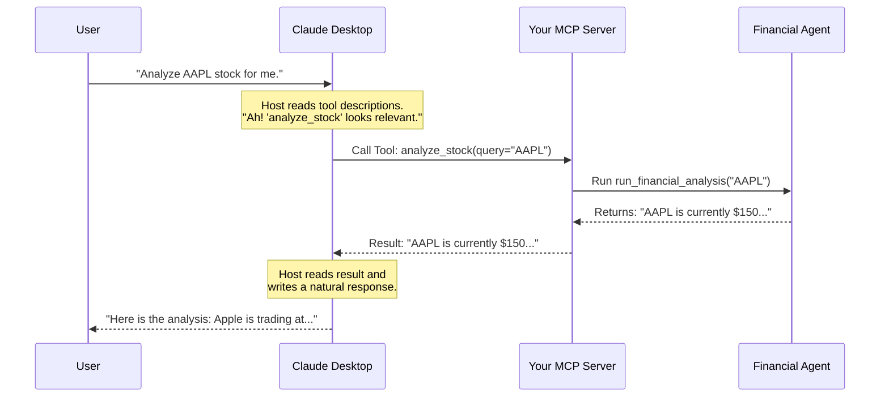

# Chapter 5: Model Context Protocol (MCP) Server

In the previous chapter, [Multi-Agent Orchestration](04_multi_agent_orchestration.md), we built a team of specialized agents that can research, analyze, and write reports.

But currently, your agents live in a "black box"—a terminal window or a Python script. To use them, you have to run code.
What if you want to use your financial analyst **inside** a beautiful, polished application like **Claude Desktop**? What if you want to drag-and-drop a PDF into Claude and have *your* custom code analyze it?

This chapter introduces the bridge between your code and the rest of the world: **The Model Context Protocol (MCP)**.

### 🎯 The Motivation: The "Universal Adapter"

Imagine you built a custom engine.
*   **Without MCP:** You have to build the entire car (wheels, steering, dashboard) just to use your engine.
*   **With MCP:** Your engine becomes a "plugin." You can drop it into a Ferrari (Claude Desktop), and the Ferrari knows exactly how to drive it.

**MCP** allows your local Python tools to appear as "native features" inside AI applications. It turns your script into a server that apps can talk to.

---

### 🔑 Key Concept: Host, Server, and Tool

MCP works on a simple relationship:

1.  **The Host (The Client):** The application the user sees (e.g., Claude Desktop). It provides the interface (Chat window).
2.  **The Server (Your Code):** A background process that holds your tools.
3.  **The Tool:** The specific function (like "Analyze Stock") that the Host is allowed to trigger.

Think of it like a restaurant:
*   **Host (Claude):** The Waiter taking orders.
*   **Server (You):** The Kitchen.
*   **Tool:** The Menu Items (Steak, Salad).

The Waiter doesn't know *how* to cook a steak; they just know how to send the order to the Kitchen.

---

### 🛠️ Hands-On: Creating an MCP Server

We will use the **FastMCP** library, which makes creating these servers incredibly easy. We are looking at the file `finagent/main.py`.

#### 1. The Setup
We create an instance of a server. This is like opening the restaurant kitchen.

```python
from mcp.server.fastmcp import FastMCP
from financial_agents import run_financial_analysis

# Create the server instance
# "financial-analyst" is the name Claude will see internally
mcp = FastMCP("financial-analyst")
```

#### 2. Exposing a Tool
This is the most important part. We have a complex function `run_financial_analysis` from our previous chapters. We need to tell the MCP server: *"Allow the outside world to call this."*

We use the `@mcp.tool()` decorator to do this.

```python
@mcp.tool()
def analyze_stock(query: str) -> str:
    """
    Performs a natural language stock market analysis.
    Returns a summary and recommendations.
    """
    try:
        # We call our complex agent logic here
        result = run_financial_analysis(query)
        return result
    except Exception as e:
        return f"Error: {e}"
```

**Crucial Detail:** The docstring (`"""..."""`) is NOT just a comment. The Host (Claude) reads this to understand *what* the tool does and *when* to use it.

#### 3. Running the Server
Finally, we tell the script to listen for connections.

```python
if __name__ == "__main__":
    # 'stdio' means it talks over standard input/output
    # This is how local desktop apps communicate securely
    mcp.run(transport='stdio')
```

---

### ⚙️ Under the Hood: The Conversation

How does Claude Desktop actually talk to your Python script? They use a standard communication flow over `stdio` (Standard Input/Output).

When you ask Claude a question, it doesn't immediately answer. It checks its list of tools first.

#### Sequence Diagram



---

### 🚀 Real-World Implementation: Connecting the Wires

Writing the code in `finagent/main.py` is only half the battle. We now need to tell Claude Desktop where to find this server.

This is done via a configuration file on your computer (usually `claude_desktop_config.json`).

#### The Configuration JSON
You don't write this in Python; you add this to your Claude settings.

```json
{
  "mcpServers": {
    "financial-analyst": {
      "command": "python",
      "args": [
        "/absolute/path/to/finagent/main.py"
      ],
      "env": {
        "GEMINI_API_KEY": "your_key_here"
      }
    }
  }
}
```

**What is happening here?**
1.  **`command`**: We tell Claude to run `python`.
2.  **`args`**: We give it the path to our `main.py`.
3.  **`env`**: We pass our API keys (so our agent can access Gemini).

#### The User Experience
Once this is saved and you restart Claude Desktop:
1.  You will see a 🔌 (Plug icon) indicating the server is connected.
2.  You can type: *"Can you check the risks for Tesla?"*
3.  Claude will reply: *"Using financial-analyst tool..."* and run your local code instantly.

---

### 📝 Summary

In this chapter, we learned:
1.  **MCP** acts as a universal adapter, connecting local code to AI interfaces (like Claude Desktop).
2.  **Host vs. Server:** The Host (app) requests actions; the Server (our script) executes them.
3.  **@mcp.tool():** This decorator turns a regular Python function into an exposed capability.
4.  **Stdio Transport:** The secure way the app and the script talk on your local machine.

Now we have a text-based system that can look up data, analyze it, and present it in a nice interface. But financial analysis isn't just about text. It's about **charts, graphs, and visual trends**.

In the next chapter, we will learn how to make our AI understand and generate images.

👉 **Next Step:** [Multimodal Processing](06_multimodal_processing.md)

---

Generated by [Code IQ](https://github.com/adityasoni99/Code-IQ)