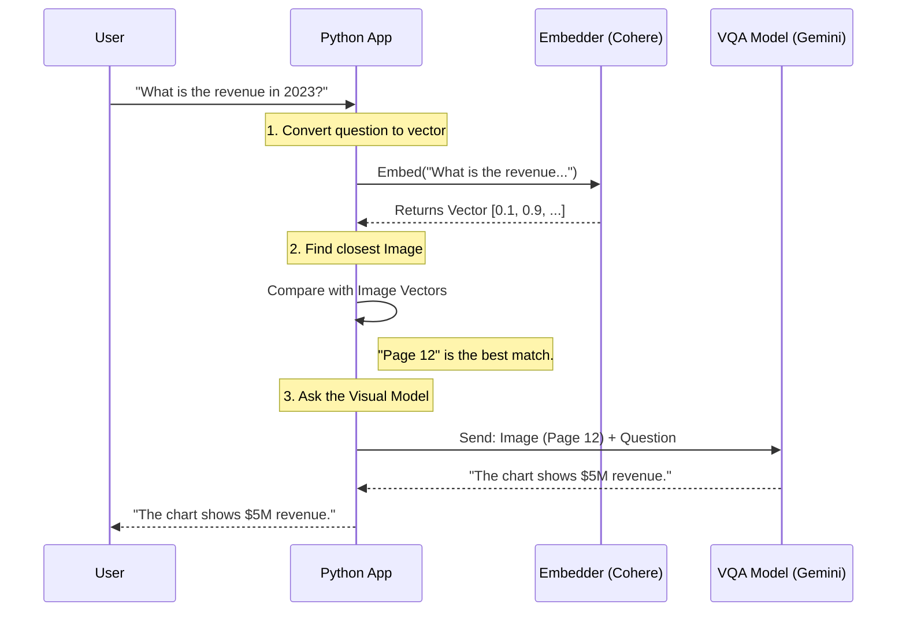

# Chapter 6: Multimodal Processing

In [Chapter 5: Model Context Protocol (MCP) Server](05_model_context_protocol__mcp__server.md), we learned how to connect our AI agents to the outside world, allowing them to communicate with desktop applications.

However, up until now, our agents have had a major limitation: **They are blind.**

They can read text, but if you give them a financial report with a **graph** showing a market crash, or a user manual with a **diagram** of a machine, they miss the most important information.

This chapter introduces **Multimodal Processing**—giving our AI "eyes" to see, analyze, and understand images alongside text.

### 🎯 The Motivation: Radio vs. TV

Think of standard LLMs (like the ones we used in Chapter 1) as **Listening to the Radio**.
*   You hear the words perfectly.
*   If the announcer says, "Look at this chart," you are lost.

Multimodal AI is like **Watching TV**.
*   You hear the words.
*   You **see** the visuals.
*   You understand the full context.

#### The Use Case: The Visual Financial Analyst
Imagine you have a 50-page PDF of a company's earnings report. Page 12 has a complex bar chart comparing revenue across 5 years.
*   **Text Agent:** Reads the caption "Figure 1: Revenue" but doesn't know the numbers.
*   **Multimodal Agent:** Looks at the image, extracts the numbers from the bars, and tells you: *"Revenue dropped by 20% in 2023."*

---

### 🔑 Key Concepts

To build this, we combine three specific technologies:

1.  **PDF-to-Image Conversion:** AI models usually can't "open" a PDF file directly like a human. We must convert the document pages into individual pictures (JPEGs or PNGs).
2.  **Visual Question Answering (VQA):** This is a special type of AI model (like Gemini Flash or GPT-4o) that takes an **Image** and a **Question** as input, and outputs a text **Answer**.
3.  **Image Embeddings:** Just like we turned text into numbers in [Chapter 3: Retrieval-Augmented Generation (RAG)](03_retrieval_augmented_generation__rag_.md), we can turn *images* into numbers to search for them.

---

### 🛠️ Hands-On: Giving the AI Eyes

Let's look at how we implement this in our project `vision_rag/utils.py`. We are building a pipeline that takes a PDF and lets you chat with it.

#### 1. Converting the Document (The Eyes)
First, we need to turn the PDF pages into images so the AI can look at them. We use a library called `PyMuPDF` (imported as `fitz`).

```python
import fitz # PyMuPDF
from PIL import Image
import io

def pdf_to_images(pdf_bytes):
    doc = fitz.open(stream=pdf_bytes, filetype="pdf")
    images = []
    
    # Loop through every page
    for page in doc:
        pix = page.get_pixmap() # Render page as image
        img_data = pix.tobytes("png")
        images.append(Image.open(io.BytesIO(img_data)))
        
    return images
```
*   **`page.get_pixmap()`**: This takes the digital page and takes a high-resolution "screenshot" of it.
*   **Result:** We now have a list of images instead of a document.

#### 2. Visual Question Answering (The Brain)
Now that we have an image, how do we ask questions about it? We use **Gemini 2.5 Flash**, a model designed to be multimodal.

```python
import requests
import base64

def gemini_vqa(api_key, image_bytes, question):
    # Encode image so it can be sent over the internet
    image_b64 = base64.b64encode(image_bytes).decode()
    
    # Structure the request: Image + Text
    data = {
        "contents": [{
            "parts": [
                {"inline_data": {"mime_type": "image/png", "data": image_b64}},
                {"text": question} # The user's question
            ]
        }]
    }
    # ... send request to Google API ...
```

**How to use it:**
```python
# Imagine we have an image of a chart
answer = gemini_vqa(key, chart_image, "Is the trend going up or down?")
print(answer) 
# Output: "The trend is going up, peaking in Q4."
```

---

### ⚙️ Under the Hood: Vision RAG

In [Chapter 3: Retrieval-Augmented Generation (RAG)](03_retrieval_augmented_generation__rag_.md), we learned how to find relevant *text* using embeddings.

**Vision RAG** works the same way, but with pictures.
1.  **User asks:** "Show me the revenue chart."
2.  **System:** Converts the question into numbers (vector).
3.  **System:** Compares that vector against the vectors of all 50 pages (images).
4.  **Match:** Finds that Page 12 looks mathematically similar to the concept of "revenue chart."
5.  **VQA:** Sends Page 12 to Gemini to answer the specific question.

#### Sequence Diagram



### 🚀 Implementation Details

Let's look at the code that makes the "Search" possible in `vision_rag/utils.py`.

#### 1. Creating Image Embeddings
We use **Cohere** (a model provider) to understand what is inside the image without even describing it in text.

```python
# From vision_rag/utils.py
def get_cohere_embedding(api_key, input_data, input_type='image'):
    co = cohere.Client(api_key)
    
    if input_type == 'image':
        # Cohere 'looks' at the image and returns numbers
        response = co.embed(
            images=[input_data], 
            model="embed-v4.0"
        )
        return np.array(response.embeddings[0])
```

#### 2. The Search Logic (Cosine Similarity)
This function compares the "Question Vector" with the "Image Vectors".

```python
# From vision_rag/utils.py
from sklearn.metrics.pairwise import cosine_similarity

def find_most_similar(query_emb, emb_list):
    # Calculate similarity between query and ALL images
    similarities = cosine_similarity([query_emb], emb_list)[0]
    
    # Find the winner (highest score)
    best_idx = int(np.argmax(similarities))
    
    return best_idx
```

If the user asks for "cats", and Image A contains a dog while Image B contains a cat, the embedding for Image B will be mathematically closer to the word "cats".

---

### 📝 Summary

In this chapter, we learned:

1.  **Multimodal Processing** allows AI to process text and images simultaneously.
2.  **PDF-to-Image** is the first step to letting AI "read" visual documents.
3.  **Vision RAG** allows us to search for specific images based on a text description.
4.  **Visual Question Answering (VQA)** is the technology that lets us ask specific questions about those images.

We have now covered Agents, Tools, RAG, Orchestration, MCP, and Vision. Our AI is smart, connected, organized, and can see.

However, throughout these chapters, we have been talking about "Embeddings" and "Vectors" as if they were magic. In the final chapter, we will demystify exactly how these vectors are stored and managed at scale.

👉 **Next Step:** [Vector Embeddings & Storage](07_vector_embeddings___storage.md)

---

Generated by [Code IQ](https://github.com/adityasoni99/Code-IQ)