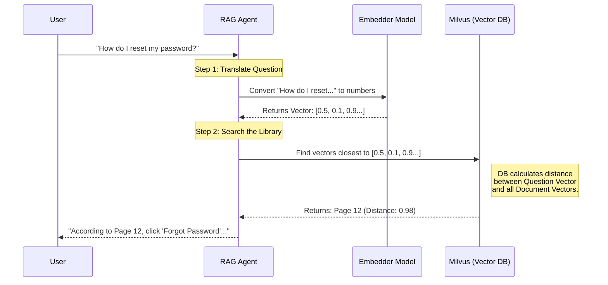

# Chapter 7: Vector Embeddings & Storage

In the previous chapter, [Multimodal Processing](06_multimodal_processing.md), we gave our agents eyes to see charts and graphs. Before that, in [Retrieval-Augmented Generation (RAG)](03_retrieval_augmented_generation__rag_.md), we taught them to read PDFs.

But there is a hidden engine powering both of these abilities. When you ask an agent to "find the page about revenue," how does it know *which* page talks about revenue without reading the whole book every time?

It doesn't use keywords (Ctrl+F). It uses **math**.

This chapter explains **Vector Embeddings** and **Vector Databases**—the long-term memory system of modern AI.

---

### 🎯 The Motivation: The "Vibes" Library

Imagine a library organized by **Title**. If you want a book about "puppies," but the book is titled *The Young Canine*, you will never find it. The words "puppy" and "canine" are completely different strings of text.

Now, imagine a library organized by **Meaning** (or "vibes").
*   In this library, books about dogs, wolves, and puppies sit on the same shelf.
*   Books about cats sit on the next shelf over.
*   Books about cars are on the other side of the building.

**Vector Embeddings** allow computers to organize data by meaning.
**Vector Storage** (like Milvus) is the library building that holds these organized shelves.

---

### 🔑 Key Concept: What is a Vector?

To a computer, a "Vector" is just a **list of numbers**.
An "Embedding Model" is a translator that turns **Content** (Text/Image) into **Numbers**.

Imagine we assign coordinates to words based on their meaning:

*   **"King"**: `[0.9, 0.1]`
*   **"Queen"**: `[0.9, 0.2]` (Very close!)
*   **"Apple"**: `[0.1, 0.9]` (Far away)

If you plot these on a graph, "King" and "Queen" sit right next to each other. This is how the AI knows they are related, even though the words look nothing alike.

---

### 🛠️ Hands-On: creating the Translator

Let's look at how this works in our project file `agentic_rag_with_qwen_and_firecrawl/app.py`. We use a class called `CustomEmbedder`.

#### 1. The Embedder
This function takes English text and turns it into that list of numbers.

```python
# From agentic_rag_with_qwen_and_firecrawl/app.py
from sentence_transformers import SentenceTransformer

class CustomEmbedder:
    def __init__(self):
        # Load a small model trained to understand English relationships
        self.model = SentenceTransformer("BAAI/bge-small-en-v1.5")

    def get_embedding(self, text: str) -> list[float]:
        # The Magic: Text -> [0.12, -0.45, 0.88, ...]
        return self.model.encode([text])[0].tolist()
```

*   **`SentenceTransformer`**: This is the brain that knows "Puppy" ≈ "Dog".
*   **`encode`**: The function that actually does the translation.

#### 2. The Storage (The Database)
Now that we have these numbers, we need a place to store them that allows for fast searching. Standard databases (like SQL) are bad at this. We use **Milvus**.

```python
from agno.vectordb.milvus import Milvus

# Define the database
vector_db = Milvus(
    collection="rag_documents_local",
    uri="http://localhost:19530", # Running on your computer
    embedder=CustomEmbedder()     # Tell it how to translate text
)
```

*   **`collection`**: Think of this as a "Table" or a "Folder" in the database.
*   **`uri`**: The address where the database lives.

---

### ⚙️ Under the Hood: The Search

How does the search actually work? It uses a concept called **Cosine Similarity**.

Think of the vectors as arrows pointing from the center of a graph.
1.  **"Dog"** arrow points North-East.
2.  **"Puppy"** arrow points North-East (almost same direction).
3.  **"Car"** arrow points South.

To find the best match, we calculate the **angle** between the arrows. Small angle = High Similarity.

#### Sequence Diagram



---

### 🚀 Implementation Deep Dive: The Math

In `vision_rag/utils.py`, we can see the raw math used to find similar images. This is what Milvus does automatically, but here we do it manually to understand it.

#### 1. Generating Embeddings (The Setup)
Here, we use **Cohere** to create the list of numbers.

```python
# From vision_rag/utils.py
import cohere
import numpy as np

def get_cohere_embedding(api_key, input_data):
    co = cohere.Client(api_key)
    
    # Send text or image to the API
    response = co.embed(
        texts=[input_data], 
        model="embed-v4.0"
    )
    # Return the list of numbers (The Vector)
    return np.array(response.embeddings[0])
```

#### 2. Calculating Similarity (The Search)
This is the core logic of "Search." We use `cosine_similarity` from the `sklearn` library.

```python
# From vision_rag/utils.py
from sklearn.metrics.pairwise import cosine_similarity

def find_most_similar(query_emb, emb_list):
    # 1. Compare the Question (query_emb) vs. All Documents (emb_list)
    similarities = cosine_similarity([query_emb], emb_list)[0]
    
    # 2. Find the highest score (The Winner)
    best_idx = int(np.argmax(similarities))
    
    return best_idx
```

*   **`query_emb`**: The numbers representing your question.
*   **`emb_list`**: The numbers representing the pages in your database.
*   **`cosine_similarity`**: A function that returns a score between 0 (Not alike) and 1 (Identical).

If you ask "Show me the revenue", the math might look like this:
*   Page 1 (Intro): Score 0.1
*   Page 10 (Team Photos): Score 0.2
*   Page 50 (Financial Chart): **Score 0.89** -> **Winner!**

---

### 📝 Summary

In this final chapter, we learned:

1.  **Computers don't read; they calculate.** Text and images must be converted into numbers to be understood.
2.  **Vectors** are lists of numbers representing meaning.
3.  **Embeddings** are the process of translating content into vectors.
4.  **Vector Databases (like Milvus)** store these vectors so we can search millions of documents instantly based on "meaning" rather than just keywords.

### 🎓 Conclusion: You are an AI Engineer

Congratulations! You have completed **Hands-On AI Engineering**.

You started with a simple text generation script and built your way up to:
1.  **Agents** that have distinct personalities.
2.  **Tools** that connect to the internet.
3.  **RAG** systems that read and learn from private documents.
4.  **Orchestration** teams that manage complex workflows.
5.  **Servers** that connect your code to desktop apps.
6.  **Multimodal** eyes that see and understand images.
7.  **Vector Storage** that powers the memory of the entire system.

You now possess the foundational blocks to build any AI application you can imagine. Go build something amazing!

---

Generated by [Code IQ](https://github.com/adityasoni99/Code-IQ)