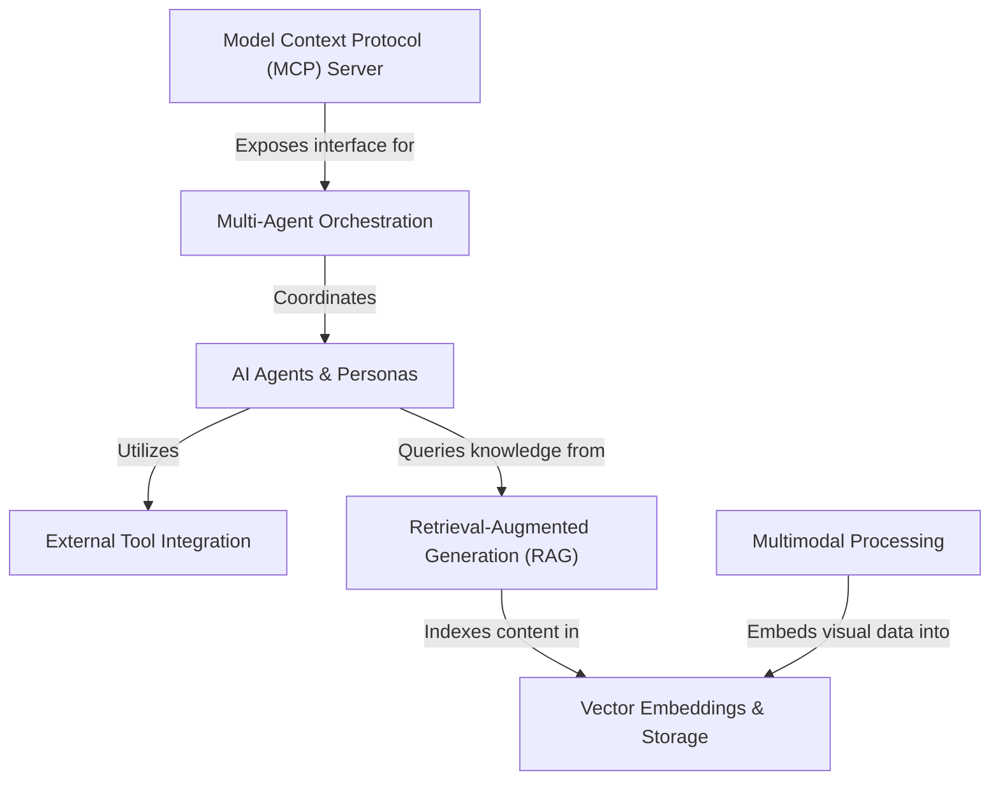

# Tutorial: Hands-On-AI-Engineering

This project builds **intelligent digital employees** that go beyond simple chatbots. It uses specialized *AI Agents* that work together in teams (orchestration) to solve complex tasks like financial analysis. These agents are equipped with **External Tools** to fetch real-time stock data or search the web, and they use **RAG** (Retrieval-Augmented Generation) to "read" and understand specific documents. The system also features **Multimodal Processing** to analyze images and exposes these capabilities to desktop apps via a standard **MCP Server**.

**Source Repository:** [https://github.com/Sumanth077/Hands-On-AI-Engineering](https://github.com/Sumanth077/Hands-On-AI-Engineering)

## Chapters

1. [AI Agents & Personas](01_ai_agents___personas.md)
2. [External Tool Integration](02_external_tool_integration.md)
3. [Retrieval-Augmented Generation (RAG)](03_retrieval_augmented_generation__rag_.md)
4. [Multi-Agent Orchestration](04_multi_agent_orchestration.md)
5. [Model Context Protocol (MCP) Server](05_model_context_protocol__mcp__server.md)
6. [Multimodal Processing](06_multimodal_processing.md)
7. [Vector Embeddings & Storage](07_vector_embeddings___storage.md)

---

Generated by [Code IQ](https://github.com/adityasoni99/Code-IQ)