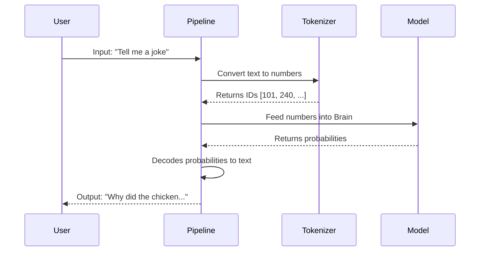

# Chapter 1: Generative Pipelines

Welcome to the world of Large Language Models (LLMs)! 

If you are just starting, the sheer number of technical terms—tensors, logits, tokenizers, attention masks—can feel overwhelming. But here is the good news: you don't need to master the math to start building cool things right now.

In this chapter, we will explore **Generative Pipelines**, the most beginner-friendly way to use the Hugging Face `transformers` library.

## The "Vending Machine" Analogy

Imagine you want a snack. You walk up to a vending machine, type in a code (like "A1" for chips), and the machine delivers the snack. 

You don't need to know how the machine's cooling system works, how the coils rotate, or how it verifies your currency. You just provide the **input** (money + selection) and get the **output** (snack).

**Generative Pipelines** are the vending machines of the AI world. They abstract away all the messy internal mechanics so you can focus purely on the task at hand.

## Use Case: The AI Joke Generator

Let's start with a classic goal: we want an AI to write a funny joke for us. 

To do this manually, we would usually have to:
1.  Load a massive dictionary to convert words into numbers.
2.  Load a neural network model.
3.  Convert our request into math formats (tensors).
4.  Run the math through the model.
5.  Convert the resulting numbers back into words.

That is a lot of work. Let's see how the **Pipeline** handles this.

### Step 1: Loading the Pipeline

The `pipeline` function is a high-level tool that bundles everything you need into one object. We simply tell it the **task** we want to perform (e.g., `"text-generation"`) and the **model** we want to use.

We will use `microsoft/Phi-3-mini-4k-instruct`, a powerful yet compact model capable of following instructions.

```python
from transformers import pipeline

# Create the vending machine (pipeline)
# We specify the task is 'text-generation'
generator = pipeline(
    "text-generation", 
    model="microsoft/Phi-3-mini-4k-instruct", 
    trust_remote_code=True
)
```

**What just happened?** 
In those few lines, the library automatically downloaded the model weights (the brain) and the tokenizer (the translator) and connected them for you.

### Step 2: Running the Pipeline

Now that our "machine" is ready, we just insert our input text.

```python
# The prompt (our request)
messages = [
    {"role": "user", "content": "Create a funny joke about chickens."}
]

# Run the generation
output = generator(messages, max_new_tokens=50)

# Print the result
print(output[0]["generated_text"])
```

**The Output:**
The model will output a text response, likely containing a joke about why the chicken crossed the road or joined a band. You didn't have to do any math—you just asked in plain English!

## Under the Hood: How It Works

While the pipeline feels like magic, understanding the high-level flow helps when things go wrong. 

When you pass text to a pipeline, three main steps happen in the background:

1.  **Preprocessing (Tokenization):** Your text is chopped into smaller pieces called "tokens" and converted into numbers. We will learn more about this in [Text Embeddings](03_text_embeddings.md).
2.  **Model Inference:** The numbers are fed into the LLM, which predicts the most likely next numbers.
3.  **Postprocessing (Decoding):** The predicted numbers are converted back into human-readable text.

Here is a diagram of the flow:



## Looking Inside the Pipeline (Optional)

If we were to strip away the `pipeline` wrapper and do this manually, the code would look significantly more complex. 

*Note: You don't need to run this, but compare it to the simple version above!*

First, we would need to manually handle the **Tokenizer**:

```python
from transformers import AutoTokenizer, AutoModelForCausalLM

# Load the components separately
tokenizer = AutoTokenizer.from_pretrained("microsoft/Phi-3-mini-4k-instruct")
model = AutoModelForCausalLM.from_pretrained("microsoft/Phi-3-mini-4k-instruct")

# Step 1: Preprocessing (Text to Numbers)
inputs = tokenizer("Tell me a joke", return_tensors="pt")
```

Next, we would have to manually run the **Generation**:

```python
# Step 2: Model Inference (The math part)
# This generates the output IDs (numbers)
outputs = model.generate(**inputs, max_new_tokens=50)
```

Finally, we would have to **Decode** the numbers back to text:

```python
# Step 3: Postprocessing (Numbers to Text)
result_text = tokenizer.decode(outputs[0])
print(result_text)
```

The **Generative Pipeline** saves us from writing these boilerplate lines every time we want to test a model. It ensures that the input text is formatted exactly how the model expects it.

## Common Pipeline Tasks

While we focused on `text-generation`, pipelines support many other tasks suitable for beginners:

*   `"sentiment-analysis"`: Classifying if a text is positive or negative.
*   `"summarization"`: Shortening long articles.
*   `"translation"`: Converting text between languages.

## Conclusion

You have just set up your first LLM application! The **Generative Pipeline** is your entry point into AI. It handles the heavy lifting of loading models, processing inputs, and decoding outputs, allowing you to treat the LLM like a utility.

 However, the quality of the output depends heavily on *how* you ask the model. In the next chapter, we will learn the art of talking to these models effectively.

**Next Step:** Learn how to craft the perfect input in [Prompt Engineering](02_prompt_engineering.md).

---

Generated by [Code IQ](https://github.com/adityasoni99/Code-IQ)