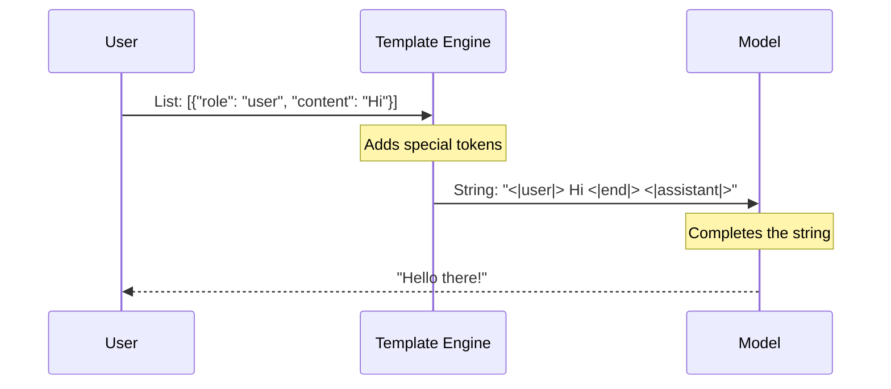

# Chapter 2: Prompt Engineering

In [Generative Pipelines](01_generative_pipelines.md), we learned how to use a "vending machine" approach to get an AI model to generate text. You put a coin in, and you get a snack.

But what if you want a *specific* snack? What if you want a savory, gluten-free snack, but the machine keeps giving you chocolate bars?

This is where **Prompt Engineering** comes in. It is the art of talking to the model to get exactly what you want.

## The "Talented Intern" Analogy

Think of a Large Language Model (LLM) as a highly intelligent, incredibly well-read, but very literal intern. 

If you say, *"Write something about cats,"* the intern might write a poem, a biology textbook entry, or a joke. They aren't wrong; your instructions were just vague.

To get the best work, you need a **Brief**:
1.  **Persona:** Who should the intern pretend to be?
2.  **Context:** What is the background info?
3.  **Examples:** Can you show them what good work looks like?
4.  **Format:** How should the final output look?

Let's set up our pipeline again (just like in Chapter 1) and see how we can improve our results.

```python
from transformers import pipeline

# Load our talented intern (the model)
pipe = pipeline(
    "text-generation", 
    model="microsoft/Phi-3-mini-4k-instruct", 
    trust_remote_code=True
)
```

## Technique 1: Role Playing (The Persona)

The simplest way to guide an LLM is to tell it *who* it is. This sets the tone and style of the response.

Let's ask for a description of a "Black Hole."

**Without a Persona:**
The model might give a dry Wikipedia-style definition.

**With a Persona:**
We can tell the model to be a pirate.

```python
messages = [
    {"role": "user", "content": "You are a pirate captain. Describe a black hole."}
]

output = pipe(messages, max_new_tokens=100)
print(output[0]["generated_text"])
```

**Output:**
> "Arrr, matey! Picture a whirlpool in the great cosmic sea, so dark and hungry it swallows light itself..."

By simply adding "You are a pirate captain," we completely changed the vocabulary and tone of the output.

## Technique 2: Few-Shot Learning (Giving Examples)

Sometimes, instructions aren't enough. The best way to teach is by showing examples.

*   **Zero-Shot:** You ask the model to do something without examples.
*   **Few-Shot:** You give the model a few examples of "Input -> Output" before asking your question.

This is incredibly useful for teaching the model new words or specific formats. Let's teach the model a made-up word: **"Screeg"**.

```python
# We provide an example of how to use a made-up word
messages = [
    {"role": "user", "content": "Use the word 'Gigamuru' (a musical instrument) in a sentence."},
    {"role": "assistant", "content": "I played the Gigamuru until my fingers hurt."},
    {"role": "user", "content": "Use the word 'Screeg' (to swing a sword) in a sentence."}
]

output = pipe(messages, max_new_tokens=50)
print(output[0]["generated_text"])
```

**What happened here?**
We didn't just ask "What is a Screeg?". We showed the model a pattern: *Here is a definition, and here is how it is used.* The model looks at the pattern and copies it for the new word.

## Technique 3: Chain-of-Thought (Show Your Work)

LLMs are sometimes bad at math or logic riddles because they try to guess the answer instantly. They are like a student shouting the first number that pops into their head.

To fix this, we force the model to **"think step-by-step."** This is called Chain-of-Thought (CoT).

**The Problem:**
If you ask: *"The cafeteria had 23 apples. They used 20 for lunch and bought 6 more. How many do they have?"* 
A fast model might just see "23", "20", "6" and guess "49" or "3".

**The Solution:**
We explicitly tell the model to show its reasoning.

```python
prompt = "The cafeteria had 23 apples. Used 20. Bought 6. How many now? Think step-by-step."

messages = [{"role": "user", "content": prompt}]

output = pipe(messages, max_new_tokens=100)
print(output[0]["generated_text"])
```

**Output:**
> 1. Start with 23 apples.
> 2. Subtract the 20 used for lunch: 23 - 20 = 3.
> 3. Add the 6 bought: 3 + 6 = 9.
> The answer is 9.

By asking for the steps, the model writes down the intermediate numbers, which actually helps it calculate the correct final result!

## Under the Hood: Chat Templates

When we write code like `{"role": "user", "content": "Hi"}`, the model doesn't actually read that dictionary object. The model only understands raw text strings.

Before the text hits the model, it goes through a **Formatting** stage (often handled by the tokenizer). It converts your structured conversation into a single long string with special "tags" that the model learned during training.

Here is what happens inside the pipeline:



### Viewing the Raw Prompt

We can actually see this translation using the tokenizer. This is useful for debugging if the model is confused about who is talking.

```python
# Access the tokenizer from the pipeline
tokenizer = pipe.tokenizer

messages = [{"role": "user", "content": "Hello!"}]

# Apply the template to see the raw string
raw_text = tokenizer.apply_chat_template(messages, tokenize=False)
print(raw_text)
```

**Output:**
`<s><|user|> Hello! <|end|> <|assistant|>`

These strange tags (`<|user|>`, `<|end|>`) act like stage directions in a script. They tell the model: " The user has stopped speaking, now it is the assistant's turn to speak."

## Conclusion

Prompt Engineering turns a generic model into a specialized tool. 
*   **Personas** set the style.
*   **Few-Shot examples** teach patterns.
*   **Chain-of-Thought** improves logic and math.

However, LLMs act on text. They don't truly "understand" concepts like a human does; they predict the next likely word based on patterns. To make computers truly understand the *meaning* behind the words (so we can search through documents or classify emails), we need to turn words into numbers.

**Next Step:** Learn how to translate text into math in [Text Embeddings](03_text_embeddings.md).

---

Generated by [Code IQ](https://github.com/adityasoni99/Code-IQ)