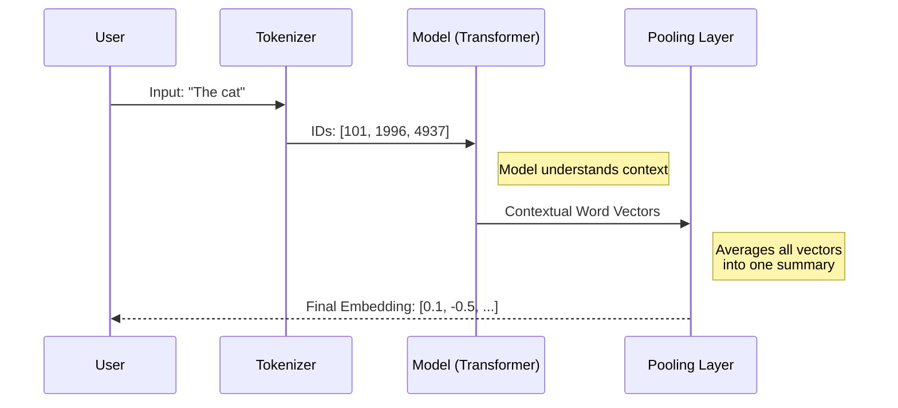

# Chapter 3: Text Embeddings

In [Chapter 2: Prompt Engineering](02_prompt_engineering.md), we learned how to talk to Large Language Models (LLMs) using English instructions. We treated the model like a "Talented Intern" who reads text and writes text.

But here is the secret: **Computers don't actually understand text.** They only understand numbers.

To build powerful AI applications—like search engines that understand meaning, or tools that organize thousands of documents—we need a way to translate human language into computer math. This translation is called a **Text Embedding**.

## The "Library of Meaning" Analogy

Imagine a standard library. Books are usually organized by genre, then alphabetically by author. If you want a book about "Canines," you have to know to look under "D" for "Dogs" or "W" for "Wolves." They are physically far apart on the shelves.

Now, imagine a **Semantic Library**. In this library, books aren't sorted by title. They are sorted by **Meaning Coordinates**.
*   A book about "Dogs" sits right next to a book about "Puppies."
*   A book about "Apples" sits near "Bananas" (because they are both fruit).
*   However, a book about "Apple Computers" sits far away, over in the "Technology" section.

**Text Embeddings** are the coordinates (GPS location) of a piece of text within this library.

## Use Case: The Similarity Detector

Let's build a simple tool. We want to check if two sentences mean the same thing, even if they use different words.

**Example:**
1.  "The cat sits outside."
2.  "The feline is outdoors."
3.  "I like pizza."

To a simple keyword search (Ctrl+F), sentences 1 and 2 look completely different. But to an **Embedding Model**, they are almost identical coordinates.

### Step 1: Loading the Embedding Model

We will use the `sentence-transformers` library. It's a popular wrapper that makes generating embeddings incredibly easy. We'll use a small, fast model called `all-MiniLM-L6-v2`.

```python
from sentence_transformers import SentenceTransformer

# Load the model (the "Translator" from text to numbers)
model = SentenceTransformer('all-MiniLM-L6-v2')
```

### Step 2: Turning Text into Numbers

Now, let's turn our sentences into vectors (lists of numbers).

```python
sentences = [
    "The cat sits outside", 
    "The feline is outdoors", 
    "I like pizza"
]

# Convert text to embeddings
embeddings = model.encode(sentences)

# Print the shape (3 sentences, 384 dimensions each)
print(embeddings.shape) 
```

**Output:** `(3, 384)`

What does `(3, 384)` mean? 
It means we have 3 sentences, and each sentence has been turned into a list of **384 numbers**. These numbers are the "coordinates" in that massive library of meaning.

### Step 3: Measuring Similarity

To find out if two sentences are similar, we measure the distance between their coordinates. In AI, we often use **Cosine Similarity**.
*   **1.0**: Perfect match.
*   **0.0**: No relation.

```python
from sentence_transformers.util import cos_sim

# Compare "Cat" (index 0) with "Feline" (index 1)
score = cos_sim(embeddings[0], embeddings[1])

print(f"Similarity score: {score.item():.4f}")
```

**Output:** `Similarity score: 0.8250` (Very High!)

If we compared the "Cat" sentence to the "Pizza" sentence, the score would be very low (close to 0). You have just built a Semantic Search engine!

## Under the Hood: How It Works

How does a string of text become a specific list of numbers? 

It involves a pipeline similar to the [Generative Pipelines](01_generative_pipelines.md) we saw earlier, but with a different ending.

1.  **Tokenization:** The text is broken into small chunks (tokens) and turned into IDs.
2.  **Transformer:** The model processes the tokens, looking at the *context* of each word.
3.  **Pooling:** This is the key difference. Instead of predicting the *next* word (generation), the model takes the average of all token values to create one single summary vector for the whole sentence.



### Seeing the Raw Process (Optional)

If we strip away the `sentence-transformers` library, we can see how the raw `transformers` library handles this. This helps us understand that "Pooling" is just math.

*Note: The code below performs the "Pooling" manually.*

```python
import torch

# Assume 'token_embeddings' is what comes out of the Model
# This is a dummy example of averaging numbers
token_embeddings = torch.tensor([[[0.1, 0.2], [0.3, 0.4]]]) # 2 words, 2 dims

# Mean Pooling: We just take the average!
pooled_embedding = torch.mean(token_embeddings, dim=1)

print(pooled_embedding) 
```

**Output:** `tensor([[0.2000, 0.3000]])`

The library calculates the average of `0.1` and `0.3` to get `0.2`. It condenses the information from multiple words into a single representation.

## Visualizing Embeddings

It is hard to visualize 384 dimensions. But we can imagine it in 2 dimensions (X and Y axis).

*   **X-axis:** How "animal-like" is the sentence?
*   **Y-axis:** How "food-like" is the sentence?

| Sentence | X (Animal) | Y (Food) |
| :--- | :--- | :--- |
| "The cat sits" | 0.9 | 0.1 |
| "The feline sits" | 0.85 | 0.15 |
| "I like pizza" | 0.1 | 0.9 |

Because the first two sentences have similar coordinates (High X, Low Y), they appear close together on a graph. "Pizza" appears far away.

## Conclusion

Text Embeddings are the bridge between human language and computer math. By converting text into vectors, we can mathematically prove that "Cat" is closer to "Feline" than it is to "Pizza."

However, calculating similarity for three sentences is easy. What if you have **10 million** documents? You can't run a for-loop to compare them one by one; it would take forever.

To handle that, we need a specialized database and advanced retrieval techniques.

**Next Step:** Learn how to build a search engine with your embeddings in [Semantic Search & RAG](04_semantic_search___rag.md).

---

Generated by [Code IQ](https://github.com/adityasoni99/Code-IQ)