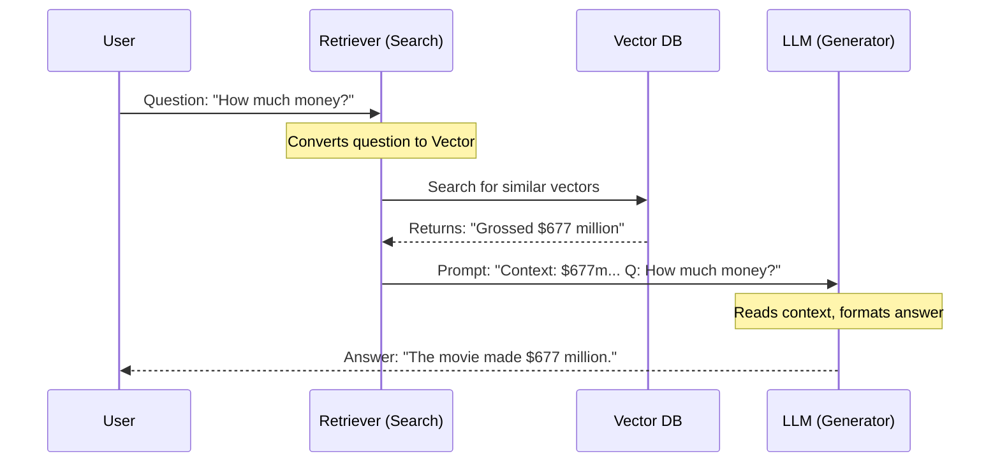

# Chapter 4: Semantic Search & RAG

In the previous chapter, [Text Embeddings](03_text_embeddings.md), we learned how to turn text into numbers (vectors). We discovered that computers can understand that "Cat" and "Feline" are mathematically close, while "Cat" and "Pizza" are far apart.

But having a list of numbers isn't enough. We want our AI to actually **answer questions** using that data.

This brings us to **RAG (Retrieval-Augmented Generation)**. It is currently the most popular way to build AI applications for business.

## The "Open-Book Exam" Analogy

To understand RAG, think about taking a test.

1.  **Standard LLM (Closed-Book):** You ask the model a question. It must rely entirely on its internal memory (what it learned during training). If it forgets a fact, it might guess (hallucinate).
2.  **RAG (Open-Book):** You ask the model a question.
    *   **Retrieval:** First, it goes to a library (your documents) and finds the specific page with the answer.
    *   **Generation:** Then, it reads that page and writes the answer for you.

**Semantic Search** is the act of finding the right page. **RAG** is the act of reading that page to answer the question.

## Use Case: The Movie Expert

Imagine we want to build an AI expert on the movie *Interstellar*. A standard model might know the plot, but it might not know exact details like the specific box-office earnings or production trivia found in your private notes.

We will build a pipeline that:
1.  **Reads** a text file about the movie.
2.  **Searches** for the specific fact we need.
3.  **Generates** a human-like answer.

## Step 1: The Knowledge Base (Indexing)

First, we need a "database" of facts. In the world of LLMs, we call this a **Vector Store**. It uses the embeddings we learned about in Chapter 3 to organize data by meaning.

We will use a library called `FAISS` (Facebook AI Similarity Search) and `LangChain` to help us.

```python
from langchain.vectorstores import FAISS
from langchain.embeddings import HuggingFaceEmbeddings

# 1. Our "Private" Data
text_chunks = [
    "Interstellar is a 2014 sci-fi film by Christopher Nolan.",
    "The film follows astronauts traveling through a wormhole near Saturn.",
    "Interstellar grossed over $677 million worldwide."
]

# 2. Load the Embedding Model (The Translator)
embeddings = HuggingFaceEmbeddings(model_name="all-MiniLM-L6-v2")

# 3. Create the Database (Index the data)
db = FAISS.from_texts(text_chunks, embeddings)
```

**What happened?**
We converted our sentences into number lists (vectors) and stored them in `db`. Now, the computer knows the "location" of each fact in the library of meaning.

## Step 2: Semantic Search (Retrieval)

Now, let's ask a question. We don't want the LLM to answer yet; we just want to find the **relevant document**.

Even if we don't use the exact words (e.g., asking about "income" instead of "grossed"), the semantic search will find the right chunk because the *meaning* is similar.

```python
query = "How much income did the movie generate?"

# Search the database for the top 1 most similar result
docs = db.similarity_search(query, k=1)

# Print the found content
print(docs[0].page_content)
```

**Output:**
> "Interstellar grossed over $677 million worldwide."

Success! The system understood that "income" is semantically related to "grossed" and retrieved the correct fact.

## Step 3: Retrieval-Augmented Generation (RAG)

Now for the final magic trick. We don't just want the raw text snippet; we want a full sentence answer.

We will combine the **Retrieved Text** with the **User Question** into a single prompt for the LLM.

### The Manual Way
If we were doing this manually without tools, the code would look like this:

```python
# 1. Retrieve the fact
context = docs[0].page_content

# 2. Create an "Augmented" Prompt
prompt = f"""
Use the following context to answer the question.
Context: {context}

Question: {query}
Answer:
"""

# 3. Send to LLM (Using the pipeline from Chapter 1)
# result = generator(prompt)
```

The LLM receives the fact *inside* the prompt. It doesn't need to memorize the movie's earnings; it just reads the context we provided and reformulates it.

## Under the Hood: The RAG Workflow

It is helpful to visualize how the data flows through the system.



### Key Concept: Reranking (Refining the Search)

Sometimes, Semantic Search gives you 10 results, and the best answer is buried at #5. 

To fix this, advanced systems use a **Reranker**.
*   **Retriever:** Fast, gathers top 50 candidates.
*   **Reranker:** Slow but smart, carefully scores those 50 and puts the best one at the top.

It’s like hiring a fast intern to pull 50 books from the shelf, and then a professor to check which single book is actually useful.

## Automated RAG with LangChain

Writing the prompt manually (as we did in Step 3) gets tedious. In the provided project code, we use `LangChain` to automate this "glue."

Here is how you set up a chain that handles the Retrieval and the Generation automatically:

```python
from langchain.chains import RetrievalQA
from langchain.llms import LlamaCpp

# Load a local LLM (like in Chapter 1, but wrapped by LangChain)
llm = LlamaCpp(model_path="Phi-3-mini-4k-instruct-q4.gguf", verbose=False)

# Create the Automatic RAG Pipeline
rag_chain = RetrievalQA.from_chain_type(
    llm=llm,
    retriever=db.as_retriever(), # Connects our database
    chain_type="stuff"           # "Stuff" means "stuff the text into the prompt"
)
```

Now, we can just run one line of code to get our answer:

```python
# Run the full chain
response = rag_chain.invoke("How much income did the movie generate?")

print(response['result'])
```

**Output:**
> "The movie generated over $677 million worldwide."

## Conclusion

You have just built the architecture behind most modern AI Chatbots!

By combining **Semantic Search** (Chapter 3) with **Generative Pipelines** (Chapter 1), you created a system that is knowledgeable, accurate, and up-to-date with your own data.

However, as you can see, gluing the Database, the Embeddings, and the LLM together requires a lot of setup code. To manage complex workflows with chat history and multiple tools, we need a better orchestrator.

**Next Step:** Learn how to build complex AI applications easily in [LangChain Orchestration](05_langchain_orchestration.md).

---

Generated by [Code IQ](https://github.com/adityasoni99/Code-IQ)