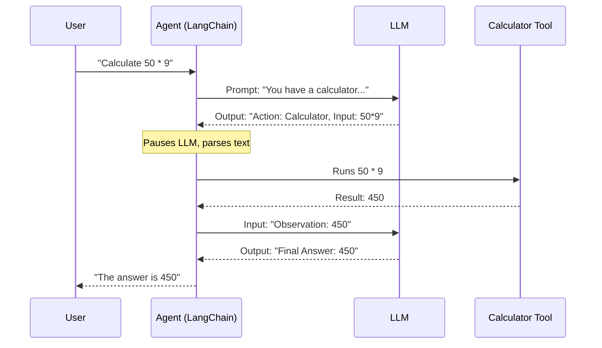

# Chapter 5: LangChain Orchestration

In the previous chapter, [Semantic Search & RAG](04_semantic_search___rag.md), we manually glued together a database and a language model to create a knowledgeable chatbot. It worked, but writing all that "glue code" manually gets messy very quickly.

What if you want your AI to remember your name? What if you want it to browse the web *and* do math in the same conversation?

This is where **LangChain** comes in.

## The "General Contractor" Analogy

Think of building a software application like building a house.
*   **The LLM (Worker):** This is the carpenter. It is very skilled at specific tasks (writing text), but it doesn't know the blueprints and can't manage the plumbing.
*   **The Tools (Equipment):** These are calculators, Google Search, or your database. The LLM needs these to do its job well.
*   **LangChain (General Contractor):** This is the manager. It tells the worker *what* to do, *when* to use a specific tool, and keeps track of the project history.

**LangChain Orchestration** is a framework that helps you chain together prompts, models, and tools to build complex applications easily.

## Core Concept 1: Chains (The Assembly Line)

The most basic building block is a **Chain**. A chain connects a specific **Input** $\rightarrow$ **Prompt** $\rightarrow$ **Model** $\rightarrow$ **Output**.

You can also connect multiple chains together, creating an assembly line where the output of one step becomes the input of the next.

### Use Case: The Story Generator
Let's create a pipeline that:
1.  Takes a short topic (e.g., "A lost cat").
2.  Generates a creative **Title**.
3.  Writes a **Story** based on that title.

First, let's load our model (just like in previous chapters):

```python
from langchain.llms import LlamaCpp

# Load the local model
llm = LlamaCpp(
    model_path="Phi-3-mini-4k-instruct-q4.gguf",
    n_ctx=2048,
    verbose=False
)
```

Now, let's create two separate chains using `PromptTemplate`.

```python
from langchain.prompts import PromptTemplate
from langchain.chains import LLMChain

# Chain 1: Generate a Title
prompt1 = PromptTemplate(
    template="Write a creative title for a story about {topic}.", 
    input_variables=["topic"]
)
chain_title = LLMChain(llm=llm, prompt=prompt1, output_key="title")
```

```python
# Chain 2: Write the Story (uses the 'title' from Chain 1)
prompt2 = PromptTemplate(
    template="Write a very short story with the title: {title}", 
    input_variables=["title"]
)
chain_story = LLMChain(llm=llm, prompt=prompt2, output_key="story")
```

Finally, we glue them together using the pipe `|` operator. This tells LangChain: "Run the title chain, then pass the result to the story chain."

```python
from langchain.schema.runnable import RunnableSequential

# Create the assembly line
full_chain = chain_title | chain_story

# Run it!
result = full_chain.invoke({"topic": "a robot who loves gardening"})
print(result['story'])
```

**Output:**
The model will generate a title (e.g., *"The Iron Thumb"*) and then immediately write a story about it. You didn't have to copy-paste the title manually!

## Core Concept 2: Memory (Curing Amnesia)

By default, LLMs are **stateless**. This means they have amnesia. If you say "Hi, I'm Bob," and then ask "What is my name?", the model will say "I don't know."

To fix this, LangChain provides **Memory** components. Memory acts as a logbook that records the conversation and feeds it back to the model every time you speak.

### Adding Memory to a Conversation

We use `ConversationBufferMemory`, which simply stores every message sent back and forth.

```python
from langchain.memory import ConversationBufferMemory

# Create the memory object
memory = ConversationBufferMemory(memory_key="chat_history")

# Create a prompt that creates space for history
template = """
History: {chat_history}
User: {input_text}
AI:"""

prompt = PromptTemplate(
    template=template, 
    input_variables=["input_text", "chat_history"]
)
```

Now we create a chain that includes this memory logbook.

```python
# Create a chain with memory attached
conversation = LLMChain(
    llm=llm, 
    prompt=prompt, 
    memory=memory
)

# Turn 1
conversation.invoke({"input_text": "My name is Alice."})

# Turn 2
response = conversation.invoke({"input_text": "What is my name?"})
print(response['text'])
```

**Output:**
> "Your name is Alice."

The orchestration layer automatically inserted the previous interaction into the prompt before sending it to the LLM.

## Core Concept 3: Agents (The Decision Makers)

**Chains** are rigid (A $\rightarrow$ B $\rightarrow$ C).
**Agents** are flexible.

An Agent is an LLM that has access to a toolkit. When you ask a question, the Agent decides:
1.  Do I know the answer?
2.  Do I need to use the Calculator tool?
3.  Do I need to use the Search tool?

It creates a "Reasoning Loop" to solve the problem step-by-step.

### The ReAct Pattern
LangChain agents often use a logic called **ReAct** (Reason + Act).

1.  **Thought:** "The user is asking for $135 \times 48$. I am bad at math."
2.  **Action:** Use `Calculator` tool with input `135 * 48`.
3.  **Observation:** Calculator returns `6480`.
4.  **Final Answer:** "The answer is 6480."

Here is how you set up a simple agent with math skills:

```python
from langchain.agents import load_tools, initialize_agent, AgentType

# Load standard tools (e.g., a math helper)
tools = load_tools(["llm-math"], llm=llm)

# Initialize the Agent
agent = initialize_agent(
    tools, 
    llm, 
    agent_type=AgentType.ZERO_SHOT_REACT_DESCRIPTION,
    verbose=True # This lets us see the thinking process!
)
```

Now, let's ask it a math question.

```python
agent.run("What is 10 raised to the power of 2.5?")
```

**Output (simplified):**
```text
> Entering chain...
Thought: I need to calculate a power.
Action: Calculator
Action Input: 10**2.5
Observation: 316.227766
Thought: I have the answer.
Final Answer: 316.227766
```

The LLM didn't guess. It realized it needed a tool, used it, read the result, and gave you the correct answer.

## Under the Hood: The Agent Loop

How does the Agent actually "use" a tool? It is not magic; it is just text processing.

The Agent is running a continuous `while` loop. It generates text until it encounters a specific keyword (like `Action:`). LangChain pauses the LLM, runs the corresponding Python function (the tool), and pastes the output back into the prompt for the LLM to read.



## Conclusion

LangChain acts as the glue that turns a raw Language Model into a functioning application.
*   **Chains** let you build workflows (Input $\rightarrow$ Process $\rightarrow$ Output).
*   **Memory** gives the application context and history.
*   **Agents** allow the model to use external tools to solve complex problems dynamically.

However, all this functionality comes at a cost: **Speed** and **Size**. Running complex chains with large models can be slow and require expensive hardware. To make these models run on consumer laptops or smaller devices, we need to make them smaller.

**Next Step:** Learn how to shrink models without losing intelligence in [Quantization](06_quantization.md).

---

Generated by [Code IQ](https://github.com/adityasoni99/Code-IQ)