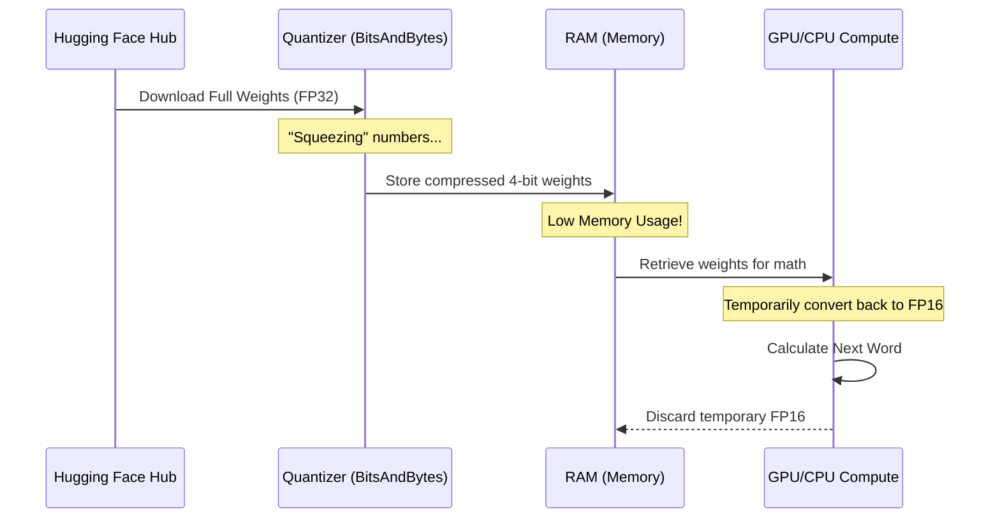

# Chapter 6: Quantization

In the previous chapter, [LangChain Orchestration](05_langchain_orchestration.md), we built complex chains and agents that could use tools and remember conversations. You might have noticed, however, that running these "smart" agents can be slow or require powerful computers with expensive Graphics Processing Units (GPUs).

What if you want to run a smart AI on your laptop, or even on a phone?

This brings us to **Quantization**. It is the science of making models smaller and faster without making them "dumber."

## The "High-Resolution Video" Analogy

Think of a Large Language Model (LLM) like a 4K Ultra-HD movie file. 
*   **The Original (FP16/FP32):** The file is huge (50GB). It looks perfect, but you need a powerful PC to play it, and it takes forever to download.
*   **The Quantized Version (INT4):** This is like compressing that movie to 720p. The file size drops to 5GB. It plays smoothly on an old laptop. 
*   **The Result:** To the human eye, the movie looks 95% the same. You might miss a tiny detail in the background, but the plot and dialogue are exactly the same.

**Quantization** reduces the precision of the numbers inside the model (the "weights") to save memory.

## Why Do We Need This?

Computers store numbers in different formats. 
1.  **FP32 (32-bit Floating Point):** Very precise (e.g., `3.14159265`). Takes up **4 bytes** of memory per number.
2.  **INT4 (4-bit Integer):** Less precise (e.g., `3`). Takes up **0.5 bytes** of memory.

If you have a model with 7 Billion parameters (like Llama-3-8B):
*   **FP32:** Requires ~28 GB of RAM (Too big for most laptops).
*   **INT4:** Requires ~4 GB of RAM (Runs easily on a standard laptop).

## Use Case: Running an LLM on a Standard Laptop

We want to load a powerful model, but we don't have a massive server. We will use a library called `bitsandbytes` to load the model in **4-bit mode**.

### Step 1: The Configuration

We don't need to do complex math ourselves. The `transformers` library allows us to create a configuration object that handles the compression for us.

We will use a technique called **NF4 (Normal Float 4)**, which is a smart way of organizing 4-bit numbers specifically for AI.

```python
from transformers import BitsAndBytesConfig

# Create the quantization configuration
bnb_config = BitsAndBytesConfig(
    load_in_4bit=True,              # Turn on 4-bit loading
    bnb_4bit_quant_type="nf4",      # Use the special NF4 data type
    bnb_4bit_compute_dtype="float16"# Do the math in 16-bit
)
```

**What just happened?**
We created a set of instructions. We told the library: "When you download the model, don't keep it in full size. Squash it down to 4-bit immediately."

### Step 2: Loading the Model

Now we load the model using this configuration. For this example, we'll use a `TinyLlama` model, which is already small, but we will make it even smaller.

```python
from transformers import AutoModelForCausalLM, AutoTokenizer

model_name = "TinyLlama/TinyLlama-1.1B-intermediate-step-1431k-3T"

# Load the model with the config we created above
model = AutoModelForCausalLM.from_pretrained(
    model_name,
    quantization_config=bnb_config, # Pass our config here
    device_map="auto"               # Automatically use GPU/CPU
)

tokenizer = AutoTokenizer.from_pretrained(model_name)
```

**The Result:**
If you check your memory usage, you will see it is significantly lower than if you had loaded the model normally. You effectively just fit a truck's worth of cargo into a small van.

### Step 3: Running Inference

Even though the model is compressed, we use it exactly the same way as we learned in [Generative Pipelines](01_generative_pipelines.md).

```python
from transformers import pipeline

# Create a pipeline with our compressed model
pipe = pipeline("text-generation", model=model, tokenizer=tokenizer)

# Ask it a question
prompt = "Tell me a fun fact about space."
output = pipe(prompt, max_new_tokens=50)

print(output[0]["generated_text"])
```

**Output:**
The model generates text just like the full-size version! It might say: *"Space is completely silent because there is no atmosphere to carry sound waves..."*

## Under the Hood: The Quantization Process

How does the computer turn a precise number like `0.123456789` into a tiny 4-bit number? It maps values to "Buckets."

Imagine you have a ruler with 100 tiny lines (High Precision). Quantization replaces that ruler with one that only has 4 big marks (Low Precision).

1.  **Quantize:** The model reads a precise weight (e.g., `0.73`) and rounds it to the nearest "bucket" (e.g., `0.75`).
2.  **Storage:** It only saves the *index* of that bucket, which is a very small number.
3.  **Dequantize:** When the model needs to think, it briefly converts that bucket index back into a number to do the math.

Here is the flow of data when you load a quantized model:



## Another Approach: GGUF Format

While `bitsandbytes` compresses the model *while* loading it, there is another popular method: downloading a model that is *already* compressed.

You will often see files ending in `.gguf` (e.g., `llama-3-8b.Q4_K_M.gguf`). These are pre-quantized files designed to run on CPUs (like your laptop processor) using a library called `llama.cpp`.

This is extremely popular for running local chat assistants because it is fast and easy.

```python
from langchain.llms import LlamaCpp

# Load a pre-quantized GGUF model file directly
llm = LlamaCpp(
    model_path="Phi-3-mini-4k-instruct-q4.gguf",
    n_ctx=2048,
    verbose=False
)

# Use it
llm.invoke("Hi! How are you?")
```

In this case, you don't need a config object because the file itself is already "shrunk."

## Conclusion

Quantization is the key to democratization in AI. It allows powerful models to run on consumer hardware, making AI accessible to everyone, not just those with massive servers.

*   **High Precision (FP16/32):** Heavy, slow, used for training.
*   **Low Precision (INT4):** Light, fast, used for running the model (inference).

Now that we can run models efficiently, what if we want to teach them new tricks? We can't retrain the whole brain (that's too expensive), but maybe we can just train a tiny part of it?

**Next Step:** Learn how to fine-tune models cheaply in [Parameter-Efficient Fine-Tuning (PEFT)](07_parameter_efficient_fine_tuning__peft_.md).

---

Generated by [Code IQ](https://github.com/adityasoni99/Code-IQ)