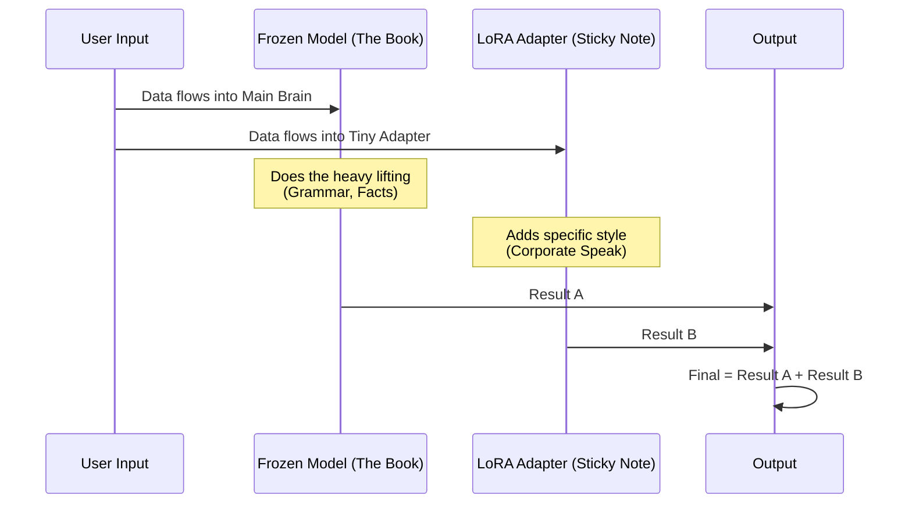

# Chapter 7: Parameter-Efficient Fine-Tuning (PEFT)

In [Chapter 6: Quantization](06_quantization.md), we learned how to shrink massive models so they can run on your laptop. We compared it to compressing a 4K movie file into a 720p file.

Now that we can *run* the model, you might notice a problem: the model is generic. It knows a lot about the world, but it doesn't know *your* specific writing style, your company's internal documents, or how to speak like a 17th-century pirate (if that is what you need).

To fix this, we need to train the model. But retraining a model with 7 billion parameters usually requires a supercomputer.

Enter **PEFT (Parameter-Efficient Fine-Tuning)**.

## The "Sticky Note" Analogy

Imagine a massive, 1,000-page encyclopedia (The Model). You want to update the entry on "Mars" because new discoveries were made.

*   **Full Fine-Tuning:** You re-print the entire 1,000-page book just to change one paragraph. This is expensive, wasteful, and you might accidentally smudge other pages (forgetting old knowledge).
*   **PEFT (LoRA):** You leave the book exactly as it is. You write your updates on a transparent **Sticky Note** and paste it over the "Mars" page.

When you read the book, you look *through* the sticky note. You see the original text combined with your corrections.

**LoRA (Low-Rank Adaptation)** is the most popular PEFT technique. It freezes the massive model (the book) and only trains tiny adapter layers (the sticky notes).

## Use Case: The Corporate Translator

Let's say we want to fine-tune a model to turn casual slang into professional corporate speak.

**Input:** "Yo, I ain't doing that."
**Target:** "I am afraid I cannot commit to that task at this time."

If we try to train the whole model, we need 80GB+ of GPU memory. With LoRA, we can do it with less than 8GB.

### Step 1: Loading the Base Model

We start by loading the model in 4-bit mode (using what we learned in [Quantization](06_quantization.md)). This is our "Frozen Book."

```python
from transformers import AutoModelForCausalLM, BitsAndBytesConfig

# Config to load model in 4-bit (Frozen Base)
bnb_config = BitsAndBytesConfig(
    load_in_4bit=True,
    bnb_4bit_quant_type="nf4",
    bnb_4bit_compute_dtype="float16"
)

model = AutoModelForCausalLM.from_pretrained(
    "TinyLlama/TinyLlama-1.1B-Chat-v1.0", 
    quantization_config=bnb_config,
    device_map="auto"
)
```

**What just happened?**
We loaded the model into memory. Currently, all its parameters are "Frozen"—meaning if we tried to train it, nothing would happen.

### Step 2: Applying the "Sticky Notes" (LoRA Config)

Now we need to define our sticky notes. We use the `peft` library for this.

Key terms:
*   **`r` (Rank):** The size of the sticky note. A low number (8 or 16) is small and fast. A high number (64+) is smarter but slower.
*   **`target_modules`:** Which pages in the book do we want to stick notes on? (Usually the Attention modules: `q_proj`, `v_proj`).

```python
from peft import LoraConfig, get_peft_model

# Define the Sticky Note configuration
peft_config = LoraConfig(
    r=16,                       # The 'rank' (size of the adapter)
    lora_alpha=32,              # Scaling factor
    lora_dropout=0.05,          # Helps prevent overfitting
    bias="none",
    task_type="CAUSAL_LM"       # We are doing text generation
)
```

### Step 3: Attaching the Adapters

Now we physically attach these trainable layers to our frozen model.

```python
# Attach the adapters
model = get_peft_model(model, peft_config)

# Let's see how many parameters we actually have to train!
model.print_trainable_parameters()
```

**Output:**
> `trainable params: 2,000,000 || all params: 1,100,000,000 || trainable%: 0.18%`

**This is the magic moment.**
Instead of training 1.1 Billion parameters, we are only training 2 Million. This is why it runs on consumer hardware!

### Step 4: The Training Loop

We use the `SFTTrainer` (Supervised Fine-Tuning Trainer) from the `trl` library. It handles the complex loop of feeding data, calculating loss, and updating the sticky notes.

*Note: In a real scenario, you would provide a dataset of "Slang -> Corporate" examples.*

```python
from trl import SFTTrainer
from transformers import TrainingArguments

# Define training settings
training_args = TrainingArguments(
    output_dir="./results",
    per_device_train_batch_size=4,
    max_steps=100,              # Short run for demonstration
    learning_rate=2e-4,
    fp16=True                   # Use mixed precision for speed
)

# Initialize the trainer
trainer = SFTTrainer(
    model=model,
    train_dataset=dataset,      # Your dataset variable goes here
    dataset_text_field="text",
    peft_config=peft_config,    # Pass our LoRA config
    args=training_args
)

# Start training!
trainer.train()
```

When this finishes, you haven't changed the original model file. You have created a tiny file (maybe 10MB) called an **Adapter**.

## Under the Hood: How LoRA Works

How does adding a tiny layer "fix" a massive model?

In deep learning, models are made of huge matrices (grids of numbers). When we learn, we update these numbers.
LoRA assumes that the *change* required to learn a new task is actually quite simple.

Instead of adding one giant matrix ($1000 \times 1000$), LoRA adds two tiny rectangular matrices ($1000 \times 8$ and $8 \times 1000$).

When you multiply the two tiny matrices, they act like the big one, but they have drastically fewer numbers to memorize.



### Visualizing the Weight Merge

If we looked at the math code inside the `peft` library, it looks roughly like this concept:

```python
def forward(input_data):
    # 1. The original frozen model path
    original_output = frozen_layer(input_data)
    
    # 2. The LoRA path (Matrix A x Matrix B)
    # This is the "Sticky Note" calculation
    lora_output = lora_B(lora_A(input_data)) * scaling
    
    # 3. Combine them
    return original_output + lora_output
```

The frozen layer provides the general intelligence. The LoRA output provides the "nudge" towards the specific task.

## Merging the Model

After training, you have two things:
1.  The heavy base model.
2.  The lightweight adapter.

To use this efficiently in production (like in [Generative Pipelines](01_generative_pipelines.md)), you usually **Merge** them permanently. This absorbs the sticky notes into the pages, creating a new standalone model.

```python
# Load the trained adapter
from peft import AutoPeftModelForCausalLM

# Load model + adapter
model = AutoPeftModelForCausalLM.from_pretrained("path_to_saved_adapter")

# Merge them into one standard model
merged_model = model.merge_and_unload()

# Save the final standalone version
merged_model.save_pretrained("./my_corporate_bot")
```

Now you can load `./my_corporate_bot` just like any other Hugging Face model!

## Conclusion

You have reached the end of the **Hands-On Large Language Models** beginner tutorial!

Let's recap your journey:
1.  You started by using pre-made models like vending machines in [Generative Pipelines](01_generative_pipelines.md).
2.  You learned to control them with [Prompt Engineering](02_prompt_engineering.md).
3.  You translated text into math with [Text Embeddings](03_text_embeddings.md).
4.  You gave the model a "library" of knowledge using [Semantic Search & RAG](04_semantic_search___rag.md).
5.  You built complex applications and agents with [LangChain Orchestration](05_langchain_orchestration.md).
6.  You shrank the models to run locally with [Quantization](06_quantization.md).
7.  And finally, you customized the model's brain using **PEFT** in this chapter.

You now possess the full toolkit to build, optimize, and customize LLM applications. The world of AI is moving fast—keep building and keep experimenting!

---

Generated by [Code IQ](https://github.com/adityasoni99/Code-IQ)