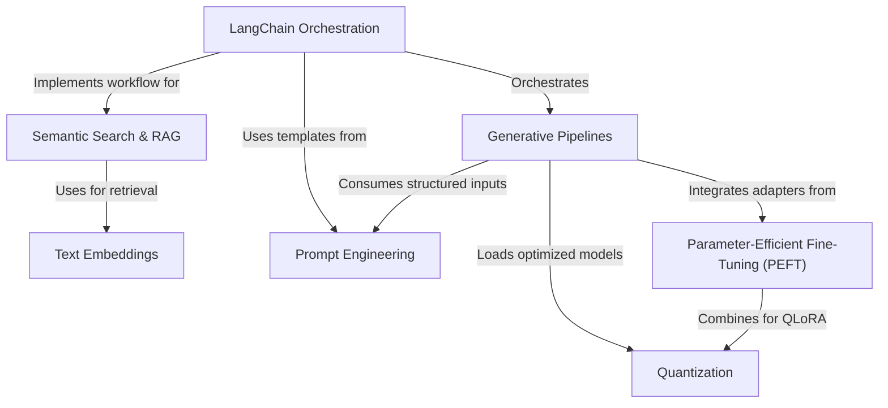

# Tutorial: Hands-On-Large-Language-Models

This project serves as a comprehensive, hands-on guide to working with **Large Language Models (LLMs)**. It covers the full lifecycle of LLM application development, from creating *generative pipelines* and **text embeddings** to building complex **Retrieval-Augmented Generation (RAG)** systems using orchestration frameworks. Additionally, it demonstrates advanced optimization techniques such as **prompt engineering**, **Parameter-Efficient Fine-Tuning (PEFT)**, and **quantization** to customize models and run them efficiently on consumer hardware.

**Source Repository:** [https://github.com/HandsOnLLM/Hands-On-Large-Language-Models](https://github.com/HandsOnLLM/Hands-On-Large-Language-Models)

## Chapters

1. [Generative Pipelines](01_generative_pipelines.md)
2. [Prompt Engineering](02_prompt_engineering.md)
3. [Text Embeddings](03_text_embeddings.md)
4. [Semantic Search & RAG](04_semantic_search___rag.md)
5. [LangChain Orchestration](05_langchain_orchestration.md)
6. [Quantization](06_quantization.md)
7. [Parameter-Efficient Fine-Tuning (PEFT)](07_parameter_efficient_fine_tuning__peft_.md)

---

Generated by [Code IQ](https://github.com/adityasoni99/Code-IQ)