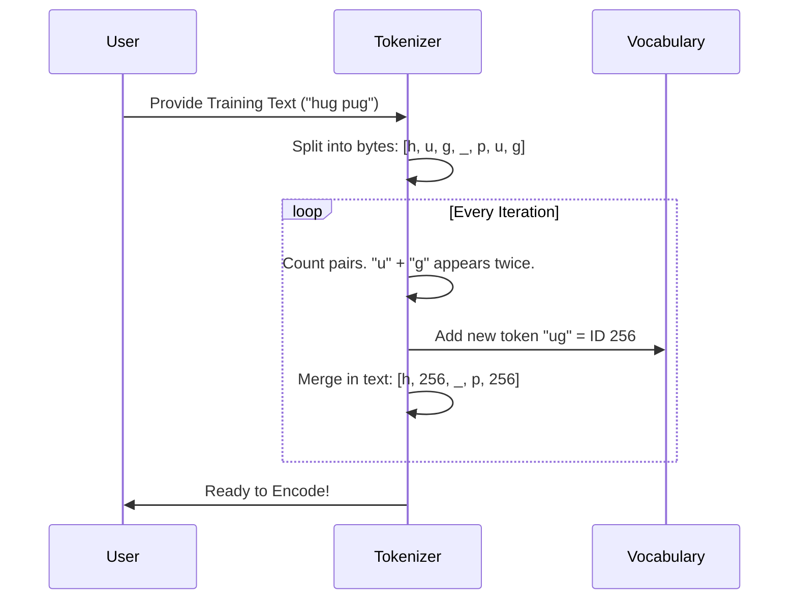

# Chapter 1: Tokenizer (Byte Pair Encoding)

Welcome to the first chapter of **LLMs from Scratch**!

Before we can teach a machine to write poetry or answer questions, we need to solve a fundamental problem: **Communication**. Computers operate on numbers, while humans communicate in words, emojis, and punctuation.

We need a translator. In the world of Large Language Models (LLMs), this translator is called a **Tokenizer**.

## 1. The Bridge Between Human and Machine

Imagine you want to pass a sentence to a mathematician who only understands integers. You need a codebook.
- You look up "Apple": the codebook says `502`.
- You look up "Pie": the codebook says `99`.

You pass `[502, 99]` to the mathematician. This is exactly what a tokenizer does. It converts text into a sequence of integers called **Tokens**.

### Why Byte Pair Encoding (BPE)?
There are two extreme ways to create this codebook:
1.  **Character-level:** Assign a number to every letter (`a`=1, `b`=2). *Problem:* The sequence gets very long. "Apple" becomes 5 tokens.
2.  **Word-level:** Assign a number to every word. *Problem:* The dictionary becomes infinite (vocabulary size explodes).

**Byte Pair Encoding (BPE)** is the "Goldilocks" solution. It starts with individual characters and learns to merge the most frequent pairs into new tokens. It finds common chunks like "ing", "the", or "sh" and assigns them a single number. This keeps the sequence short and the vocabulary manageable.

## 2. Using the Tokenizer

Let's look at how to use the `BPETokenizerSimple` implementation provided in this project. We will train it on some text so it creates its own vocabulary.

### Step 1: Initialization and Training
First, we instantiate the tokenizer and "train" it. Training here simply means scanning text to find the most frequent character pairs to add to our vocabulary.

```python
# Assuming BPETokenizerSimple is imported from the project files
tokenizer = BPETokenizerSimple()

# We need some text to learn from
training_text = "the cat in the hat"

# Train the tokenizer to build a vocab of size 300
# (Starts with 256 bytes + adds new merges)
tokenizer.train(training_text, vocab_size=300)
```

**What just happened?**
The tokenizer scanned "the cat in the hat". It noticed that "th" appears often. It might assign a new unique ID (like 256) to represent the pair "th".

### Step 2: Encoding (Text to Numbers)
Now that the tokenizer has learned a vocabulary, we can convert human text into machine numbers.

```python
# Encode a string into integers
input_text = "the cat"
token_ids = tokenizer.encode(input_text)

print(f"Text: {input_text}")
print(f"Token IDs: {token_ids}")
```
*Hypothetical Output:*
`Token IDs: [256, 301, 45]`
(Where `256` might represent "th", `301` might be "e ", etc.)

### Step 3: Decoding (Numbers to Text)
The model will output numbers. We need to turn them back into text to read the response.

```python
# Decode the integers back into a string
decoded_text = tokenizer.decode(token_ids)

print(f"Decoded: {decoded_text}")
```
*Output:*
`Decoded: the cat`

## 3. Under the Hood: How BPE Works

How does the tokenizer know which pairs to merge? Let's visualize the process.

The algorithm runs in a loop:
1.  **Count** all pairs of adjacent tokens.
2.  **Find** the most frequent pair.
3.  **Merge** that pair into a new token ID.
4.  **Repeat** until we reach the desired vocabulary size.

### Visual Sequence



### Implementation Details

Let's look at the core logic used inside the `train` method. This is a simplified view of how the tokenizer finds the "best" pair to merge.

#### Finding the Frequent Pair
Inside the class, we count how often every adjacent pair of numbers appears.

```python
def find_freq_pair(token_ids):
    # token_ids is a list like [10, 20, 10, 20, 30]
    # We look at (10,20), (20,10), (10,20), (20,30)
    
    # Count frequency of pairs
    pairs = Counter(zip(token_ids, token_ids[1:]))
    
    # Return the pair that appears most often
    return max(pairs.items(), key=lambda x: x[1])[0]
```
*Explanation:* If `(10, 20)` appears most often, this function identifies it as the winner. This pair is the best candidate to become a new, single token.

#### Merging the Pair
Once we identify the best pair (e.g., `10` and `20`), we replace all occurrences of it with a new ID (e.g., `256`).

```python
def replace_pair(token_ids, pair_to_merge, new_id):
    new_tokens = []
    i = 0
    while i < len(token_ids):
        # Check if current and next token match the pair
        if i < len(token_ids)-1 and (token_ids[i], token_ids[i+1]) == pair_to_merge:
            new_tokens.append(new_id) # Add the merged ID
            i += 2 # Skip the next token (it's merged)
        else:
            new_tokens.append(token_ids[i])
            i += 1
    return new_tokens
```
*Explanation:* This creates a compressed version of the text. The list of integers gets shorter every time we merge, meaning the model can process more text with less computation.

## 4. Special Tokens

You might see tokens like `<|endoftext|>` or `Ġ`.

*   **`<|endoftext|>`**: This signals to the model that a document has finished. It is crucial for training so the model doesn't blindly mash unrelated sentences together.
*   **`Ġ` (The "G" character)**: In some implementations (like GPT-2), this represents a space. BPE usually treats spaces as part of the word (e.g., `_dog` is different from `dog`).

## Summary

In this chapter, we built the foundation of our LLM:
1.  **Input:** Raw Text.
2.  **Process:** **Byte Pair Encoding (BPE)** merges frequent characters into subwords.
3.  **Output:** A list of integers (Tokens).

Without this step, the model sees only gibberish. With it, the model sees a structured sequence of numbers it can learn patterns from.

Now that we have numbers, we need to organize them into batches for the model to learn efficiently.

[Next Chapter: Data Loading and Formatting](02_data_loading_and_formatting.md)

---

Generated by [Code IQ](https://github.com/adityasoni99/Code-IQ)