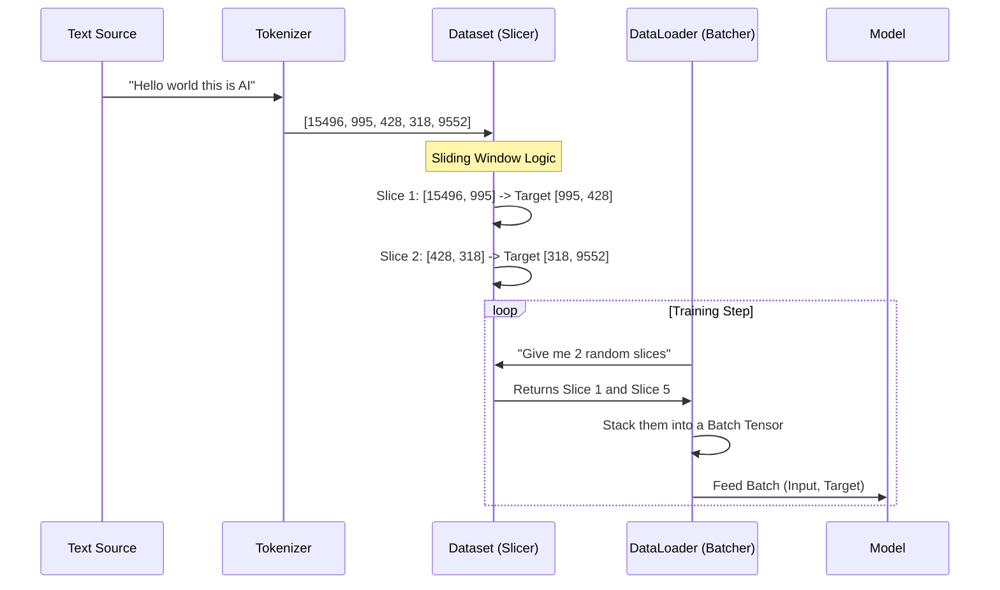

# Chapter 2: Data Loading and Formatting

In the previous chapter, [Chapter 1: Tokenizer (Byte Pair Encoding)](01_tokenizer__byte_pair_encoding_.md), we learned how to translate human language into lists of integers (tokens).

But we can't just throw a massive list of 1,000,000 numbers at a model and expect it to learn. It would be like trying to eat a whole watermelon in one bite—you need to slice it first.

In this chapter, we will build the **Data Loading Pipeline**. We will take our raw tokens and organize them into neat, bite-sized packages (Tensors) that the model can process efficiently.

## 1. The Challenge: Predicting the Future

To train a Large Language Model (LLM), we usually want it to do one thing: **predict the next word**.

If we have the sentence:
`"The cat eats fish"`

We need to turn this into a training lesson for the model.
*   **Input (x):** "The cat eats"
*   **Target (y):** "cat eats fish"

Notice the shift?
*   When the model sees "The", it should predict "cat".
*   When it sees "The cat", it should predict "eats".

We need a system that automatically slices our text into these shifted pairs.

## 2. The Sliding Window (Pretraining)

The most common way to slice text for generic training is the **Sliding Window** approach. We decide on a `max_length` (how many tokens the model reads at once) and a `stride` (how far we move the window for the next sample).

### Concept: Inputs and Targets
Let's see how we create inputs (`input_ids`) and targets (`target_ids`) from a list of token IDs.

```python
import torch

# Suppose our text is tokens 0 to 5
token_ids = [0, 1, 2, 3, 4, 5]
max_length = 3

# We take the first 3 tokens as input
input_chunk = token_ids[0 : max_length]        # [0, 1, 2]

# We shift by 1 to get the targets (the "next" tokens)
target_chunk = token_ids[1 : max_length + 1]   # [1, 2, 3]
```

**What just happened?**
We created a training pair. If the model sees sequence `[0, 1, 2]`, the correct answer (the target) is `[1, 2, 3]`.

### Concept: The Dataset Class
In PyTorch, we use a class called `Dataset` to handle this logic. We will look at `GPTDatasetV1`. It stores the text and creates these slices on demand.

```python
from torch.utils.data import Dataset

class GPTDatasetV1(Dataset):
    def __init__(self, txt, tokenizer, max_length, stride):
        self.tokenizer = tokenizer
        self.input_ids = []
        self.target_ids = []
        
        # We will fill input_ids and target_ids here...
        # (See implementation details section below)

    def __len__(self):
        return len(self.input_ids) # How many slices do we have?

    def __getitem__(self, idx):
        return self.input_ids[idx], self.target_ids[idx] # Give me slice #idx
```

**Why this structure?**
This structure allows PyTorch to ask for "Item #5" or "Item #100" without knowing how the data was created. It separates the *preparation* of data from the *training* of the model.

## 3. Batches and The DataLoader

If you were grading exams, you could grade them one by one. But computers are parallel machines—they prefer to grade 4 or 8 exams at the same time. This is called a **Batch**.

The `DataLoader` is the delivery truck. It goes to the `Dataset` warehouse, grabs 4 items, packages them into a single tensor, and delivers them to the model.

```python
from torch.utils.data import DataLoader
# Assuming 'dataset' is already created
dataloader = DataLoader(
    dataset, 
    batch_size=4,   # Process 4 chunks at a time
    shuffle=True,   # Mix them up for better learning
    drop_last=True  # Drop incomplete batches
)
```

Now, when we loop through `dataloader`, we get chunks of data stacked together.

## 4. Instruction Formatting (Finetuning)

The sliding window is great for teaching a model grammar (Pretraining). But to make it a helpful assistant, we use **Instruction Fine-Tuning**.

Here, we don't just slice text randomly. We structure it so the model learns to follow commands. We format the data into a specific template.

### The Template
We usually format our data like this:
```text
Below is an instruction that describes a task. Write a response...

### Instruction:
Calculate 2 + 2

### Response:
The answer is 4.
```

### The `InstructionDataset`
This dataset class reads a JSON file (containing Instruction, Input, and Output) and applies the template before tokenizing.

```python
def format_input(entry):
    instruction_text = (
        f"Below is an instruction that describes a task... "
        f"\n\n### Instruction:\n{entry['instruction']}"
    )
    # Append the input context if it exists
    input_text = f"\n\n### Input:\n{entry['input']}" if entry["input"] else ""
    return instruction_text + input_text
```

**Why do this?**
By forcing the data into this shape, the model learns that text following `### Instruction:` is a command, and text following `### Response:` is where it should generate an answer.

## 5. Under the Hood: The Data Pipeline

Let's visualize exactly what happens when we prepare data for the model.



### Implementation Details: `GPTDatasetV1`

Let's look deeper into how `GPTDatasetV1` (from `gpt.py`) actually slices the data inside the `__init__` method.

#### Step 1: Tokenize Everything
First, we turn the entire book/text into one giant list of integers.

```python
# Inside GPTDatasetV1.__init__
token_ids = tokenizer.encode(txt, allowed_special={"<|endoftext|>"})
# Output: [101, 502, 99, 10, ... thousands more ...]
```

#### Step 2: The Sliding Window Loop
We loop through that giant list using a `stride`. The stride determines how much overlap there is between chunks.

```python
# Prepare lists to hold our chunks
self.input_ids = []
self.target_ids = []

# Loop through the tokens
for i in range(0, len(token_ids) - max_length, stride):
    # Cut out the input chunk
    input_chunk = token_ids[i : i + max_length]
    
    # Cut out the target chunk (shifted by 1)
    target_chunk = token_ids[i + 1 : i + max_length + 1]
    
    # Convert to PyTorch tensors and save
    self.input_ids.append(torch.tensor(input_chunk))
    self.target_ids.append(torch.tensor(target_chunk))
```

*   **`max_length`**: Controls the width of the window (how much context the model sees).
*   **`stride`**: Controls how fast the window moves. If `stride` is smaller than `max_length`, the chunks overlap (which is good for data efficiency).

### Implementation Details: `InstructionDataset`

In `gpt_instruction_finetuning.py`, the logic is slightly different. We don't slide a window over a book; we process distinct Q&A pairs.

```python
class InstructionDataset(Dataset):
    def __init__(self, data, tokenizer):
        self.encoded_texts = []
        for entry in data:
            # 1. Format the string (Instruction + Input)
            instruction_plus_input = format_input(entry)
            
            # 2. Add the response
            response_text = f"\n\n### Response:\n{entry['output']}"
            full_text = instruction_plus_input + response_text
            
            # 3. Tokenize and store
            self.encoded_texts.append(tokenizer.encode(full_text))
```

Here, `len(self.encoded_texts)` equals the number of instruction examples we have.

## Summary

In this chapter, we built the factory floor for our model:
1.  **Datasets** (`GPTDatasetV1`, `InstructionDataset`) take raw tokens and organize them into `inputs` and `targets`.
2.  **Sliding Windows** allow us to generate thousands of training examples from a single text file.
3.  **Instruction Formatting** allows us to structure data so the model learns how to be an assistant.
4.  **DataLoaders** bundle these examples into batches for efficient processing.

Now we have batches of numbers ready to go. But how does the model process these numbers to understand context? How does it know that "bank" in "river bank" is different from "bank" in "bank account"?

To solve this, we need the most important concept in modern AI: **Attention**.

[Next Chapter: Attention Mechanisms (Self & Grouped Query)](03_attention_mechanisms__self___grouped_query_.md)

---

Generated by [Code IQ](https://github.com/adityasoni99/Code-IQ)