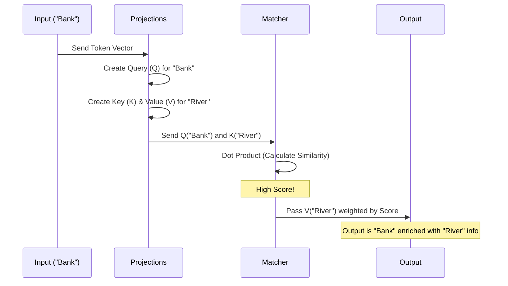

# Chapter 3: Attention Mechanisms (Self & Grouped Query)

In the previous chapter, [Chapter 2: Data Loading and Formatting](02_data_loading_and_formatting.md), we turned text into batches of numbers (tokens).

However, right now, those numbers are lonely. If the model sees the number for the word **"Bank"**, it doesn't know if it refers to a **river bank** or a **financial bank**. To solve this, the model needs to look at the surrounding words (context).

This is where **Attention** comes in. It is the heart of the Transformer architecture.

## 1. The "Search" Analogy (Query, Key, Value)

Attention is simply a communication mechanism. Imagine each token in a sentence is a person trying to talk to the others.

To understand how they communicate, we use a database retrieval analogy. Every token produces three vectors (lists of numbers):

1.  **Query (Q):** What am I looking for? (e.g., "I am the word 'bank', I am looking for adjectives like 'river' or 'money'.")
2.  **Key (K):** What do I contain? (e.g., "I am the word 'money'.")
3.  **Value (V):** What information do I actually pass on? (e.g., "Here is the concept of finance.")

### How it works:
1.  Current token sends out a **Query**.
2.  It checks the **Keys** of all previous tokens.
3.  If the Query matches a Key (high similarity), the model pays **Attention**.
4.  It absorbs the **Value** from that token.

## 2. Multi-Head Attention (The GPT Approach)

In the GPT architecture (used in `gpt.py`), we use **Multi-Head Attention**. This just means we run the attention process several times in parallel.

Why? Because "Bank" might want to look for adjectives (Head 1) AND prepositions (Head 2) at the same time.

### Step 1: Creating Q, K, and V
First, we use Linear layers to project our input `x` into these three forms.

```python
# Simplified from gpt.py
class MultiHeadAttention(nn.Module):
    def __init__(self, d_in, d_out, num_heads):
        super().__init__()
        # These layers transform the input into Q, K, V
        self.W_query = nn.Linear(d_in, d_out)
        self.W_key   = nn.Linear(d_in, d_out)
        self.W_value = nn.Linear(d_in, d_out)
```

### Step 2: Calculating Attention Scores
We check similarity by multiplying Queries and Keys (Dot Product).

```python
    def forward(self, x):
        # 1. Create Q, K, V
        keys = self.W_key(x)
        queries = self.W_query(x)
        values = self.W_value(x)
        
        # 2. Compute Match Scores (Dot Product)
        # (This determines how much focus to put on each word)
        attn_scores = queries @ keys.transpose(1, 2)
```

*Note: In the code, the `@` symbol performs matrix multiplication.*

### Step 3: The Mask (No Peeking!)
When training a text generator, the model reads left-to-right. It shouldn't be allowed to see the future words. We "mask" the future by setting those attention scores to negative infinity.

```python
        # 3. Mask out the future
        # (We use a matrix of 1s and 0s called a 'tril' or triangle)
        mask_bool = self.mask.bool()[:num_tokens, :num_tokens]
        
        # Set future positions to -infinity so they become 0 probability
        attn_scores.masked_fill_(mask_bool, -torch.inf)
```

### Step 4: Absorbing Context
Finally, we apply `softmax` (to turn scores into percentages that add up to 100%) and multiply by the **Values**.

```python
        # 4. Normalize scores to probabilities (0.0 to 1.0)
        attn_weights = torch.softmax(attn_scores, dim=-1)

        # 5. Aggregate the values based on weights
        context_vec = attn_weights @ values
        
        return context_vec
```

**Result:** The output `context_vec` is no longer just the word "Bank". It is a mathematical blend of "Bank" + "Money" + "Account".

## 3. Visualizing the Flow

Here is what happens inside the Attention block when processing the phrase "River Bank".



## 4. Modern Variation: Grouped Query Attention (Llama & Qwen)

The standard Multi-Head Attention (used in GPT-2) gives every "Head" its own unique Key and Value.
*   **GPT-2 (12 Heads):** 12 Queries, 12 Keys, 12 Values.

This is great for accuracy but heavy on memory. Modern models like Llama 3 (covered in `standalone-llama32.ipynb`) use **Grouped Query Attention (GQA)**.

### The Concept
In GQA, multiple Query heads **share** the same Key and Value heads.
*   **Llama 3 (Example):** 4 Queries might share 1 Key and 1 Value.

Imagine a classroom.
*   **Multi-Head:** Every student (Query) has their own personal textbook (Key/Value).
*   **Grouped Query:** Groups of 4 students share 1 textbook.

This drastically reduces the memory needed to store the Keys and Values (this storage is often called the **KV Cache**, which we will discuss in [Chapter 8: Inference Optimization (KV Cache)](08_inference_optimization__kv_cache_.md)).

### Implementation Details
In the project file `standalone-llama32.ipynb`, you can see this logic in `GroupedQueryAttention`.

```python
class GroupedQueryAttention(nn.Module):
    def __init__(self, d_in, d_out, num_heads, num_kv_groups):
        super().__init__()
        # ... logic to define dimensions ...
        self.group_size = num_heads // num_kv_groups
        
        # Notice K and V are smaller than Q
        self.W_query = nn.Linear(d_in, d_out) 
        self.W_key   = nn.Linear(d_in, num_kv_groups * self.head_dim)
        self.W_value = nn.Linear(d_in, num_kv_groups * self.head_dim)

    def forward(self, x):
        # ... generate q, k, v ...
        
        # We repeat the keys/values so the shapes match for calculation
        # Each "textbook" is virtually copied for the 4 students sharing it
        keys = keys.repeat_interleave(self.group_size, dim=1)
        values = values.repeat_interleave(self.group_size, dim=1)
        
        # Proceed with standard attention...
```

By using `repeat_interleave`, we make the math work as if everyone had a textbook, but we only store the unique ones in memory.

## Summary

In this chapter, we learned how the model understands context:
1.  **Q, K, V:** The "search engine" mechanism where tokens look for relevant information in previous tokens.
2.  **Self-Attention:** The process of weighting and combining these vectors.
3.  **Masking:** Preventing the model from cheating by looking at future words.
4.  **Grouped Query Attention:** A modern optimization (used in Llama) that shares Keys and Values to save memory.

Now that our tokens are communicating and understanding context, we need to package this mechanism into the actual building block of the neural network.

[Next Chapter: The GPT Architecture (Transformer Block)](04_the_gpt_architecture__transformer_block_.md)

---

Generated by [Code IQ](https://github.com/adityasoni99/Code-IQ)