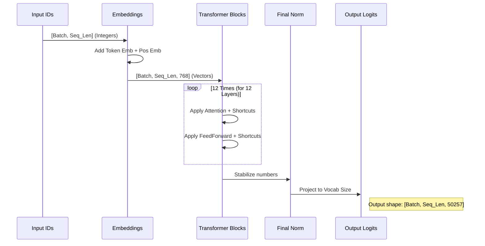

# Chapter 4: The GPT Architecture (Transformer Block)

In the previous chapter, [Chapter 3: Attention Mechanisms (Self & Grouped Query)](03_attention_mechanisms__self___grouped_query_.md), we built the "search engine" of our model. We learned how tokens look at each other to gather context.

However, **Attention** is only half the story.

Imagine a team meeting.
1.  **Attention:** Everyone listens to each other and gathers information.
2.  **Processing:** Everyone thinks about that information individually to reach a conclusion.

In this chapter, we will build the **Processing** part (The Feed Forward Network) and combine it with Attention to create the fundamental building block of LLMs: the **Transformer Block**.

Finally, we will stack these blocks on top of each other to create the full **GPT Model**.

## 1. The "Sandwich" Architecture

Deep learning models are often called "Deep" because they consist of many layers stacked on top of each other.

The GPT Architecture is essentially a giant sandwich made of identical layers.
*   **The Bread (Bottom):** Embeddings (Input).
*   **The Filling (Middle):** A stack of **Transformer Blocks**.
*   **The Bread (Top):** Output Head (Prediction).

The data enters at the bottom, flows up through 12, 24, or even 96 identical blocks, and emerges at the top as a probability distribution for the next word.

## 2. The Feed Forward Network (The "Brain")

If Attention is "looking," the Feed Forward Network (FFN) is "thinking."

After the tokens have gathered information from their neighbors via Attention, each token passes through a small neural network independently. This is where the model stores much of its factual knowledge.

### How it works
It involves two linear transformations with a non-linear "activation" function in the middle. It expands the data dimension (making it wider) and then compresses it back down.

```python
class FeedForward(nn.Module):
    def __init__(self, cfg):
        super().__init__()
        # 1. Expand inputs (e.g., 768 -> 3072)
        self.layers = nn.Sequential(
            nn.Linear(cfg["emb_dim"], 4 * cfg["emb_dim"]),
            GELU(), # The "activation" spark
            nn.Linear(4 * cfg["emb_dim"], cfg["emb_dim"]),
        )

    def forward(self, x):
        return self.layers(x)
```
*Explanation:*
*   **`4 * cfg["emb_dim"]`**: We temporarily make the network 4 times wider. This gives the model more "space" to process complex relationships.
*   **`GELU`**: This is an activation function. Without it, the network would just be linear algebra. This adds the complexity needed to learn language.

## 3. Layer Normalization (The Stabilizer)

As data flows through many layers, the numbers can get very large or very small, making training unstable.

**Layer Normalization** is like a volume knob that automatically adjusts the signal. It centers the data (mean = 0) and scales it (variance = 1). This ensures that every layer receives clean, standardized inputs.

```python
class LayerNorm(nn.Module):
    def __init__(self, emb_dim):
        super().__init__()
        # Parameters the model learns to tweak the normalization
        self.scale = nn.Parameter(torch.ones(emb_dim))
        self.shift = nn.Parameter(torch.zeros(emb_dim))

    def forward(self, x):
        mean = x.mean(dim=-1, keepdim=True)
        var = x.var(dim=-1, keepdim=True, unbiased=False)
        # Normalize: (x - mean) / standard_deviation
        norm_x = (x - mean) / torch.sqrt(var + 1e-5)
        return self.scale * norm_x + self.shift
```

## 4. Shortcut Connections (The Memory Lane)

Deep networks suffer from a problem called "vanishing gradients." As the signal travels through 12+ layers, the original input can get lost or distorted.

To fix this, we use **Shortcut Connections** (also called Residual Connections).

Instead of:
`Output = Layer(Input)`

We do:
`Output = Layer(Input) + Input`

We simply **add** the original input to the result of the layer. This creates a "highway" for information to flow unchanged from the bottom to the top if needed.

## 5. The Transformer Block

Now we combine everything into a single unit: the **Transformer Block**.

Each block performs two main steps:
1.  **Communication:** The tokens talk to each other (Attention).
2.  **Computation:** The tokens process what they heard (FeedForward).

```python
class TransformerBlock(nn.Module):
    def __init__(self, cfg):
        super().__init__()
        # Define the components
        self.att = MultiHeadAttention(...) # From Chapter 3
        self.ff = FeedForward(cfg)         # Defined above
        self.norm1 = LayerNorm(cfg["emb_dim"])
        self.norm2 = LayerNorm(cfg["emb_dim"])

    def forward(self, x):
        # Step 1: Attention with Shortcut
        # Notice we Normalize BEFORE Attention (Pre-Norm)
        shortcut = x
        x = self.norm1(x)
        x = self.att(x)
        x = x + shortcut  # Add original input back

        # Step 2: FeedForward with Shortcut
        shortcut = x
        x = self.norm2(x)
        x = self.ff(x)
        x = x + shortcut  # Add input back again

        return x
```

*Key Takeaway:* The variable `x` represents our batch of tokens. It flows through the block, getting enriched with context (Attention) and processed (FeedForward), while the shortcut ensures we don't lose the original meaning.

## 6. The Full GPT Model

Finally, we build the skyscraper. The `GPTModel` class holds everything together.

### The Components
1.  **Token Embeddings:** Converts IDs (like `502`) into vectors.
2.  **Positional Embeddings:** Tells the model *where* the token is (1st, 2nd, 3rd position).
3.  **Transformer Blocks:** A list of the blocks we defined above.
4.  **Final Head:** Converts the vectors back into vocabulary probabilities.

### Internal Data Flow



### Implementation Details

Here is how we implement the high-level structure in `GPTModel`.

#### Initialization (`__init__`)
We set up the layers based on a configuration dictionary (e.g., `GPT_CONFIG_124M`).

```python
class GPTModel(nn.Module):
    def __init__(self, cfg):
        super().__init__()
        # 1. Embeddings
        self.tok_emb = nn.Embedding(cfg["vocab_size"], cfg["emb_dim"])
        self.pos_emb = nn.Embedding(cfg["context_length"], cfg["emb_dim"])
        
        # 2. Stack of Transformer Blocks
        self.trf_blocks = nn.Sequential(
            *[TransformerBlock(cfg) for _ in range(cfg["n_layers"])]
        )

        # 3. Output Head
        self.final_norm = LayerNorm(cfg["emb_dim"])
        self.out_head = nn.Linear(cfg["emb_dim"], cfg["vocab_size"], bias=False)
```

#### The Forward Pass
This is the path the data takes when we run `model(input_data)`.

```python
    def forward(self, in_idx):
        batch_size, seq_len = in_idx.shape
        
        # 1. Create Embeddings
        tok_embeds = self.tok_emb(in_idx)
        # Create position IDs [0, 1, 2, ..., seq_len-1]
        pos_ids = torch.arange(seq_len, device=in_idx.device)
        pos_embeds = self.pos_emb(pos_ids)
        
        # Combine them
        x = tok_embeds + pos_embeds
        
        # 2. Run through all Transformer Blocks
        x = self.trf_blocks(x)
        
        # 3. Final Norm and Output Projection
        x = self.final_norm(x)
        logits = self.out_head(x)
        
        return logits
```

## Summary

In this chapter, we completed the architecture of our Large Language Model.

1.  **Feed Forward Networks** act as the "brain," processing information independently for each token.
2.  **Layer Normalization** keeps the math stable.
3.  **Shortcut Connections** allow information to flow easily through deep layers.
4.  **Transformer Blocks** combine Attention and FFNs into a repeating unit.
5.  **GPTModel** stacks these blocks to transform input integers into output predictions.

We now have a "brain" structure, but it is currently empty. The weights are random. If you run it now, it will output gibberish.

To make it smart, we need to teach it. We need to **Train** it.

[Next Chapter: Training and Finetuning Loops](05_training_and_finetuning_loops.md)

---

Generated by [Code IQ](https://github.com/adityasoni99/Code-IQ)