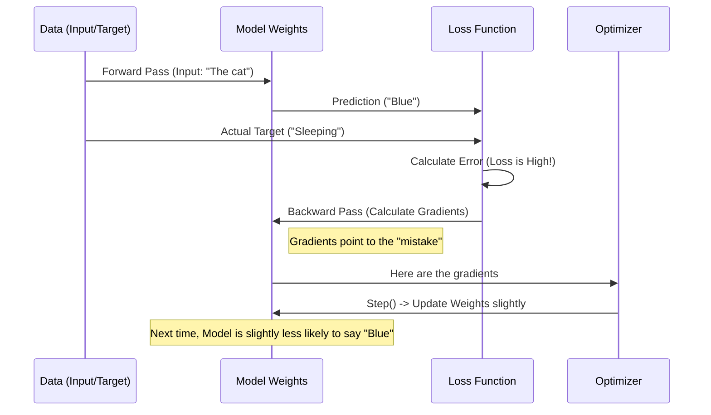

# Chapter 5: Training and Finetuning Loops

In the previous chapter, [The GPT Architecture (Transformer Block)](04_the_gpt_architecture__transformer_block_.md), we assembled the complete structure of our Large Language Model (LLM). We built the "brain" (neural network) capable of processing information.

However, right now, that brain is empty. If you run the model we built in Chapter 4, it will output random gibberish. It's like a newborn baby—it has the biological machinery to speak, but it hasn't learned any words yet.

In this chapter, we will turn that random gibberish into fluent text. We will learn how to **Train** the model. We will cover:
1.  **The Training Loop:** The repeated cycle of "Guess -> Grade -> Correct".
2.  **Pretraining:** Teaching the model the structure of language.
3.  **Classification Finetuning:** Adapting the model to detect spam.
4.  **Instruction Finetuning:** Teaching the model to chat and answer questions.

## 1. The High-Level Concept: Teacher and Student

Training a neural network is exactly like a teacher correcting a student's homework.

Imagine a student (the Model) taking a multiple-choice test.
1.  **Forward Pass (The Guess):** The student looks at the question ("The cat is...") and guesses the answer ("Blue").
2.  **Loss Calculation (The Grade):** The teacher looks at the correct answer ("Sleeping"). The teacher calculates an "Error Score" (Loss). "Blue" is very far from "Sleeping", so the error is high.
3.  **Backward Pass (The Blame):** The teacher figures out *why* the student got it wrong. Was it the vision part of the brain? The logic part? This is calculating **gradients**.
4.  **Optimizer Step (The Correction):** The student adjusts their brain connections slightly so next time they see "The cat is...", they are more likely to think "Sleeping".

We repeat this process millions of times until the student gets every answer right.

## 2. The Training Loop (`train_model_simple`)

In our codebase (specifically `gpt_train.py`), this entire process happens inside a function called `train_model_simple`.

Let's look at the "Magic 5 Lines" of code that exist in almost every PyTorch training loop.

### The Code
```python
# Inside the training loop...
for input_batch, target_batch in train_loader:
    
    # 1. Clear previous calculations
    optimizer.zero_grad()
    
    # 2. The Student Guesses (Forward Pass)
    loss = calc_loss_batch(input_batch, target_batch, model, device)
    
    # 3. Calculate "Blame" (Backward Pass)
    loss.backward()
    
    # 4. Update the Brain (Optimization)
    optimizer.step()
```

### Explanation
1.  **`optimizer.zero_grad()`**: We clear out the corrections from the previous question. We don't want old corrections messing up the new one.
2.  **`calc_loss_batch`**: The model makes a prediction. We compare it to the target (the actual next word) and calculate a number representing the error (Loss).
3.  **`loss.backward()`**: This is the magic of Deep Learning (Backpropagation). It calculates which weights in the model contributed to the error.
4.  **`optimizer.step()`**: The **Optimizer** (usually `AdamW`) nudges the weights in the opposite direction of the error to reduce it next time.

## 3. Pretraining: Learning to Speak

**Pretraining** is the first stage. We take a massive amount of text (like the story "The Verdict" used in `gpt_train.py` or the entire internet for GPT-4) and force the model to predict the next word.

We rely on the tools we built in [Data Loading and Formatting](02_data_loading_and_formatting.md).

### The Goal
*   **Input:** "The quick brown fox"
*   **Target:** "jumps"

The model doesn't care about "facts" yet; it just cares about grammar and patterns.

### Calculating the Loss
Inside `calc_loss_batch`, we use a standard formula called **Cross Entropy**.

```python
def calc_loss_batch(input_batch, target_batch, model, device):
    # Get the model's predictions (logits)
    logits = model(input_batch)
    
    # Flatten data to match CrossEntropy expectations
    # Compare "logits" (guesses) vs "target_batch" (answers)
    loss = torch.nn.functional.cross_entropy(
        logits.flatten(0, 1), target_batch.flatten()
    )
    return loss
```

If the model predicts "jumps" with 99% probability, the Loss is near 0. If it predicts "pizza", the Loss is high.

## 4. Classification Finetuning: The Spam Detector

Once a model is pretrained, it understands English. Now we want to specialize it. This is called **Finetuning**.

In `gpt_class_finetune.py`, we turn our text generator into a Spam Detector (Classification).

### The Head Replacement
Our Pretrained model outputs probabilities for 50,257 words (the vocabulary).
For spam detection, we only need 2 outputs: **Spam** or **Ham** (Non-spam).

We perform "surgery" on the model by replacing the final layer (the output head).

```python
# 1. Freeze the body (Keep the English knowledge)
for param in model.parameters():
    param.requires_grad = False

# 2. Replace the head (New untrained layer)
num_classes = 2 # Spam or Ham
model.out_head = torch.nn.Linear(
    in_features=768, 
    out_features=num_classes
)

# 3. Make sure the new head can learn
for param in model.out_head.parameters():
    param.requires_grad = True
```

### Why Freeze?
We freeze the main body because it already knows how to read. We only want to train the final decision-maker. This is much faster and requires less data.

## 5. Instruction Finetuning: The Chatbot

Classification is useful, but we usually want LLMs to answer questions. This is **Instruction Finetuning**.

We use datasets formatted as shown in [Data Loading and Formatting](02_data_loading_and_formatting.md):
*   **Instruction:** "What is 2+2?"
*   **Response:** "The answer is 4."

### The Challenge
If we train normally, the model tries to predict *everything*, including the instruction.
*   Model input: "What is" -> Model predicts: "2+2?"

We don't want to grade the model on its ability to memorize the question. We only want to grade the **Response**.

### Masking the Loss
In `gpt_instruction_finetuning.py`, we use a trick inside `custom_collate_fn`. We set the target tokens for the "Instruction" part to a special number: `-100`.

PyTorch's `cross_entropy` function creates a "mask": it sees `-100` and ignores that token completely.

```python
# Concept of Masking Targets
# Input:  [Instruction Tokens] [Response Tokens]
# Target: [-100, -100, -100,    Real, Real, Real]

# When calculating loss, PyTorch only looks at the "Real" parts.
```

This acts like a teacher saying, "I won't grade you on reading the question aloud, I will only grade your written answer."

## 6. Under the Hood: The Gradient Flow

What actually happens when `loss.backward()` runs? Let's visualize the flow of data.



### The Optimizer
The `optimizer` (variable in our code) holds the state of this process. We use **AdamW** (Adaptive Moment Estimation with Weight Decay).

Think of AdamW as a smart GPS for the model.
*   Standard Gradient Descent is like walking down a hill in the fog.
*   AdamW remembers which direction was successful previously (Momentum) and adjusts step sizes so we don't trip.

```python
# Defining the Optimizer
optimizer = torch.optim.AdamW(
    model.parameters(), 
    lr=0.00005,      # Learning Rate (How big of a step to take)
    weight_decay=0.1 # regularization (prevents over-memorizing)
)
```

## Summary

In this chapter, we breathed life into our model.

1.  **Training Loop:** We implemented the standard PyTorch cycle: Forward, Loss, Backward, Step.
2.  **Pretraining:** Teaches the model generic language patterns using raw text.
3.  **Classification Finetuning:** Adapts the model to specific categories (Spam/Ham) by swapping the output head.
4.  **Instruction Finetuning:** Teaches the model to be a helpful assistant by masking the instructions and grading only the responses.

We now have a working, trainable GPT model!

However, the field of AI moves fast. While GPT-2 (the architecture we used) is the classic foundation, modern models like **Llama** and **Qwen** have introduced new tricks to be faster and smarter.

[Next Chapter: Modern Model Variations (Llama & Qwen)](06_modern_model_variations__llama___qwen_.md)

---

Generated by [Code IQ](https://github.com/adityasoni99/Code-IQ)