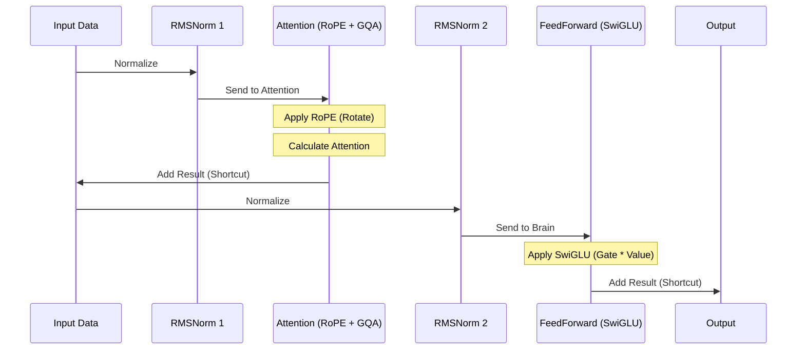

# Chapter 6: Modern Model Variations (Llama & Qwen)

In the previous chapter, [Chapter 5: Training and Finetuning Loops](05_training_and_finetuning_loops.md), we taught our model how to learn. We used a classic architecture based on GPT-2.

However, if you look at modern state-of-the-art models like **Llama 3.2** (Meta) or **Qwen 3** (Alibaba), they don't look exactly like the classic GPT-2. They have been "tuned up."

Think of the GPT architecture as a classic internal combustion engine.
*   **GPT-2** is like a reliable engine from the 1990s. It works perfectly well.
*   **Llama & Qwen** are modern racing engines. They use the same fundamental principles (explosions push pistons), but they add **Turbochargers**, **Fuel Injection**, and **Lighter Materials**.

In this chapter, we will explore these specific upgrades: **RMSNorm**, **SwiGLU**, and **RoPE**.

## 1. The Blueprint of Change

Both Llama and Qwen share a very similar structure. They modify the standard [Transformer Block](04_the_gpt_architecture__transformer_block_.md) in three key ways to make training more stable and inference faster.

1.  **Normalization:** Change `LayerNorm` to `RMSNorm`.
2.  **Activation:** Change `GELU` to `SwiGLU`.
3.  **Position:** Change `Learned Embeddings` to `RoPE` (Rotary Positional Embeddings).

Let's break these down one by one.

## 2. Upgrade 1: RMSNorm (The Stabilizer)

In Chapter 4, we used **Layer Normalization**. It centers the numbers (subtracts the average) and scales them (divides by variance).

**Root Mean Square Normalization (RMSNorm)** simplifies this. Researchers found that "centering" the data isn't actually necessary. We only need to "scale" it to keep the numbers from exploding.

### Why use it?
It requires less math (no subtraction of the mean), making it slightly faster and more computationally efficient.

### The Code
Here is how `RMSNorm` looks in our Llama/Qwen implementation.

```python
class RMSNorm(nn.Module):
    def __init__(self, emb_dim, eps=1e-6):
        super().__init__()
        self.eps = eps
        # We learn a scaling parameter, but NO shift parameter
        self.scale = nn.Parameter(torch.ones(emb_dim))

    def forward(self, x):
        # Calculate the "magnitude" of the data
        variance = x.pow(2).mean(dim=-1, keepdim=True)
        # Normalize inputs and apply learned scale
        norm_x = x * torch.rsqrt(variance + self.eps)
        return norm_x * self.scale
```

**Key Difference:** Notice we don't calculate `x - mean`. We just divide by the root mean square of the values.

## 3. Upgrade 2: SwiGLU (The Gate)

In the classic Feed Forward Network (the "Brain" of the block), we used an expansion pattern:
`Input -> Linear -> Activation (GELU) -> Linear -> Output`

Modern models use **SwiGLU**. This adds a third "Gate" layer.

### The Analogy
Imagine a security checkpoint.
*   **Standard:** You walk through a metal detector (`Activation`).
*   **SwiGLU:** There are two paths. One path calculates the data (`Value`). The other path acts as a gate (`Gate`). The Gate decides how much of the Value gets through by multiplying them together.

### The Code
This creates a network with 3 linear layers instead of 2.

```python
class FeedForward(nn.Module):
    def __init__(self, cfg):
        super().__init__()
        # 3 Layers instead of 2
        self.fc1 = nn.Linear(cfg["emb_dim"], cfg["hidden_dim"], bias=False)
        self.fc2 = nn.Linear(cfg["emb_dim"], cfg["hidden_dim"], bias=False)
        self.fc3 = nn.Linear(cfg["hidden_dim"], cfg["emb_dim"], bias=False)

    def forward(self, x):
        # The "Gate" (fc1) controls the "Value" (fc2)
        # silu is the "Swish" activation function
        x_gate = nn.functional.silu(self.fc1(x))
        x_value = self.fc2(x)
        
        # Element-wise multiplication
        return self.fc3(x_gate * x_value)
```

**Result:** This structure allows the model to learn more complex patterns because it can selectively "silence" or "amplify" specific neurons using the gating mechanism.

## 4. Upgrade 3: Rotary Positional Embeddings (RoPE)

This is the most significant change.

In standard GPT, we assigned a unique vector to "Position 1" and added it to the word.
In **RoPE**, we don't add a vector. We **rotate** the word vector itself.

### The Concept
Imagine the token vector is an arrow on a compass.
*   If the token is at **Position 0**, we leave the arrow pointing North.
*   If the token is at **Position 1**, we rotate the arrow 10 degrees.
*   If the token is at **Position 2**, we rotate it 20 degrees.

When the Attention mechanism compares two tokens (Query and Key), it compares the angle between the arrows. This allows the model to understand **Relative Position** ("These words are 5 steps apart") much better than **Absolute Position** ("This is the 500th word").

### The Code
Implementing RoPE involves some complex trigonometry, but using it is straightforward. We pre-calculate `cos` and `sin` tables and apply them.

```python
def apply_rope(x, cos, sin):
    # Split the vector into two halves
    head_dim = x.shape[-1]
    x1 = x[..., : head_dim // 2]
    x2 = x[..., head_dim // 2 :]

    # Rotate the vector using the rotation matrix formula
    rotated = torch.cat((-x2, x1), dim=-1)
    x_rotated = (x * cos) + (rotated * sin)
    
    return x_rotated
```

*Note: In the code files `llama3.py` and `standalone-qwen3.ipynb`, you will see helper functions `compute_rope_params` that generate the `cos` and `sin` grids.*

## 5. Qwen 3 Specifics: QK Norm

While Llama and Qwen are 90% identical, Qwen 3 introduces a small but impactful tweak called **QK Norm**.

In [Chapter 3: Attention Mechanisms](03_attention_mechanisms__self___grouped_query_.md), we learned about Queries (Q) and Keys (K). If these vectors get too large, the attention scores explode, causing training instability.

Qwen 3 applies **RMSNorm** to the Queries and Keys *before* calculating the attention score.

```python
# Inside Qwen's Attention Block
if self.qk_norm:
    queries = self.q_norm(queries)
    keys = self.k_norm(keys)

# Then calculate attention scores...
attn_scores = queries @ keys.transpose(2, 3)
```

This ensures that the "search" mechanism in attention remains stable, even for massive models with billions of parameters.

## 6. Under the Hood: The Modern Block Flow

Let's visualize the path of data through a modern Llama/Qwen block. It uses **Grouped Query Attention** (from Chapter 3) alongside our new upgrades.



## 7. Defining the Modern Model

Finally, let's look at how we initialize the `Llama3Model` class. It looks very similar to our GPT model, but uses the upgraded components.

```python
class Llama3Model(nn.Module):
    def __init__(self, cfg):
        super().__init__()
        self.tok_emb = nn.Embedding(cfg["vocab_size"], cfg["emb_dim"], dtype=cfg["dtype"])
        
        # Stack of Modern Transformer Blocks
        self.trf_blocks = nn.ModuleList(
            [TransformerBlock(cfg) for _ in range(cfg["n_layers"])]
        )
        
        self.final_norm = nn.RMSNorm(cfg["emb_dim"])
        self.out_head = nn.Linear(cfg["emb_dim"], cfg["vocab_size"], bias=False)
        
        # Pre-compute the RoPE rotation tables (Cos and Sin)
        cos, sin = compute_rope_params(..., cfg["context_length"])
        self.register_buffer("cos", cos)
        self.register_buffer("sin", sin)

    def forward(self, in_idx):
        x = self.tok_emb(in_idx)
        
        # Pass RoPE tables to every block
        for block in self.trf_blocks:
            x = block(x, self.cos, self.sin)
            
        x = self.final_norm(x)
        return self.out_head(x)
```

**Key Takeaway:** Notice that we calculate `cos` and `sin` once at the beginning and pass them into every block. This saves time so each block doesn't have to recalculate the rotation angles.

## Summary

In this chapter, we upgraded our "Classic Car" to a "Modern Supercar."

1.  **RMSNorm:** Replaced LayerNorm for better efficiency.
2.  **SwiGLU:** Replaced GELU to give the FeedForward network a "gating" mechanism.
3.  **RoPE:** Replaced standard positions with "Rotary" embeddings to better handle relative distances between words.
4.  **Qwen vs Llama:** We saw that Qwen adds **QK Norm** to stabilize attention.

These changes are the industry standard for 2024/2025.

However, as models get bigger (like Llama 3 70B or Qwen 72B), running them becomes incredibly expensive. What if we could have a huge model, but only use a tiny part of its brain for each token?

This leads us to the next major efficiency breakthrough: **Mixture of Experts**.

[Next Chapter: Mixture of Experts (MoE)](07_mixture_of_experts__moe_.md)

---

Generated by [Code IQ](https://github.com/adityasoni99/Code-IQ)