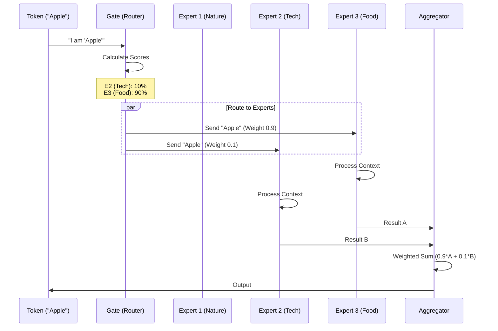

# Chapter 7: Mixture of Experts (MoE)

In the previous chapter, [Chapter 6: Modern Model Variations (Llama & Qwen)](06_modern_model_variations__llama___qwen_.md), we upgraded our model engine with modern parts like RoPE and RMSNorm to make it stable and effective.

But there is still a problem: **Size**.

To make a model smarter, we usually make it bigger (more parameters). But making it bigger makes it **slower** and more expensive to run. It's like building a massive library where the librarian has to run through every single aisle to answer even a simple question.

In this chapter, we will implement **Mixture of Experts (MoE)**. This architectural trick allows us to build a massive model where we only use a tiny fraction of the brain for any given word.

## 1. The "Hospital" Analogy

Imagine you go to a massive hospital. It has hundreds of doctors.
*   **Dense Model (Standard GPT):** Every single doctor in the hospital must come into the room, examine you, and vote on the diagnosis. This is slow and inefficient.
*   **Mixture of Experts (MoE):** You meet a **Receptionist (Router)**. You say, "My heart hurts." The receptionist sends you *only* to the Cardiologists. The Dermatologists and Podiatrists stay in their offices.

In an MoE model:
1.  **The Experts:** We replace the single large Feed-Forward Network (FFN) with many smaller FFNs.
2.  **The Router (Gate):** A small neural network that decides which Expert is best suited for the current token.

This allows models like **Mixtral 8x7B** or **Grok-1** to have huge total knowledge (Parameters) but very fast speed (Active Parameters).

## 2. Defining the Experts

In [Chapter 4: The GPT Architecture (Transformer Block)](04_the_gpt_architecture__transformer_block_.md), we defined a `FeedForward` layer. It was the "processing center" of the block.

For MoE, we simply create a **list** of these FeedForward networks.

### The Code Structure
Instead of one set of layers, we use `nn.ModuleList` to hold a team of experts.

```python
class MoEFeedForward(nn.Module):
    def __init__(self, cfg):
        super().__init__()
        self.num_experts = cfg["num_experts"]
        
        # A list of Expert Networks (e.g., 8 different FFNs)
        # Note: We separate the layers into lists for easier access
        self.fc1 = nn.ModuleList([
            nn.Linear(cfg["emb_dim"], cfg["hidden_dim"], bias=False)
            for _ in range(self.num_experts)
        ])
        # ... repeated for fc2 and fc3 ...
```

*Explanation:* If `num_experts` is 8, we literally create 8 independent neural networks. They initially look identical, but during training, they will learn to specialize (e.g., Expert 1 might get good at grammar, Expert 2 at math).

## 3. The Router (Gating Mechanism)

How does the model know which expert to use? We need a **Gate**.

The Gate is just a simple Linear layer. It looks at the input token (e.g., "Bank") and outputs a score for each expert.

```python
# Inside MoEFeedForward __init__
self.gate = nn.Linear(cfg["emb_dim"], cfg["num_experts"], bias=False)
```

### Top-K Selection
We don't want to activate *all* experts (that would defeat the purpose). We usually pick the top 2 best experts.

```python
def forward(self, x):
    # 1. Calculate scores for all experts
    scores = self.gate(x) 
    
    # 2. Find the top-k highest scores (e.g., Top 2)
    # topk_indices tells us WHO the experts are
    topk_scores, topk_indices = torch.topk(
        scores, 
        k=self.num_experts_per_tok, 
        dim=-1
    )
    
    # 3. Convert scores to probabilities (Sum to 1.0)
    topk_probs = torch.softmax(topk_scores, dim=-1)
```

*Explanation:* 
*   If we have 8 experts, `scores` might look like `[0.1, 0.9, 0.0, 0.8, ...]`.
*   `topk` selects the winners: Expert 1 (0.9) and Expert 3 (0.8).

## 4. Visualizing the Process

Let's see what happens to a single token as it flows through this layer.



## 5. Routing the Traffic (Implementation)

Writing the code to route tokens efficiently in PyTorch is tricky because we process batches of data. We can't just use `if/else` statements easily.

Instead, we use a loop over the experts.
1.  Identify all tokens assigned to Expert 1.
2.  Process them.
3.  Place the results back into the correct spots in the final output.

### The Routing Loop
Here is a simplified view of the logic inside `forward`:

```python
    # Create an empty canvas for the output
    final_output = torch.zeros_like(x)

    # Loop through every expert we have
    unique_experts = torch.unique(topk_indices)

    for expert_id in unique_experts:
        # A. Find which tokens chose this expert
        # (This creates a mask of True/False)
        mask = topk_indices == expert_id
        
        # B. Extract only those tokens
        tokens_for_expert = x[mask]
        
        # C. Let the expert do the work
        # SwiGLU logic: (Gate * Val)
        processed = (
            F.silu(self.fc1[expert_id](tokens_for_expert)) * 
            self.fc2[expert_id](tokens_for_expert)
        )
        out = self.fc3[expert_id](processed)
        
        # D. Add result to the final canvas, weighted by probability
        final_output[mask] += out * prob_for_this_expert
```

**Why loop over experts?** 
In a batch of 4 tokens, Expert 1 might handle Token A and Token C. It's faster to gather A and C together, run them through Expert 1 at the same time (Matrix Multiplication), and then put them back.

## 6. Integrating MoE into the Transformer

Now we place our `MoEFeedForward` into the [Transformer Block](04_the_gpt_architecture__transformer_block_.md).

We add a configuration option to choose between a standard FFN and our new MoE.

```python
class TransformerBlock(nn.Module):
    def __init__(self, cfg):
        super().__init__()
        self.att = MultiHeadAttention(...) 
        
        # Choose: Standard FFN or Mixture of Experts?
        if cfg["num_experts"] > 0:
            self.ff = MoEFeedForward(cfg)
        else:
            self.ff = FeedForward(cfg)
            
        self.norm1 = LayerNorm(cfg["emb_dim"])
        self.norm2 = LayerNorm(cfg["emb_dim"])
```

### Configuration
To run an MoE model, we simply update our config dictionary:

```python
GPT_CONFIG_MOE = {
    "emb_dim": 768,
    "n_layers": 12,
    "num_experts": 8,        # Total experts available
    "num_experts_per_tok": 2 # How many experts act on each token
}
```

## 7. Performance Trade-offs

Why doesn't everyone use MoE all the time?

**Pros:**
*   **Massive Capacity:** You can have trillions of parameters (memories/facts) stored in the experts.
*   **Inference Speed:** You only pay the compute cost for the 2 active experts, not all 8 (or 64).

**Cons:**
*   **VRAM Usage:** While you only *compute* with a fraction of parameters, you still need to *store* all of them in GPU memory (VRAM). An MoE model requires a lot of RAM.
*   **Training Stability:** Training a router is hard. Sometimes the router gets lazy and sends everything to Expert 1 (called "Expert Collapse").

## Summary

In this chapter, we learned how to scale up our model without slowing it down.

1.  **Mixture of Experts (MoE)** replaces the dense Feed-Forward layer with a team of specialists.
2.  **The Router** assigns each token to the top-k (usually 2) most relevant experts.
3.  **Sparse Activation** means we can have a model with massive knowledge but fast reaction times.

We now have a model that is smart, stable, and scalable. But there is one final bottleneck. When the model writes a long essay, it gets slower and slower with every word it generates.

To fix this, we need to optimize the **Attention Memory**.

[Next Chapter: Inference Optimization (KV Cache)](08_inference_optimization__kv_cache_.md)

---

Generated by [Code IQ](https://github.com/adityasoni99/Code-IQ)