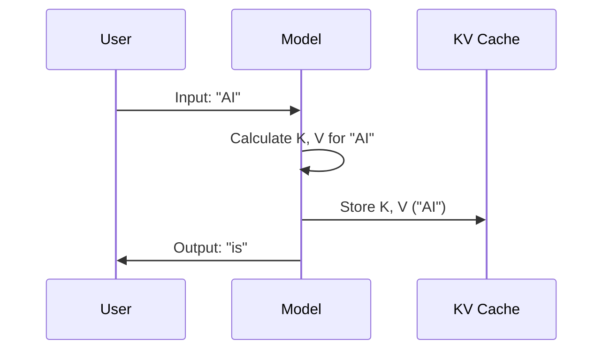
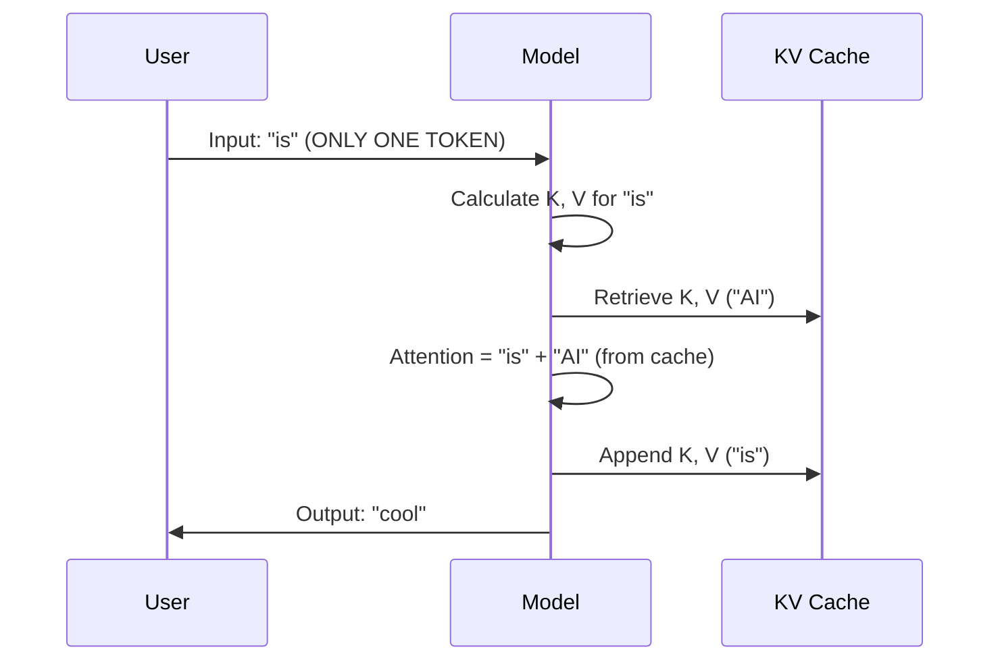

# Chapter 8: Inference Optimization (KV Cache)

Welcome to the final chapter of **LLMs from Scratch**!

In the previous chapter, [Chapter 7: Mixture of Experts (MoE)](07_mixture_of_experts__moe_.md), we learned how to make our model smarter and more scalable by giving it a "team of specialists."

However, we still face a major bottleneck. As the model generates longer and longer text (like writing an essay), it gets slower and slower. The first word is instant, but the 1000th word takes forever.

In this chapter, we will solve this using **Inference Optimization** with a technique called the **KV Cache (Key-Value Cache)**.

## 1. The Problem: The Forgetful Writer

To understand why LLMs get slow, imagine you are writing a speech.

**The "Standard" Way (Without Cache):**
1.  You write: *"The"*
2.  To write the next word, you re-read *"The"*. You write *"cat"*.
3.  To write the next word, you re-read *"The cat"*. You write *"sat"*.
4.  To write the next word, you re-read *"The cat sat"*. You write *"on"*.

By the time you are at the 100th word, you are re-reading 99 words just to add one more. This is extremely inefficient!

**The "Optimized" Way (With Cache):**
1.  You write *"The"*. You remember it.
2.  You simply look at your memory of *"The"* and add *"cat"*.
3.  You look at your memory of *"The cat"* and add *"sat"*.

The **KV Cache** is that memory. It stops the model from re-calculating the past over and over again.

## 2. What are we Caching?

Recall [Chapter 3: Attention Mechanisms (Self & Grouped Query)](03_attention_mechanisms__self___grouped_query_.md). We learned that every token produces three vectors:
*   **Query (Q):** What I'm looking for.
*   **Key (K):** What I contain.
*   **Value (V):** What information I pass on.

When we generate the word "sat" in the sentence "The cat sat", the word "The" doesn't change. Its **Key** and **Value** vectors are exactly the same as they were a moment ago.

Instead of recalculating $K$ and $V$ for "The" and "cat" every single step, we save them in a **Cache** (a temporary storage in GPU memory).

## 3. Implementing the Cache

We need to modify our `MultiHeadAttention` class to hold this memory.

### Step 1: Creating the Storage
In the `__init__` method, we create placeholders (buffers) to store the Keys and Values.

```python
# Inside MultiHeadAttention.__init__
# We register buffers to hold the history. 
# They start as None (Empty).
self.register_buffer("cache_k", None, persistent=False)
self.register_buffer("cache_v", None, persistent=False)
```

*Explanation:* `register_buffer` tells PyTorch to store these tensors inside the model, but *not* to treat them as trainable weights. They are just temporary storage.

### Step 2: Updating the Forward Pass
Now, when the model runs, we check if we should use the cache.

```python
# Inside MultiHeadAttention.forward
if use_cache:
    # If we have history, glue the new Keys to the old Keys
    if self.cache_k is not None:
        keys = torch.cat([self.cache_k, keys], dim=1)
        values = torch.cat([self.cache_v, values], dim=1)
    
    # Save the updated history back to the buffer
    self.cache_k = keys
    self.cache_v = values
```

*Explanation:* `torch.cat` (concatenate) is like gluing two lists together. We take the history we saved (`self.cache_k`) and glue the new token's key (`keys`) to the end of it.

### Step 3: Handling Position
In [Chapter 4: The GPT Architecture (Transformer Block)](04_the_gpt_architecture__transformer_block_.md), we learned about **Positional Embeddings**. The model needs to know if a word is the 1st or the 100th.

If we only feed the model **one word** (the newest one), the model might think it's the 1st word. We need to tell it: "Hey, this is actually word #100."

```python
# Inside GPTModel.forward
if use_cache:
    # We track a variable 'current_pos'
    # Start creating IDs from current_pos (e.g., 100)
    pos_ids = torch.arange(self.current_pos, self.current_pos + seq_len, device=device)
    
    # Update position for next time
    self.current_pos += seq_len
```

## 4. The Generation Loop

This is where the magic happens. We change how we call the model.

In the standard loop, we passed the **entire sequence** every time.
In the cached loop, we pass **only the new token**.

### The Code Comparison

**Old Way (Slow):**
```python
# Pass the FULL history every time
logits = model(full_sequence_indices) 
next_token = logits[:, -1].argmax()
```

**New Way (Fast):**
```python
# Pass ONLY the newest token
# The model looks in its cache for the rest!
logits = model(new_token, use_cache=True)
next_token = logits[:, -1].argmax()
```

### Resetting
Just like clearing your browser cache, we must clear the KV Cache when we start a brand new prompt.

```python
def reset_kv_cache(self):
    for block in self.trf_blocks:
        block.att.reset_cache()
    self.current_pos = 0
```

## 5. Visualizing the Speedup

Let's look at what happens under the hood when we generate the phrase "AI is cool".

### Step 1: The Prompt ("AI")
We must process the first word normally to fill the cache.



### Step 2: The Next Word ("is")
Here is the optimization. We input *only* "is".



Notice that the model did not have to recalculate the math for "AI". It just retrieved it.

## 6. Trade-offs: Speed vs. Memory

You might ask: "Is there a downside?"

Yes. **Memory (VRAM).**

Storing the Keys and Values for a long conversation takes up space on your Graphics Card (GPU).
*   **Time Complexity:** Reduced from $O(N^2)$ to $O(N)$. (Much Faster)
*   **Space Complexity:** Increased. (Uses more RAM)

For very long documents (like summarizing a book), the cache can get so big it fills up your GPU memory. This is why techniques like **Grouped Query Attention** (discussed in [Chapter 6: Modern Model Variations (Llama & Qwen)](06_modern_model_variations__llama___qwen_.md)) are important—they shrink the size of the KV Cache.

## Conclusion

Congratulations! You have reached the end of the tutorial.

In this chapter, we:
1.  Identified that re-processing old text makes generation slow.
2.  Implemented the **KV Cache** to remember the Key and Value vectors of past tokens.
3.  Updated our generation loop to feed the model one token at a time, drastically increasing speed.

**Course Summary:**
You started with raw text and built a complete Large Language Model from scratch.
1.  **Tokenizer:** Turning text into numbers.
2.  **Embeddings:** Turning numbers into vectors.
3.  **Attention:** Letting words look at each other.
4.  **Transformer Blocks:** The brain of the model.
5.  **Training:** Teaching the model to speak.
6.  **Finetuning:** Teaching the model to follow instructions.
7.  **Optimization:** Making it fast (KV Cache) and scalable (MoE).

You now possess the foundational knowledge to understand papers about GPT-4, Claude, Llama, and whatever comes next. Happy coding!

---

Generated by [Code IQ](https://github.com/adityasoni99/Code-IQ)