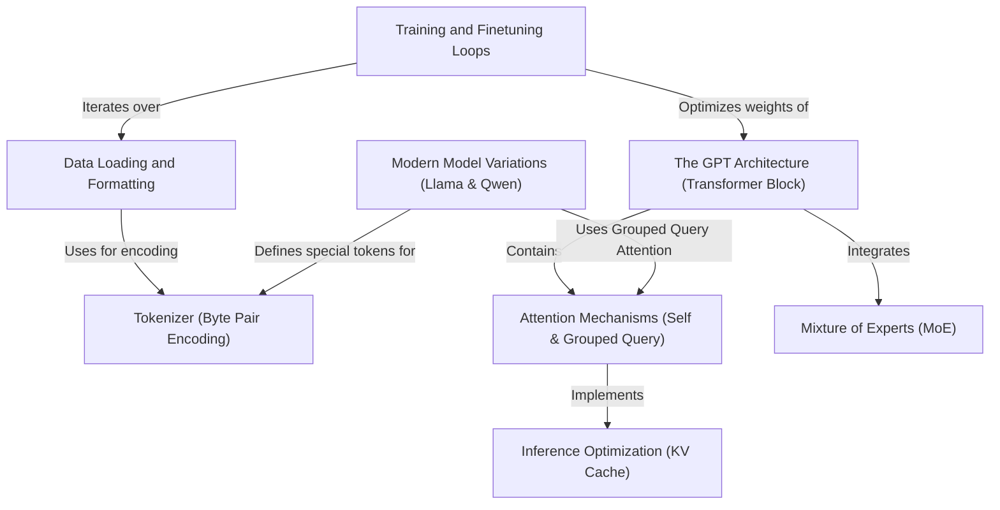

# Tutorial: LLMs-from-scratch

This project serves as a comprehensive educational guide for building **Large Language Models (LLMs)** from the ground up. It demonstrates how to transform raw text into numerical data using a *Tokenizer*, construct the core **GPT Architecture** and modern variants like *Llama* and *Qwen*, and implement efficient training loops to teach the model to generate coherent text.

**Source Repository:** [https://github.com/rasbt/LLMs-from-scratch](https://github.com/rasbt/LLMs-from-scratch)

## Chapters

1. [Tokenizer (Byte Pair Encoding)](01_tokenizer__byte_pair_encoding_.md)
2. [Data Loading and Formatting](02_data_loading_and_formatting.md)
3. [Attention Mechanisms (Self & Grouped Query)](03_attention_mechanisms__self___grouped_query_.md)
4. [The GPT Architecture (Transformer Block)](04_the_gpt_architecture__transformer_block_.md)
5. [Training and Finetuning Loops](05_training_and_finetuning_loops.md)
6. [Modern Model Variations (Llama & Qwen)](06_modern_model_variations__llama___qwen_.md)
7. [Mixture of Experts (MoE)](07_mixture_of_experts__moe_.md)
8. [Inference Optimization (KV Cache)](08_inference_optimization__kv_cache_.md)

---

Generated by [Code IQ](https://github.com/adityasoni99/Code-IQ)