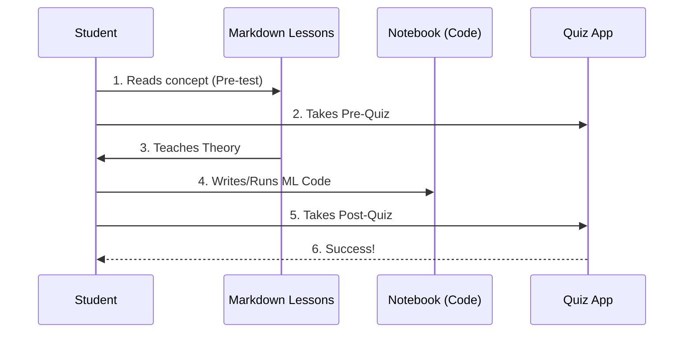

# Chapter 1: Project Overview

Welcome to the start of your journey! If you are reading this, you are likely interested in Machine Learning (ML) but might be feeling a little overwhelmed by the complex math or jargon usually associated with it.

This chapter introduces **ML-For-Beginners**, a project designed to solve exactly that problem.

## The Motivation: A Curriculum for Everyone

Imagine you want to learn how to cook. You wouldn't start by trying to manage a 5-star restaurant kitchen. You would start by learning how to chop vegetables, then boil water, and finally make a simple pasta dish.

**ML-For-Beginners** is your cookbook.

The central problem this project solves is **Accessibility**. Many ML courses focus heavily on abstract theory. This project flips that approach using **Project-Based Learning**.

### Central Use Case: The "Pumpkin Market"

Let's look at a concrete example you will encounter early in this curriculum.

**The Goal:** You are a farmer and you want to predict the price of pumpkins so you can sell them at the best time.

**The Solution:** Instead of writing complex equations on a whiteboard, this curriculum guides you to:
1.  Load pumpkin sales data.
2.  Clean the data (remove bad apples... or pumpkins).
3.  Draw a line through the data points (Linear Regression).
4.  Predict a price.

This chapter explains the "School" (the project structure) that allows you to learn these skills.

## Core Concepts

The project is a massive abstraction of a university semester. Here are the key concepts broken down:

### 1. The 12-Week Structure
The curriculum is divided into time-based milestones. It isn't just a pile of files; it is a roadmap.
*   **Weeks:** Groupings of related topics.
*   **Lessons:** 26 total lessons.
*   **Languages:** You can choose to learn in **Python** or **R**.

### 2. Project-Based Learning
You learn by doing. Every concept (like "Classification") creates a tangible result (like "Sorting cuisines based on ingredients").

### 3. The Quiz App
Learning requires validation. We use a custom-built quiz application to test your knowledge before and after lessons.

## How to Use This Curriculum

To "use" this project, you navigate it like a map. You don't just "run" the whole project at once; you consume it piece by piece.

Here is the high-level flow of how a student interacts with the curriculum:

1.  **Select a Topic:** Choose a folder (e.g., Regression).
2.  **Read the Theory:** Open the `.md` (Markdown) file.
3.  **Run the Code:** Open the `.ipynb` (Jupyter Notebook) file.

### Example: Starting a Lesson
If you were to start the curriculum, your first interaction in code might look like checking the syllabus.

```python
# Pseudo-code representing the curriculum flow
def start_curriculum():
    print("Welcome to ML-For-Beginners!")
    
    # Choose your path
    language = "Python" # or "R"
    
    # Start Lesson 1
    return open_lesson(1, language)
```

*Explanation: In this simplified snippet, we simulate the student's choice. You pick a language (covered in [Python Setup](05_python_setup.md) or [R Setup](06_r_setup.md)), and the project provides the specific content for that track.*

## Internal Implementation: How It Works

Under the hood, this project is a static repository, but it functions like an interactive application.

### The Flow of Learning

When you interact with the project, you are moving between three layers: **Documentation**, **Code Environments**, and the **Quiz Engine**.



1.  **Student** accesses the lesson text.
2.  **Student** tests their current knowledge.
3.  **Lesson** provides the "recipe."
4.  **Student** cooks the recipe in the Notebook.
5.  **Quiz App** validates the result.

### Deep Dive: Project Configuration

To keep this environment safe and inclusive, the project relies on specific configuration files. One crucial file is the `CODE_OF_CONDUCT.md`.

This file ensures that all contributors and students treat each other with respect—essential for an open-source education project.

```markdown
# CODE_OF_CONDUCT.md Snippet

# Microsoft Open Source Code of Conduct

This project has adopted the [Microsoft Open Source Code of Conduct]
(https://opensource.microsoft.com/codeofconduct/).

Resources:
- [Microsoft Open Source Code of Conduct](...)
```

*Explanation: This file is located at the root of the repository. It is the "law" of the project. It doesn't run code, but it governs the behavior of the community building the code.*

### The Tech Stack

The curriculum is built using several technologies working in harmony.
*   **Jupyter Notebooks:** For executable code.
*   **Markdown:** For readable text.
*   **Vue.js:** Powered the quiz application (we will explore this in [Quiz Application Development](07_quiz_application_development.md)).

We will dive deeper into the specific tools used in the next chapter, [Key Technologies](02_key_technologies.md).

## Summary

In this chapter, we learned:
*   **ML-For-Beginners** is a 12-week curriculum designed to make ML accessible.
*   It uses a **Project-Based** approach (learning by building).
*   It combines **text lessons**, **executable code**, and **quizzes**.
*   It is governed by a **Code of Conduct** to ensure a welcoming community.

Now that you understand *what* this project is, let's look at the tools that make it possible.

[Next Chapter: Key Technologies](02_key_technologies.md)

---

Generated by [Code IQ](https://github.com/adityasoni99/Code-IQ)