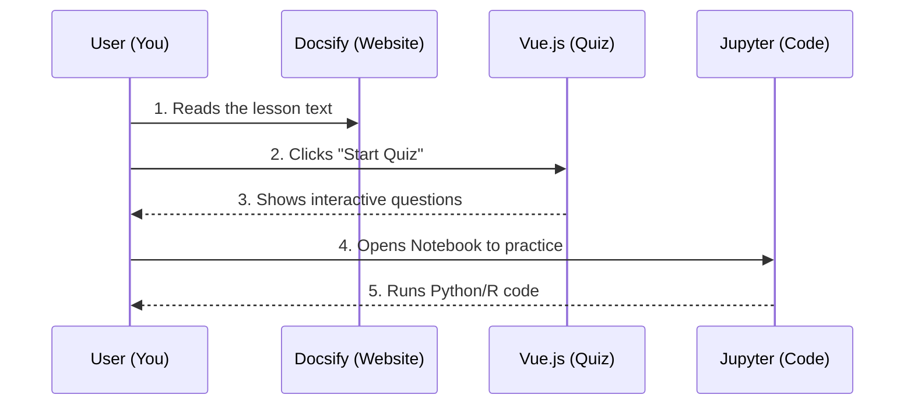

# Chapter 2: Key Technologies

In the previous chapter, [Project Overview](01_project_overview.md), we introduced **ML-For-Beginners** as a "Cookbook" for learning Machine Learning.

Now, we need to talk about the kitchen equipment. You cannot cook a meal without a stove, a knife, and a pan. Similarly, you cannot build Machine Learning models without a specific set of software tools. This chapter introduces the "Toolbox" you will use throughout the course.

## The Motivation: The Right Tool for the Job

Machine Learning involves complex calculations. Doing these by hand would be like trying to dig a swimming pool with a spoon. We use programming languages and specialized tools to do the heavy lifting for us.

### Central Use Case: "The Calculator and The Notebook"

Imagine you are trying to predict the price of a pumpkin (our goal from Chapter 1).
1.  You have a list of 1,000 previous pumpkin sales.
2.  You need to calculate the average price.
3.  You need to draw a chart to show the trend.

To do this, you need two main things:
1.  **A Brain:** A language that knows how to do math (Python or R).
2.  **A Canvas:** A place to write instructions and see the charts (Jupyter Notebooks).

## Key Concepts

We use a variety of technologies in this project. Let's break them down into three easy categories: **The Languages**, **The Environment**, and **The Support Tools**.

### 1. The Languages: Python and R
These are the programming languages you will "speak" to the computer.
*   **Python:** Currently the most popular language for AI. It reads very much like English.
*   **R:** A language built specifically for statistics and data visualization.

You don't need to know both! You pick one track.

### 2. The Environment: Jupyter Notebooks
A standard code file just runs and closes. A **Jupyter Notebook** is special because it is interactive. It allows you to mix:
*   **Text:** Explanations of what you are doing.
*   **Code:** The actual instructions.
*   **Output:** The result (graphs, numbers) appears right below the code.

### 3. The Web Tools: Vue.js, Flask, and Docsify
These tools run the "School" website itself.
*   **Docsify:** Turns our text files into a beautiful website.
*   **Vue.js 3:** Runs the interactive quizzes.
*   **Flask:** A tiny Python web server that helps grade the quizzes.

## How to Use These Technologies

As a student, your main interaction will be importing "Libraries" in Python or R inside a Jupyter Notebook.

Think of a **Library** like a specialized toolbelt. Python knows basic math, but if you want to draw complex graphs, you need to grab the "Graphing Toolbelt" (a library called `matplotlib`).

### Example: Importing Tools
Here is how you start almost every lesson in this curriculum. You tell Python to bring in the heavy machinery.

```python
# Import the tools we need
import pandas as pd     # Tool for handling data tables
import numpy as np      # Tool for heavy math
import matplotlib.pyplot as plt # Tool for drawing graphs

# Now we are ready to work!
print("Tools loaded successfully.")
```

*Explanation: `import` tells Python to load code written by others. We give them nicknames (like `pd` for pandas) to save typing time later.*

## Internal Implementation: How They Connect

It might look like magic when you visit the course website, take a quiz, and then open a notebook. Here is what is happening under the hood.

### The Ecosystem Workflow

When you use the project, different technologies handle different parts of your experience.



1.  **Docsify** renders the `.md` files so they look like a clean website.
2.  **Vue.js** wakes up when you reach a quiz section to test your knowledge.
3.  **Jupyter** is where you go to actually write code.

### Deep Dive: Managing Dependencies

How does the computer know which versions of the tools to install? We use "Shopping Lists."

#### Python's Shopping List: `requirements.txt`
This file tells the computer exactly which libraries to install so the lessons work correctly.

```text
# content of requirements.txt
jupyter>=1.0.0
pandas>=1.3.0
scikit-learn>=0.24.2
flask>=2.0.1
```

*Explanation: This file lists the "ingredients" needed. `pandas>=1.3.0` means "Get me the Pandas library, but make sure it is version 1.3.0 or newer."*

#### GitHub Actions: The Robot Cleaner
We also use a tool called **GitHub Actions**. This is an automated robot that lives in the cloud. Every time we change the course, this robot:
1.  Wakes up.
2.  Reads the `requirements.txt`.
3.  Checks if our code still works.
4.  Builds the website.

This ensures that the code you download is always working.

### The Quiz App Stack

The quiz is a mini-application embedded in the lessons. We will explore how to build this in [Quiz Application Development](07_quiz_application_development.md), but simply put:
*   **Front-end (Vue.js):** Handles the buttons and score display.
*   **Back-end (Flask):** Handles the logic (though often the quizzes run entirely in the browser for simplicity).

## Summary

In this chapter, we unpacked the **Key Technologies** that power `ML-For-Beginners`:

*   **Python/R:** The languages used to calculate and predict.
*   **Jupyter:** The interactive notebook for experimenting.
*   **Vue.js & Docsify:** The tools that present the lessons and quizzes on the web.
*   **GitHub Actions:** The automation that keeps the project healthy.

Now that we have our tools ready, we need to understand how the files are organized on the shelf.

[Next Chapter: Repository Structure](03_repository_structure.md)

---

Generated by [Code IQ](https://github.com/adityasoni99/Code-IQ)